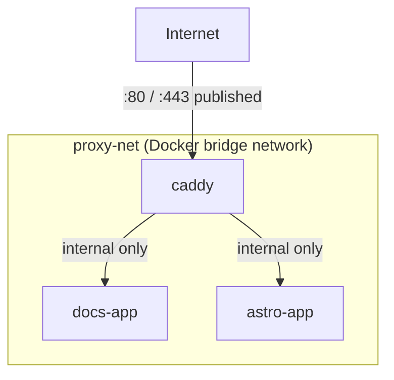

# Docker Networking Basics

Containers need to talk to each other (app → database, proxy → app) without necessarily exposing
any of that to the outside world. Docker's networking model is what makes that possible.

## Bridge networks

A **bridge network** is a private virtual network that containers can be attached to — containers
on the same bridge network can reach each other by **container name**, without any ports being
published to the host machine at all.

```bash
docker network create proxy-net
docker run --network proxy-net --name docs-app docs-image
docker run --network proxy-net --name caddy caddy-image
```

Now, from inside the `caddy` container:

```bash
curl http://docs-app:80      # works — "docs-app" resolves via Docker's internal DNS
```

...but `docs-app:80` is **not** reachable from the host machine or the internet unless that port
is explicitly published (`-p`).

## Why this org's containers share `proxy-net`



Only Caddy's ports are published to the host (and from there, to the internet). `docs-app` and
`astro-app` are reachable *by name* from Caddy over `proxy-net`, but have no route in from outside
at all — this is the mechanism behind
["only Caddy is exposed directly"](./deploying-a-static-site.md) described on the previous page.

## Published vs. internal ports

```bash
docker run -p 8080:80 my-app     # host's port 8080 -> container's port 80, reachable from outside
docker run my-app                  # no -p at all: only reachable by other containers on the same network
```

`-p HOST:CONTAINER` is the only thing that makes a container's port reachable from outside Docker
entirely — everything else is internal-only by default, which is a security property worth relying
on deliberately (as this org's setup does), not just an implementation detail.

## `docker compose` and networks

`docker-compose.yml` creates a network automatically per project unless told otherwise; to share
one network across multiple independently-deployed compose projects (as with `proxy-net` here,
shared between the docs site and the main marketing site's separate repos), declare it as
`external: true`:

```yaml title="docker-compose.yml"
services:
  docs-app:
    build: .
    networks:
      - proxy-net

networks:
  proxy-net:
    external: true
```

`external: true` tells Compose "this network already exists, don't try to create it" — it has to
be created once (`docker network create proxy-net`) before any compose project using it can start.

## Check yourself

- From inside the `caddy` container, `curl http://docs-app:80` works. Does that mean `docs-app:80`
  is also reachable from the internet, or even from the host machine?

  <details>
  <summary>Answer</summary>

  No — containers on the same bridge network reach each other by name with no ports published to
  the host at all; only an explicit `-p` publish makes a port reachable from outside Docker.
  </details>

- Why does `proxy-net` need to be declared `external: true` in this org's `docker-compose.yml`
  files?

  <details>
  <summary>Answer</summary>

  Because it's shared across multiple independently-deployed compose projects (the docs site and
  the main marketing site) — `external: true` tells Compose the network already exists and not to
  try creating its own per-project network.
  </details>

- What single thing makes a container's port reachable from outside Docker entirely?

  <details>
  <summary>Answer</summary>

  Publishing it explicitly with `-p HOST:CONTAINER` — everything else is internal-only by default.
  </details>

