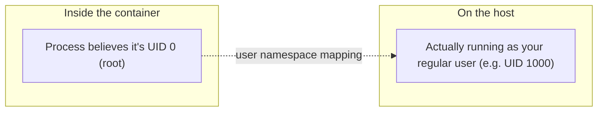

# Rootless by Default

The practical, security-relevant consequence of Podman's daemonless architecture (see
[What Is Podman](./what-is-podman.md)): a regular, non-root user can run Podman containers with no
special setup, without ever needing root privileges at all.

## The Docker comparison

```bash
# Docker: your user typically needs to be in the "docker" group
usermod -aG docker deploy
```

Being in the `docker` group grants access to the Docker daemon's socket — which, since the daemon
traditionally runs as root, is functionally equivalent to root access on the host (see
[Sudo & Root](/study-materials/linux-shell/permissions-and-users/sudo-and-root) in the Linux &
Shell topic, and its note on treating `docker`-group membership with the same care as sudo rights).
This is a deliberate, understood tradeoff in Docker's design, not an oversight — but it does mean
"can run containers" and "has root-equivalent access" are the same permission in practice.

```bash
# Podman: no daemon, no special group needed
podman run -d nginx      # runs as your own regular user, no elevated access involved at all
```

## How rootless containers actually work

A rootless Podman container still uses namespaces and cgroups (see
[What Is a Container](/study-materials/docker/basics/what-is-a-container) in the Docker topic) —
the container process runs with your own regular user's actual UID on the host, while Linux's
**user namespaces** let it *appear* to be root **inside** the container's own isolated view,
without that mapping to real root privileges on the host at all.



An application inside the container that expects to run as root (many do, by convention) still
works normally — it just doesn't grant real root access to the host if the container is somehow
broken out of.

## Why this matters for security specifically

If a container is compromised (a vulnerability in the containerized app itself, or a
container-escape bug), the practical blast radius is bounded by what the **host user** running it
could do — not by root, because there generally isn't a root-privileged daemon or process in the
picture for a rootless container at all. This directly narrows the worst-case outcome of a
container compromise compared to a setup where the daemon (and by extension, effectively, every
container it manages) runs as root.

:::note
Docker *can* also run rootless (`dockerd-rootless`), and this comparison isn't "Docker is
insecure" — it's that rootless is Podman's default, zero-extra-setup mode, while Docker's default
installation is still the traditional root daemon, with rootless as an opt-in alternative most
setups don't bother enabling.
:::

## Real limits of rootless operation

Not everything works identically rootless — some genuinely need real root:

```text
Works fine rootless:        Most typical app containers, web servers, most databases
Needs extra config/root:    Binding to ports below 1024 without extra setup, some advanced
                              networking modes, certain volume permission edge cases
```

Binding directly to port 80 rootless, for instance, requires either running as root anyway, or a
kernel setting (`net.ipv4.ip_unprivileged_port_start`) to lower the privileged-port threshold —
worth knowing before assuming rootless is a drop-in replacement for every existing Docker setup
with no adjustments needed at all.
