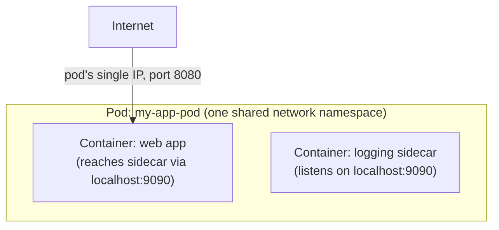

# The Pod Concept

The one genuinely new idea Podman introduces that plain Docker has no direct equivalent for — and
not a coincidence that the name "Podman" (**Pod** Man**ager**) centers on it.

## What a pod is

A **pod** is a group of one or more containers that share certain resources — most notably, the
same **network namespace** (they share one IP address, and can reach each other over `localhost`)
and can share storage. This is deliberately the same concept, and the same term, as a Kubernetes
pod — Podman's pod model is meant to mirror it directly, in a way plain Docker's container model
doesn't attempt to.



## Creating and using a pod

```bash
podman pod create --name my-app-pod -p 8080:8080

podman run -d --pod my-app-pod --name web my-web-image
podman run -d --pod my-app-pod --name sidecar my-sidecar-image
```

Both `web` and `sidecar` now share one network namespace — `web` can reach `sidecar` over
`localhost:9090` (whatever port `sidecar` listens on) without any Docker-style custom network or
service-name DNS resolution (see
[Ports & Network Modes](/study-materials/docker/networking-and-storage/ports-and-network-modes) in
the Docker topic for how Docker handles the equivalent multi-container communication need
differently, via named bridge networks rather than a shared namespace).

## Managing a pod as one unit

```bash
podman pod ps                    # list pods
podman pod stop my-app-pod         # stop every container in the pod together
podman pod rm my-app-pod             # remove the pod and its containers
```

## Why this maps to Kubernetes so directly

Kubernetes's own pod concept works the same way — one or more containers sharing a network
namespace, typically a main container plus one or more "sidecar" containers (logging, a proxy, a
metrics exporter) that need tight, localhost-level access to the main container. Podman's pod
model exists specifically so a local multi-container setup can closely mirror how it would
actually be deployed on Kubernetes later — including directly generating Kubernetes YAML from a
running pod (see [Podman Compose](../02-using-podman/podman-compose.md)).

## Docker's closest equivalent, and why it's not really the same thing

Docker Compose's multi-container networking (see
[Multi-Container Apps](/study-materials/docker/docker-compose/multi-container-apps) in the Docker
topic) achieves a similar practical *outcome* — containers that can reach each other easily — but
via a shared **bridge network** with service-name DNS resolution, not a shared network namespace.
Containers on a Docker Compose network still each have their own IP and reach each other by
hostname; pod-mates in Podman share literally one IP and talk over `localhost`. Functionally
similar for many use cases, but a genuinely different mechanism underneath — and specifically the
mechanism that doesn't map onto Kubernetes pods the way Podman's does.
