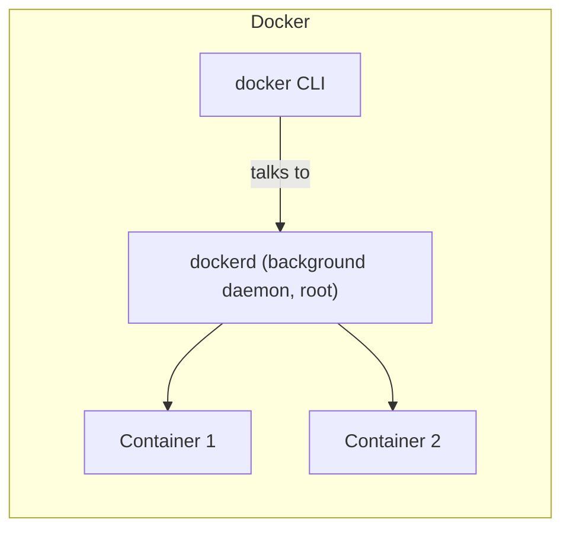
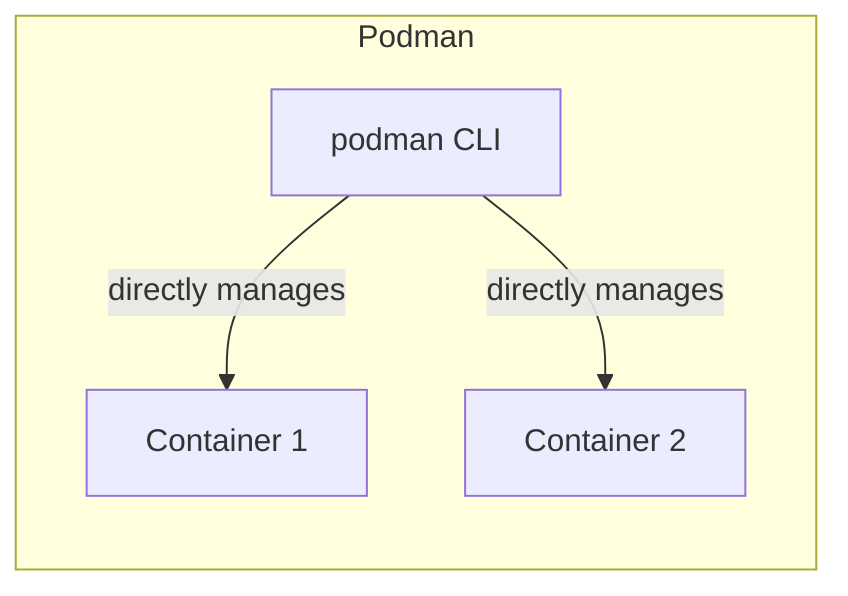

# What Is Podman

**Podman** is a container engine — like Docker, it builds and runs containers from OCI-compliant
images (the same image format Docker uses), and its CLI is deliberately designed to feel almost
identical. The single biggest architectural difference is right in how it runs.

## Daemonless — the headline difference

Docker's architecture relies on a long-running background service, the **Docker daemon**
(`dockerd`), which every `docker` CLI command actually talks to over a socket — the daemon is what
actually builds images, runs containers, and manages everything, while the CLI is just a client
sending it requests.





Podman has **no background daemon at all** — the `podman` command directly creates and manages
containers as its own child processes, using the same underlying Linux mechanisms (namespaces,
cgroups — see
[What Is a Container](/study-materials/docker/basics/what-is-a-container) in the Docker topic) but
without a central always-running service coordinating everything.

## Why "no daemon" is a meaningful architectural difference, not just trivia

- **No single point of failure** — a crashed or hung Docker daemon can take down *every* container
  it manages, since they all depend on it. A crashed `podman` process only ever affected the one
  command that was running.
- **Simpler permission model** — Docker's daemon traditionally runs as root, and the `docker` CLI
  talks to it through a socket that effectively grants root-equivalent access to anyone who can
  reach it. Podman's process-per-container model sidesteps that entirely (see
  [Rootless by Default](./rootless-by-default.md) for the direct consequence of this).
- **Container processes are real child processes** of whatever started them — visible in the
  process tree the normal way, not hidden behind a separate daemon's own process management.

## CLI compatibility — deliberately, not by accident

```bash
podman run -d nginx
podman ps
podman build -t my-app .
podman exec -it my-app bash
```

Every one of these is identical to the equivalent `docker` command — see
[Podman CLI Basics](../02-using-podman/podman-cli-basics.md) for the practical extent of this
compatibility, including the literal `alias docker=podman` trick many setups use.

## Where Podman fits, relative to Docker

Podman isn't a wrapper around Docker, and doesn't require Docker installed at all — it's a
genuinely independent implementation of largely the same container concepts, developed primarily
by Red Hat, with rootless operation and tighter Kubernetes/systemd integration as its main
differentiators (see [The Pod Concept](./the-pod-concept.md) and
[Podman & systemd](../02-using-podman/podman-and-systemd.md)). The
[Docker vs. Podman](../03-docker-vs-podman/architecture-differences.md) section covers how these
differences play out in practice, and when each is actually the better choice.
