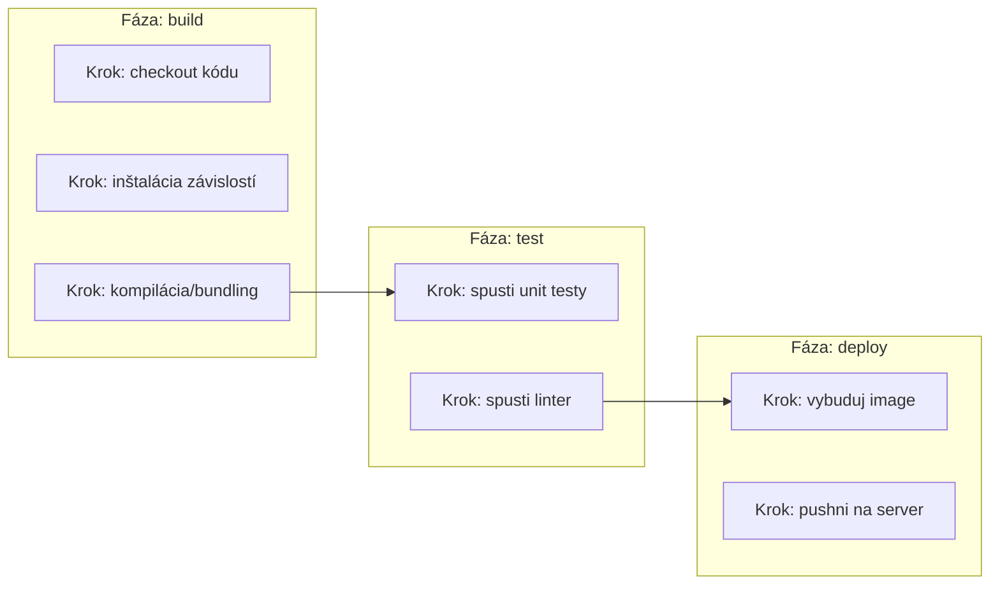

# Koncept Pipeline

**Pipeline** je konkrétna, automatizovaná sekvencia krokov, ktorú CI/CD tooling naozaj spúšťa —
zvyčajne definovaná ako konfiguračný súbor commitnutý priamo do repozitára, takže definícia
pipeline je verzovaná priamo popri kóde, ktorý buildne a testuje.

## Pipeline ako kód

```yaml title="Minimálna pipeline, v syntaxi podobnej GitHub Actions"
name: CI
on: [push]

jobs:
  build-and-test:
    runs-on: ubuntu-latest
    steps:
      - uses: actions/checkout@v4
      - run: npm install
      - run: npm run build
      - run: npm test
```

Definovanie pipeline takto — ako súbor v repozitári, nie poskladané v nejakom externom UI —
znamená:

- **Je verzovaná** — zmena pipeline je bežný commit/PR, recenzovateľná rovnako ako akákoľvek
  zmena kódu, s plnou históriou toho, kto čo a prečo zmenil.
- **Je reprodukovateľná** — ktokoľvek si vie prečítať presné kroky, ktoré bežia, namiesto
  dôverovania aktuálnej (a možno nezdokumentovanej) konfigurácii externého systému.
- **Cestuje s kódom** — checkout starého commitu ti dá pipeline, ktorá naozaj bežala pre tento
  commit, nie dnešnú verziu.

## Slovník: fázy, joby, kroky

Terminológia sa medzi platformami mierne líši, ale koncepty sú konzistentné:

```text
Pipeline
 └─ Fáza (alebo "job")   — logická fáza, napr. "build," "test," "deploy"
     └─ Krok               — jeden príkaz alebo akcia v rámci tejto fázy
```



[Fázy a Joby](../04-pipeline-design/stages-and-jobs.md) pokrýva, ako fázy medzi sebou súvisia
(sekvenčne vs. paralelne) podrobnejšie.

## Behy pipeline sú spustené, nie vždy manuálne

Pipeline nebeží kontinuálne — beží ako reakcia na konkrétne **triggery** (push, naplánovaný čas,
manuálne kliknutie na tlačidlo). Pozri [Triggery a Eventy](./triggers-and-events.md) pre bežné
typy triggerov a na čo je každý naozaj určený.

## Čo beh pipeline naozaj produkuje

Minimálne výsledok pass/fail — ale zvyčajne viac:

- **Logy** — plný výstup každého kroku, nevyhnutný na debugovanie zlyhania.
- **Artefakty** — súbory produkované pipeline, ktoré sa oplatí ponechať (vybudovaný binárny súbor,
  test coverage report) — pozri [Artefakty](../02-build-and-test/artifacts.md).
- **Status checky** — viditeľný pass/fail signál, často blokujúci merge PR, kým nie je zelený.

## Čítanie statusu pipeline

```bash
# koncepčne, bez ohľadu na platformu:
✅ build-and-test    2m 14s
✅ lint                 34s
❌ deploy                — zlyhal na kroku "push to server"
```

Zlyhaná pipeline by mala byť diagnostikovateľná len z logov vo veľkej väčšine prípadov — pipeline,
ktorej zlyhania rutinne vyžadujú hádanie alebo lokálnu reprodukciu na pochopenie, je zvyčajne znak,
že samotná pipeline potrebuje lepšie logovanie alebo jasnejšie oddelenie krokov.
