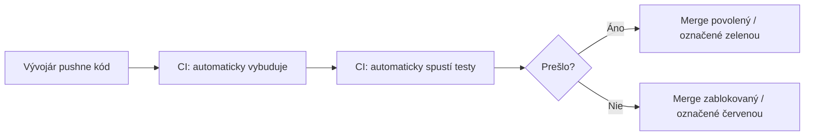
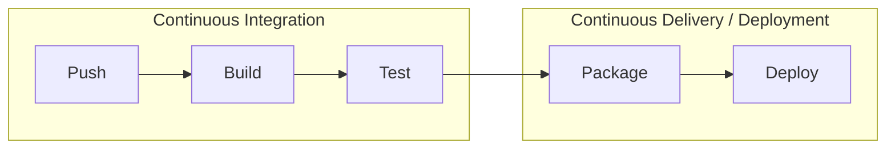

# Čo je CI/CD

**CI/CD** je skratka pre dve súvisiace, ale odlišné praxe: **Continuous Integration** a
**Continuous Delivery** (alebo **Deployment**) — automatizácia cesty od zmeny kódu k tomu, aby
táto zmena bežala niekde reálne, s ľuďmi kontrolujúcimi výsledky namiesto ručného vykonávania
každého kroku.

## Continuous Integration (CI)

Prax zlučovania zmien kódu do zdieľanej vetvy **často** (ideálne viackrát denne), s automatizovaným
procesom, ktorý každú zmenu okamžite overí — vybuduje ju, spustí testy, skontroluje zjavné
problémy.

Základná myšlienka predchádza akémukoľvek konkrétnemu nástroju: zachytiť integračné problémy (dve
zmeny od rôznych ľudí sa konfliktujú, zmena rozbije niečo iné) **rýchlo**, kým je kontext čerstvý,
namiesto objavenia o týždne neskôr, keď sa naraz skombinuje veľká dávka zmien.

## Continuous Delivery vs. Continuous Deployment

Oboje rozšíri CI o jeden krok navyše — automatizujú, čo sa deje *po* prejdení testov — ale
zastavia sa na rôznych bodoch:

- **Continuous Delivery** — každá zmena, ktorá prejde CI, je automaticky pripravená na release
  (vybudovaná, zabalená, pripravená na odoslanie), ale **človek explicitne rozhodne**, kedy ju
  naozaj nasadiť.
- **Continuous Deployment** — každá zmena, ktorá prejde CI, sa **automaticky nasadí** do produkcie,
  bez akéhokoľvek manuálneho schvaľovacieho kroku.

Rozlíšenie je podrobne pokryté v
[Continuous Delivery vs. Deployment](../03-deployment-strategies/continuous-delivery-vs-deployment.md)
— je to naozaj bežný bod zmätku, keďže oboje sa bežne (a voľne) nazýva "CD."

## Celkový obraz

"CI/CD pipeline" sa vzťahuje na celý tento automatizovaný reťazec — pozri
[Koncept Pipeline](./the-pipeline-concept.md) pre to, čo pipeline naozaj je ako konkrétny
artefakt (zvyčajne YAML konfiguračný súbor), nie len abstraktná myšlienka.

## Prečo na tom záleží nad rámec "automatizácia je fajn"

- **Rýchlejší feedback** — pokazený build alebo zlyhaný test sa zachytí za minúty, nie objaví
  spoluhráčom, ktorý stiahne pokazený kód o hodiny alebo dni neskôr.
- **Nižšie rizikové releasy** — nasadenie malých, častých zmien je bezpečnejšie než nasadenie
  obrovskej dávky nahromadených zmien naraz, lebo ak sa niečo rozbije, na podozrenie je oveľa
  menšia sada nedávnych zmien.
- **Odstraňuje manuálne, chybové kroky** — človek spúšťajúci ten istý 8-krokový deploy checklist
  nakoniec omylom preskočí krok; pipeline spustí rovnaké kroky identicky úplne zakaždým.

## Poznámka k rozsahu tejto témy

Táto téma pokrýva CI/CD ako všeobecnú prax a sadu konceptov — myšlienky platia bez ohľadu na to,
ktorý konkrétny nástroj ich spúšťa (GitHub Actions, GitLab CI, Jenkins, CircleCI, a ďalšie
implementujú rovnaké podkladové koncepty rôzne). Pozri
[Nástroje a Platformy](../06-tools-and-platforms/github-actions-basics.md) tam, kde je konkrétna
platforma pokrytá konkrétne.
