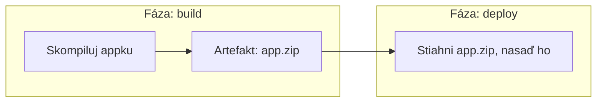

# Artefakty

**Artefakt** je súbor (alebo sada súborov), ktorú pipeline produkuje a ktorú sa oplatí ponechať
po skončení behu — vybudovaný binárny súbor, skompilovaný bundle, test report, container image.

## Prečo artefakty existujú ako koncept

Každá fáza pipeline zvyčajne beží vo vlastnom **čerstvom, izolovanom prostredí** (pozri
[Fázy a Joby](../04-pipeline-design/stages-and-jobs.md)) — nič z build fázy nie je automaticky
dostupné v deploy fáze, pokiaľ to nie je explicitne odovzdané ďalej. Artefakty sú tento explicitný
mechanizmus odovzdávania.



## Nahrávanie a sťahovanie

```yaml
jobs:
  build:
    steps:
      - run: npm run build
      - uses: actions/upload-artifact@v4
        with:
          name: dist
          path: dist/

  deploy:
    needs: build
    steps:
      - uses: actions/download-artifact@v4
        with:
          name: dist
          path: dist/
      - run: ./deploy.sh dist/
```

Joby `build` a `deploy` by tu mohli dokonca bežať na úplne rôznych počítačoch — mechanizmus
artefaktov je to, čo premostí túto medzeru, namiesto predpokladu zdieľaného stavu súborového
systému medzi fázami.

## Bežné veci považované za artefakty

```text
- Skompilovaný binárny súbor alebo bundlovaný frontend build
- Container image (aj keď sa často rieši cez push do registry namiesto toho — pozri sekciu
  Budovanie a Tagovanie Image v téme Docker)
- Reporty výsledkov testov (pozri Spúšťanie Testov v CI)
- Reporty pokrytia kódu
- Vygenerovaná dokumentácia
- Build logy, pre čokoľvek nezachytené v štandardnom log výstupe
```

## Retencia artefaktov

```yaml
- uses: actions/upload-artifact@v4
  with:
    name: dist
    path: dist/
    retention-days: 7
```

Artefakty sa predvolene na väčšine platforiem neuchovávajú navždy — retenčná doba vyvažuje "drž to
dosť dlho, aby to bolo užitočné na debugovanie nedávneho problému" oproti neobmedzenému rastu
úložiska. Krátkodobý build artefakt (používaný len na odovzdanie medzi fázami toho istého behu)
typicky potrebuje oveľa menšiu retenciu než release artefakt určený na neskoršie stiahnutie.

## Artefakty vs. registry/package repozitár

Pre čokoľvek určené na verzovanie, objaviteľnosť, a znovupoužitie naprieč mnohými samostatnými
behmi pipeline (Docker image, npm balík) je zvyčajne lepšou voľbou skutočný registry než vlastné
úložisko artefaktov pipeline:

```text
Artefakt pipeline:   krátkodobý, obmedzený na jeden beh pipeline, hlavne na odovzdanie medzi
                       fázami toho istého behu
Registry/balík:         dlhodobý, verzovaný, nezávisle stiahnuteľný/inštalovateľný čímkoľvek,
                          nielen pipeline, ktorá ho vyprodukovala
```

[Budovanie a Tagovanie Image](/sk/study-materials/docker/images-and-dockerfiles/building-and-tagging-images)
v téme Docker pokrýva presne toto rozlíšenie pre container image konkrétne — pushnuté do registry
(Docker Hub, GHCR), nie len nahrané ako artefakt pipeline.
