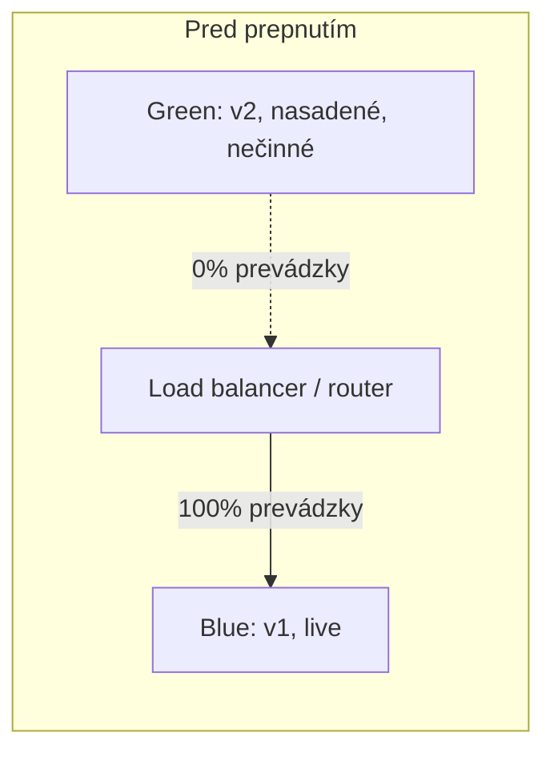
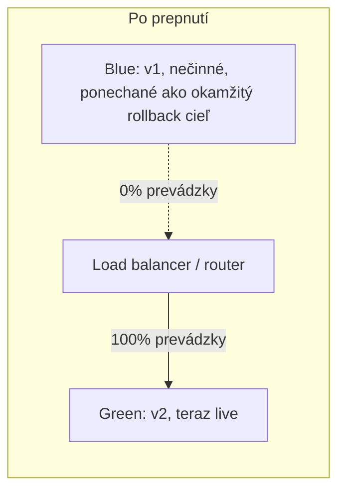
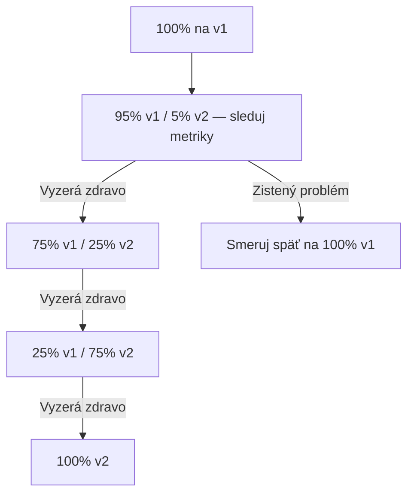

# Blue-Green a Canary Nasadenia

Dve rôzne stratégie **ako** nová verzia naozaj nahradí starú v produkcii — oboje mieria na rovnaký
cieľ (vyhnúť sa tvrdému, riskantnému prepnutiu), cez naozaj odlišné mechanizmy.

## Blue-green nasadenie

Beží **dve kompletné, identické produkčné prostredia** — "blue" (aktuálne live) a "green" (nová
verzia) — a prepne prevádzku z jedného na druhé naraz, na úrovni smerovania.

- **Prepnutie je okamžité** — jedna zmena smerovania prepne celú prevádzku z blue na green.
- **Rollback je rovnako okamžitý** — ak má green problém, prepni router späť na blue, ktorý nikdy
  neprestal bežať.
- **Cena**: vyžaduje beh dvoch plných produkčných prostredí súčasne, aspoň počas prechodu —
  zmysluplne viac infraštruktúry než jedno prostredie.

## Canary nasadenie

Smeruj **malé percento** reálnej prevádzky na novú verziu najprv, sleduj problémy, potom postupne
zvyšuj toto percento, kým nedosiahne 100% — pomenované podľa historickej praxe používania kanárikov
na detekciu nebezpečenstva skôr, než dosiahlo baníkov.

- **Vystavenie je postupné a obmedzené** — skutočný problém v novej verzii ovplyvní malú časť
  používateľov najprv, nie všetkých naraz.
- **Vyžaduje skutočnú infraštruktúru na delenie prevádzky** — load balancer alebo service mesh
  schopný smerovať presné percento požiadaviek na každú verziu, plus monitoring dostatočne citlivý
  na skutočné zachytenie problému v tom malom canary výseku pred ďalším rolloutom.
- **Pomalšie** — dosiahnutie 100% rolloutu trvá zámerne dlhšie, podľa dizajnu, na rozdiel od
  okamžitého prepnutia blue-green.

## Vedľa seba

| | Blue-Green | Canary |
|---|---|---|
| Presun prevádzky | Naraz | Postupne, percentuálne |
| Náklady na infraštruktúru | Dve plné prostredia | Schopnosť delenia prevádzky, nie nutne 2x infra |
| Rýchlosť rollbacku | Okamžitá (prepni späť) | Rýchla, ale canary už ovplyvnila nejakých reálnych používateľov |
| Zachytí problémy pred... | Plným prepnutím prevádzky (binárne: funguje alebo nie) | Dosiahnutím 100% používateľov (postupné vystavenie) |
| Zložitosť | Jednoduchšie smerovanie, viac infra | Zložitejšie smerovanie/monitoring, menej duplikácie infra |

## Ani jedno nenahradí dobrú schopnosť rollbacku

Oboje stratégie znižujú riziko počas samotného *rolloutu*, ale ani jedno nenahradí solídny plán
na to, čo sa deje, keď sa problém zachytí — pozri [Vrátenie Zmien](./rollbacks.md) pre presne
tento kúsok, ktorý platí bez ohľadu na to, ktorá rollout stratégia ťa tam doviedla.
