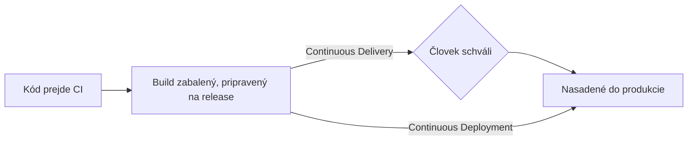

# Continuous Delivery vs. Deployment

[Čo je CI/CD](../01-basics/what-is-ci-cd.md) toto rozlíšenie krátko predstavilo — táto stránka
ide hlbšie, lebo tieto dva termíny sa používajú zameniteľne oveľa častejšie, než by podkladové
praxe naozaj zodpovedali.

## Jediný skutočný rozdiel: kto stlačí spúšť



- **Continuous Delivery** — každá zmena, ktorá prejde CI, je automaticky vybudovaná a pripravená
  na release, ale človek explicitne klikne "deploy." Automatizácia sa zastaví jeden krok pred
  produkciou.
- **Continuous Deployment** — tá istá zmena ide priamo do produkcie bez akéhokoľvek manuálneho
  gate, v momente, keď prejde CI.

Oboje sa bežne (a voľne) skracuje na "CD" — samotné písmeno ti nepovie, ktoré tím myslí, čo je
presne dôvod, prečo toto rozlíšenie ľudí zaskočí v konverzácii.

## Prečo by si tím vybral delivery pred deployment

- **Regulačné alebo compliance požiadavky** — niektoré odvetvia vyžadujú zdokumentovaný ľudský
  súhlas pred produkčnými zmenami, čo robí plné continuous deployment nemožné bez ohľadu na
  technickú pripravenosť.
- **Koordinované releasy** — zmena, ktorá musí ísť von spolu s marketingovým oznámením, review v
  mobile app store, alebo závislou zmenou iného tímu, profituje zo zámerného release momentu
  namiesto odoslania v momente, keď je pripravená.
- **Budovanie dôvery** — tím novší v automatizovanom nasadzovaní často začína s delivery
  (automatizácia buildu, manuálne deploy tlačidlo) a postupne prejde na plné deployment, akonáhle
  sa etabluje dôvera v pokrytie testami pipeline.

## Prečo by si tím vybral plné deployment

- **Rýchlosť** — celý zmysel odstránenia manuálneho gate: fix alebo feature sa dostane k
  používateľom za minúty, nie kedykoľvek si niekto ďalší spomenie kliknúť na deploy.
- **Odstráni ľudské úzke hrdlo** — vyžadované manuálne schválenie, ktoré sa stane rutinnou
  formalitou, poskytuje malú reálnu bezpečnosť, pritom stále spomaľuje každý release.
- **Vynúti naozaj silné automatizované testovanie** — tím nemôže zodpovedne nasadiť každý
  prechádzajúci commit priamo do produkcie bez úplnej dôvery vo vlastnú testovaciu sadu, čo tlačí
  na skutočnú investíciu do kvality testov namiesto spoliehania sa na manuálny review ako
  bezpečnostnú sieť.

## Feature flagy — oddelenie deploy od release

Technika, ktorá robí plné continuous deployment oveľa menej rizikové: odošli kód do produkcie za
**feature flagom**, predvolene vypnutým, takže *nasadenie* kódu a *vydanie* funkcie používateľom
sa stanú dvoma samostatnými, nezávisle ovládateľnými udalosťami.

```text
1. Nasaď novú funkciu, flag VYPNUTÝ        — kód je live v produkcii, ale neaktívny/neviditeľný
2. Zapni flag len pre interný tím           — over v produkcii so skutočnou infraštruktúrou
3. Zapni flag pre 5% používateľov             — canary-štýl postupný rollout (pozri Blue-Green a Canary)
4. Zapni flag pre všetkých                      — plný release, žiadny nový deploy netreba
```

Toto znamená, že pokazený deploy a pokazená *funkcia* sa stanú oddeliteľnými problémami — vrátenie
pokazenej funkcie je prepnutie flagu (okamžité), nie nutne vrátenie celého deployu (pozri
[Vrátenie Zmien](./rollbacks.md)).

## Ani jedno nie je striktne "vyspelejšie" než druhé

Continuous deployment sa často prezentuje ako aspiratívny konečný stav, ale continuous delivery so
zámerným ľudským gate je úplne legitímna, trvalá voľba pre mnohé tímy a kontexty — správna
odpoveď závisí od toho, čo sa naozaj odosiela a koho ovplyvní, ak sa to pokazí, nie rebríček
vyspelosti, po ktorom má vyliezť každý tím.
