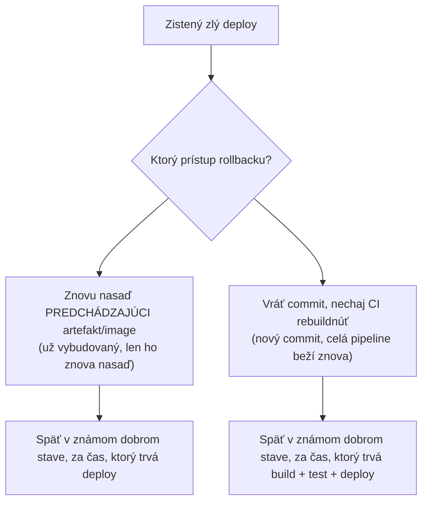

# Vrátenie Zmien

Akokoľvek opatrná rollout stratégia (pozri [Blue-Green a Canary](./blue-green-and-canary.md)),
niečo sa nakoniec nasadí pokazené. **Rollback** je to, ako sa tím rýchlo vráti do známeho dobrého
stavu — a najrýchlejšia správna voľba nie je vždy prvá, ktorá príde na um.

## Dva zásadne odlišné prístupy

- **Znovu nasaď predchádzajúci artefakt** — ak výstup buildu predchádzajúcej verzie (tag container
  image, skompilovaný binárny súbor) ešte niekde existuje, jeho opätovné nasadenie je často
  najrýchlejšia cesta späť — žiadny rebuild, žiadne opätovné spustenie testovacej sady, len
  opätovné spustenie deploy kroku voči už overenému výstupu.
- **Vráť commit a nechaj CI rebuildnúť** — `git revert` pokazeného commitu (pozri
  [Vracanie Zmien](/sk/study-materials/git/history-and-fixes/undoing-changes) v téme Git), pushni,
  a nechaj celú pipeline bežať znova od nuly. Čistejšie z pohľadu histórie verzií, ale pomalšie —
  celý cyklus build-test-deploy beží znova.

## Prečo "len vráť commit" nie je vždy dosť rýchle

Počas aktívneho incidentu môže byť rozdiel medzi týmito dvoma prístupmi minúty vs. desiatky minút
— celá CI pipeline (build, testovacia sada, deploy) môže trvať 10-20 minút, kým sa znova dokončí,
čas, na ktorom veľmi záleží, keď je produkcia aktívne pokazená pre reálnych používateľov. Toto je
praktický argument pre udržiavanie nedávnych build artefaktov/image tagov ľahko nasaditeľných
(pozri [Artefakty](../02-build-and-test/artifacts.md)) namiesto spoliehania sa výlučne na "vráť a
rebuildni" ako jedinú cestu rollbacku.

:::note
Tieto dva prístupy sa nevylučujú — bežný reálny vzor: okamžite znovu nasaď predchádzajúci artefakt,
aby si zastavil krvácanie, potom samostatne vráť pokazený commit v gite, aby história zostala
poctivá a ďalší bežný deploy náhodou znova nezaviedol rovnaký bug.
:::

## Čo naozaj robí rollback rýchlym

- **Nemenné, otagované artefakty** — ak každý build produkuje unikátne otagovaný, uchovávaný
  artefakt (pozri [Budovanie a Tagovanie Image](/sk/study-materials/docker/images-and-dockerfiles/building-and-tagging-images)
  v téme Docker pre presne tento vzor s container image), "nasaď predchádzajúci" je jednoduchá,
  dobre pochopená operácia, nie improvizovaná pod tlakom.
- **Deploy proces, ktorý je už automatizovaný** — ak nasadenie vyžaduje rovnaké pipeline
  mašinériu v oboch smeroch, rollback je len "nasaď, ale nasmeruj na staršiu verziu" namiesto
  špeciálnej, zriedka precvičovanej procedúry.
- **Zmeny databázy/schémy potrebujú vlastný plán** — rollback, ktorý vráti len kód appky, ale
  ponechá nekompatibilnú databázovú migráciu na mieste, môže veci *zhoršiť*, nie zlepšiť. Preto sú
  spätne kompatibilné migrácie (nový stĺpec, nie premenovanie/zmazanie, kým starý kód nie je úplne
  vyradený) zámerná prax konkrétne na udržanie bezpečných rollbackov.

## Schopnosť rollbacku by mala byť precvičená, nie len predpokladaná

Procedúra rollbacku, ktorá nikdy naozaj nebola spustená pred momentom, keď je urgentne potrebná,
je sama osebe reálne riziko — rovnaký princíp ako testovanie zálohy skutočnou obnovou z nej, nie
len dôverou, že job zálohy "asi" funguje.
