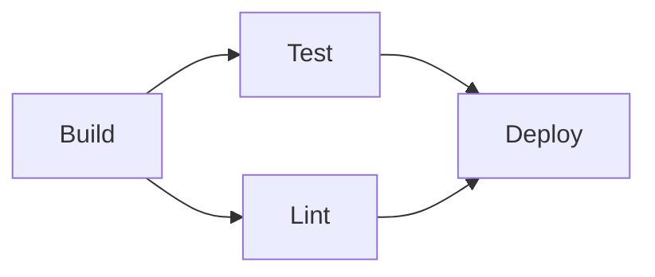
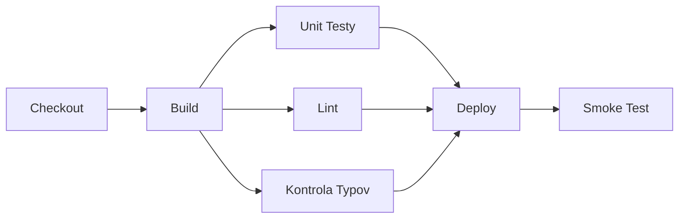

# Fázy a Joby

[Koncept Pipeline](../01-basics/the-pipeline-concept.md) krátko predstavil fázy a joby — táto
stránka pokrýva, ako medzi sebou naozaj súvisia: čo beží v poradí, čo môže bežať súčasne, a prečo
na tomto tvare záleží.

## Predvolene sekvenčné, paralelné podľa voľby

Bez explicitnej konfigurácie väčšina CI platforiem spúšťa joby sekvenčne — každý čaká na
dokončenie predchádzajúceho. Deklarovanie nezávislosti medzi jobmi je to, čo odomkne ich spustenie
paralelne namiesto toho.

```yaml
jobs:
  build:
    steps: [...]

  test:
    needs: build      # čaká na dokončenie build
    steps: [...]

  lint:
    needs: build        # TIEŽ čaká na build, ale nezávisí od test
    steps: [...]

  deploy:
    needs: [test, lint]   # čaká na dokončenie OBOCH test aj lint
    steps: [...]
```



`test` aj `lint` závisia len od `build`, nie od seba navzájom — takže akonáhle sa `build` dokončí,
bežia **súčasne**, a `deploy` čaká na dokončenie oboch. Tento tvar (jeden fan-out, jeden fan-in)
je extrémne bežný: jeden build kŕmiaci viacero nezávislých overovacích krokov, ktoré všetky musia
prejsť pred nasadením.

## Prečo deklarovať závislosti explicitne namiesto len vypísania jobov v poradí

CI platforma nespúšťa joby v poradí, v akom sú napísané v súbore — postaví skutočný graf
závislostí z `needs:` (alebo ekvivalentu platformy) a podľa toho joby naplánuje. Dva joby bez
vzťahu závislosti medzi sebou bežia automaticky paralelne, bez potreby explicitne žiadať o
paralelizmus — pozri [Paralelizácia](./parallelization.md) pre viac o zámernom využívaní tohto.

## Čo beží vnútri jedného jobu vs. naprieč jobmi

```yaml
jobs:
  build:
    steps:
      - run: npm install     # krok 1
      - run: npm run build     # krok 2, ten istý job, to isté prostredie, beží po kroku 1
```

Kroky v rámci jedného jobu bežia **sekvenčne, v jednom zdieľanom prostredí** (rovnaký súborový
systém, rovnaké nainštalované závislosti z predchádzajúcich krokov). Samostatné joby naopak
typicky bežia v **čerstvých, izolovaných prostrediach** — nič nainštalované v prostredí `build`
nie je automaticky dostupné v `test`, pokiaľ to nie je explicitne odovzdané ďalej (pozri
[Artefakty](../02-build-and-test/artifacts.md) pre tento mechanizmus odovzdávania).

## Realistický multi-stage tvar



Rozvetvenie viacerých nezávislých, rýchlych kontrol (testy, lint, kontrola typov) hneď po jednom
builde, potom opätovné zlúčenie pred deploy, je bežný vzor presne preto, lebo minimalizuje celkový
čas pipeline — najpomalšia jedna kontrola určuje, ako dlho táto fan-out fáza trvá, nie súčet
všetkých.

## Kedy nechať veci v jednom jobe vs. rozdeliť do viacerých

Príliš jemné rozdelenie pridáva réžiu (každý job typicky platí vlastnú cenu za nastavenie
prostredia — checkout kódu, opätovná inštalácia závislostí), ktorá môže prevážiť výhodu
paralelizmu pri naozaj rýchlych krokoch. Užitočné pravidlo palca: rozdeľ do samostatných jobov,
keď sú kroky dosť pomalé, alebo dosť nezávislé, že ich súčasný beh zmysluplne skráti pipeline —
nie čisto kvôli organizačnej upratanosti.
