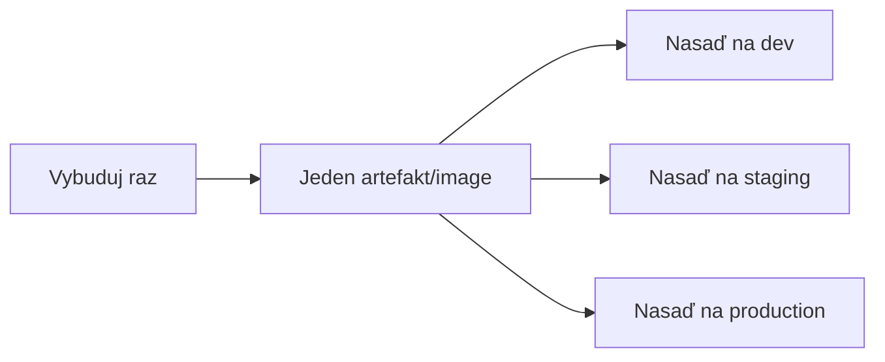

# Postup Cez Prostredia

Väčšina reálnych nastavení nasadzovania nejde priamo od "kód zlúčený" k "beží pred každým
používateľom" — build typicky prechádza sekvenciou **prostredí**, každé bližšou aproximáciou
produkcie, získavajúc dôveru pri každom kroku.

## Typický reťazec


- **Development** — zdieľané alebo per-developer prostredie, často nasadzované automaticky a
  často, používané na skoré integračné testovanie. Najnižšie stávky, ak sa niečo pokazí.
- **Staging** (niekedy nazývané pre-production) — nakonfigurované tak, aby úzko zrkadlilo
  produkciu (podobná infraštruktúra, produkčný objem/tvar dát), posledný checkpoint pred
  ovplyvnením reálnych používateľov.
- **Production** — reálni používatelia, reálne následky. Najvyššie stávky, a typicky prostredie s
  najzámernejším gatingom pred tým, než sa deploy k nemu dostane.

## Ten istý build artefakt, postupujúci — nie rebuildovaný pre každé prostredie



Zmysluplný princíp: vybuduj **raz**, potom postupuj s tým istým artefaktom cez každé prostredie,
namiesto samostatného rebuildovania pre každé. Rebuildovanie pre každé prostredie znovu zavádza
presne to riziko, ktoré má CI odstrániť — možnosť, že to, čo sa testuje na staging, nie je
bit-for-bit identické s tým, čo sa naozaj nasadí do production (iné riešenie závislostí, iná
verzia kompilátora, čokoľvek nedeterministické v builde). Pozri
[Automatizované Buildy](../02-build-and-test/automated-builds.md) pre to, prečo na determinizme
buildu záleží, a [Artefakty](../02-build-and-test/artifacts.md) pre mechanizmus, ktorý robí
"vybuduj raz, nasaď všade" praktickým.

## Konfigurácia špecifická pre prostredie

```yaml title="Koncepčne: ten istý artefakt, iná konfigurácia pre každé prostredie"
# staging
DATABASE_URL: postgres://staging-db/app
LOG_LEVEL: debug

# production
DATABASE_URL: postgres://prod-db/app
LOG_LEVEL: warn
```

To, čo sa medzi prostrediami líši, by mala byť **konfigurácia**, vložená pri deploy/za behu — nie
iný build. Toto je rovnaký mechanizmus premenných prostredia pokrytý v
[Správa Secretov v CI](./managing-secrets-in-ci.md), len aplikovaný per-prostredie: staging a
production typicky majú úplne samostatné hodnoty secretov (credential staging databázy by nikdy
nemal poskytnúť prístup k production databáze).

## Manuálne schvaľovacie gate konkrétne pre production

```yaml title="Koncepčne"
jobs:
  deploy-staging:
    steps: [...]        # beží automaticky

  deploy-production:
    needs: deploy-staging
    environment:
      name: production
      # špecifické pre platformu: vyžaduj manuálne schválenie pred pokračovaním tohto jobu
    steps: [...]
```

Bežný, zámerný stredný bod medzi plným continuous deployment a plne manuálnymi releasmi (pozri
[Continuous Delivery vs. Deployment](../03-deployment-strategies/continuous-delivery-vs-deployment.md)):
automaticky nasaď na každé prostredie až po staging, ale vyžaduj explicitné ľudské schválenie
konkrétne pre production krok — overenie sa deje automaticky, dôsledkové rozhodnutie zostáva
ľudské.

## Prečo staging musí naozaj pripomínať production

Staging prostredie, ktoré sa výrazne odlišuje od production (iný objem dát, iné dimenzovanie
infraštruktúry, chýbajúce integrácie), zachytí len podmnožinu problémov, ktoré by production
naozaj odhalila — "fungovalo to na staging" poskytuje skutočnú dôveru len úmerne tomu, ako verne
staging naozaj zrkadlí to, čo je pred ním v reťazci.
