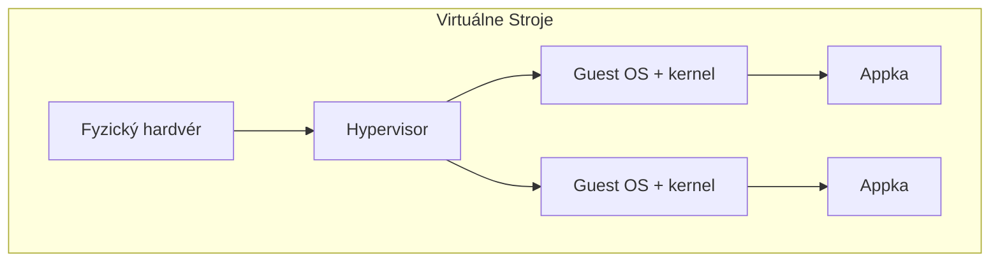
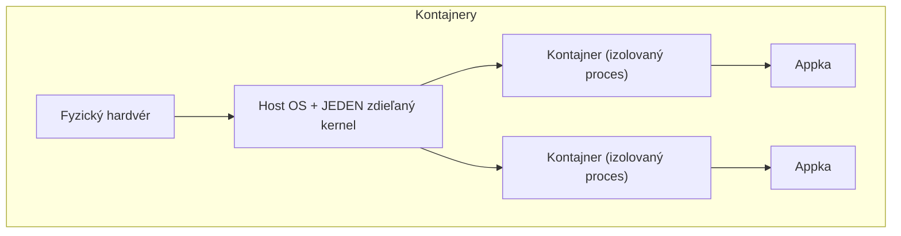

# Kontajnery vs. VM

Oboje ti umožnia bežať izolované workloady na zdieľanom hardvéri — ale na zásadne rôznych
vrstvách, s reálnymi následkami na rýchlosť, hustotu, a aký druh izolácie naozaj dostaneš.

## Kľúčový rozdiel

VM virtualizuje hardvér a beží **kompletný, samostatný operačný systém** (vlastný kernel) navrch.
Kontajner zdieľa **vlastný kernel hostiteľa** (pozri
[Čo je Kontajner](./what-is-a-container.md) pre mechanizmus namespaces/cgroups za tým) — nebootuje
sa vôbec žiadny druhý kernel.

## Čo tento rozdiel naozaj stojí a prináša

| | Virtuálny Stroj | Kontajner |
|---|---|---|
| Čas spustenia | Sekundy až minúty (bootovanie skutočného OS) | Milisekundy až pár sekúnd |
| Réžia na inštanciu | Celý OS-ov diel RAM/disku | Len appka + vlastná vrstva súborového systému |
| Sila izolácie | Veľmi silná — samostatný kernel, vynucovaná hardvérom | Slabšia — zdieľa kernel hostiteľa; kernel-level exploit môže ovplyvniť kontajnery inak než VM |
| Hustota (inštancie na hostiteľa) | Nižšia — každá je celý OS | Oveľa vyššia — tisíce ľahkých kontajnerov je realistické |
| Vie bežať iný *kernel* OS než hostiteľ | Áno (napr. Windows VM na Linux hostiteľovi) | Nie — Linux kontajner potrebuje Linux host kernel |

## Kompromis izolácie, úprimne

VM dávajú silnejšiu izoláciu, lebo hranica hypervisora je vynucovaná hardvérovými
virtualizačnými funkciami, do veľkej miery nezávislo od bezpečnosti samotného guest OS. Izolácia
kontajnera je vynucovaná samotným kernelom hostiteľa (namespaces, cgroups) — v praxi naozaj dobrá,
a ďalej spevnená nástrojmi, ktoré väčšina container runtime predvolene používa (seccomp, dropping
capabilities), ale kernel zraniteľnosť je priamejšia cesta k rozbitiu izolácie kontajnera, než
typicky býva k úniku z VM.

:::note
Toto je reálna bezpečnostná úvaha, nie len poznámka o výkone — je to časť dôvodu, prečo
multi-tenant cloudové platformy bežiace naozaj nedôveryhodné workloady od rôznych zákazníkov
často stále siahajú po izolácii na úrovni VM (alebo hybride ako Firecracker microVM), zatiaľ čo
kontajnery sú predvolená voľba na izoláciu *vlastných* dôveryhodných služieb od seba navzájom.
:::

## Prečo kontajnery vyhrali pri typickom nasadzovaní appiek

Pre beh služieb vlastnej appky (webová appka, databáza, background worker) — workloady, ktorým
dôveruješ, ktoré nepotrebujú bežať iný kernel — rýchlosť a hustota kontajnerov je jasná výhra nad
VM, bez zmysluplného oslabenia izolácie pre tento use case. Presne preto vlastné stránky tejto
organizácie bežia ako Docker kontajnery namiesto samostatných VM na stránku (pozri
[Nastavenie Kontajnerov Tejto Organizácie](../06-production-practices/this-orgs-container-setup.md))
— viacero izolovaných služieb na jednom VPS, bez réžie bootovania celého OS na stránku.
