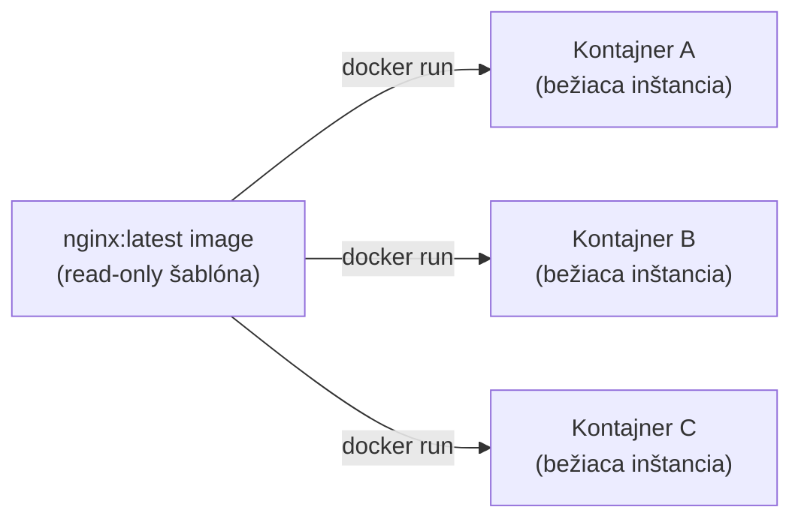
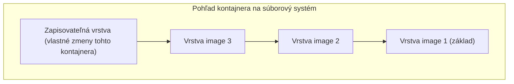

# Image vs. Kontajnery

Najdôležitejšie rozlíšenie, ktoré treba mať jasné pred čímkoľvek iným v tejto téme.

## Analógia trieda/inštancia

**Image** je read-only šablóna — snapshot súborového systému plus metadáta (aký príkaz spustiť,
aké porty očakáva, predvolené premenné prostredia). **Kontajner** je bežiaca (alebo zastavená)
*inštancia* vytvorená z image, s vlastnou zapisovateľnou vrstvou navrch.



Ten istý image môže zrodiť ľubovoľný počet nezávislých kontajnerov — presne ako sa trieda dá
inštanciovať mnohokrát, každá inštancia s vlastným stavom, ale zdieľajúca rovnakú podkladovú
definíciu.

## Vidieť to priamo

```bash
docker images                # vypíš image na tomto počítači — šablóny
docker ps -a                   # vypíš kontajnery — každú inštanciu z nich niekedy vytvorenú, bežiacu alebo nie
```

```bash
docker run --name web1 -d nginx
docker run --name web2 -d nginx
docker ps
# web1 a web2 — dva samostatné kontajnery, oba z toho istého nginx image
```

## Čo sa medzi nimi mení

- **Image sú nemenné** — nikdy priamo "neupravíš" image; vybuduješ *nový* image z Dockerfile
  (pozri [Základy Dockerfile](../02-images-and-dockerfiles/dockerfile-basics.md)).
- **Kontajnery sú predvolene efemérne** — akýkoľvek súbor, ktorý kontajner zapíše počas behu, žije
  len vo vlastnej zapisovateľnej vrstve tohto kontajnera. Zmaž kontajner (`docker rm`), a táto
  vrstva je preč — image, z ktorého vznikol, zostáva úplne nedotknutý. Presne preto
  [Perzistencia Dát](../04-networking-and-storage/data-persistence.md) potrebuje volumes pre
  čokoľvek, čo musí prežiť opätovné vytvorenie kontajnera.

## Zapisovateľná vrstva kontajnera



Všetko pod zapisovateľnou vrstvou je zdieľané, read-only, a identické naprieč každým kontajnerom
vytvoreným z tohto image — preto je spustenie nového kontajnera takmer okamžité (nič nekopírovať,
len pridať novú tenkú zapisovateľnú vrstvu navrch), zatiaľ čo boot VM je porovnateľne pomalý (celý
OS sa musí skutočne spustiť). [Vrstvy Image a Caching](../02-images-and-dockerfiles/image-layers-and-caching.md)
pokrýva presne, ako sa tieto read-only vrstvy budujú a znovupoužívajú.

## Rebuild vs. reštart — bežná zámena

```bash
docker restart web1        # rovnaký kontajner, rovnaká zapisovateľná vrstva, len zastavený/spustený znova
docker rm web1 && docker run --name web1 -d nginx    # úplne nový kontajner, čerstvá zapisovateľná vrstva, vlastné dáta nginx resetnuté
```

`restart` zachová čokoľvek, čo kontajner zapísal do vlastnej vrstvy; odstránenie a opätovné
spustenie z image nie — nuansa, na ktorej veľmi záleží, akonáhle kontajner naozaj drží stav (pozri
[Volumes a Bind Mounts](../04-networking-and-storage/volumes-and-bind-mounts.md) pre správny
spôsob, ako sa vyhnúť spoliehaniu na túto vrstvu pre čokoľvek dôležité).
