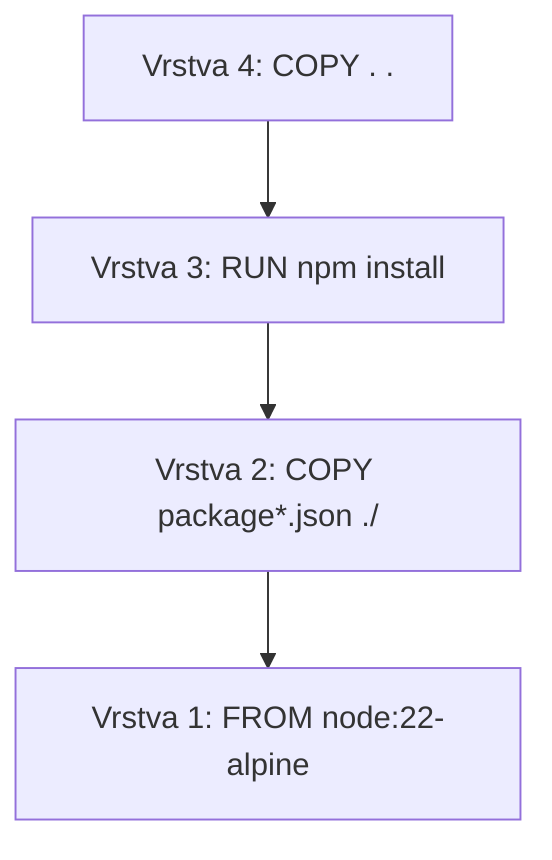
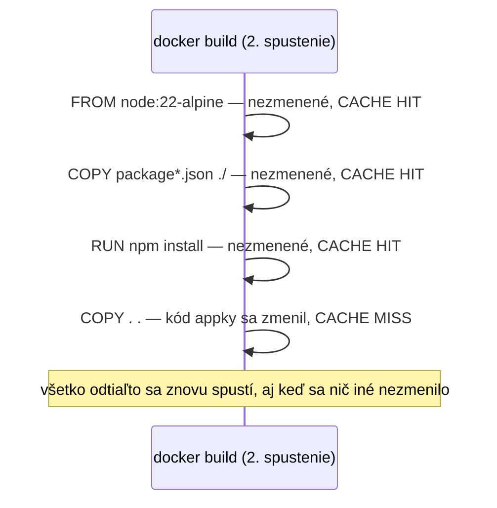

# Vrstvy Image a Caching

Každá inštrukcia v Dockerfile, ktorá mení súborový systém (`FROM`, `RUN`, `COPY`, `ADD`),
produkuje novú, **nemennú vrstvu** naskladanú na tú predchádzajúcu. Pochopenie tohto je to, čo
robí poradie inštrukcií Dockerfile skutočným výkonnostným rozhodnutím, nie len štýlom.

## Vrstvy, vizuálne



Každá vrstva ukladá len *diff* voči vrstve pod ňou — `docker history` (pozri
[Budovanie a Tagovanie Image](./building-and-tagging-images.md)) ukáže presne, čo každá vrstva
pridala a aká je veľká.

## Build cache

Docker cachuje každú vrstvu, kľúčovanú jej inštrukciou **a** jej vstupmi. Pri rebuilde, ak sú
inštrukcia a vstupy vrstvy nezmenené, Docker znovupoužije cachovanú vrstvu namiesto jej
opätovného vykonania — a kriticky, **každá vrstva po prvej zmenenej sa tiež invaliduje**, aj keď
sa tieto neskoršie inštrukcie samotné nezmenili.



Toto je presne *prečo* [Základy Dockerfile](./dockerfile-basics.md) odporúča skopírovať
`package.json` a spustiť `npm install` **pred** kopírovaním zvyšku appky — kód appky sa mení
oveľa častejšie než závislosti, takže udržanie drahého, zriedka sa meniaceho kroku `npm install`
skoro znamená, že zostáva cachovaný naprieč väčšinou rebuildov.

## Konkrétne pred/po

```dockerfile title="❌ Poradie nepriateľské voči cache"
FROM node:22-alpine
WORKDIR /app
COPY . .              # AKÁKOĽVEK zmena súboru invaliduje všetko pod týmto riadkom
RUN npm install          # znovu sa spustí pri každej jednej zmene kódu, aj jednoriadkovej CSS úprave
CMD ["node", "server.js"]
```

```dockerfile title="✅ Poradie priateľské voči cache"
FROM node:22-alpine
WORKDIR /app
COPY package*.json ./     # invaliduje sa len keď sa naozaj zmenia závislosti
RUN npm install
COPY . .                    # zmeny kódu appky pristávajú tu, npm install zostáva cachovaný
CMD ["node", "server.js"]
```

Rovnaký finálny image, dramaticky iná rýchlosť rebuildu v bežnom dennodennom vývoji.

## Vynútenie čistého rebuildu

```bash
docker build --no-cache -t my-app:latest .
```

Užitočné, keď podozrievaš, že zastaraná cachovaná vrstva maskuje reálny problém (napr. základný
image bol aktualizovaný upstream, ale cachovaná vrstva to nevie) — normálny vývoj by toto
pravidelne nemal potrebovať, keďže caching má byť transparentný a korektný.

## Multi-stage buildy — zámerné znovupoužitie tohto istého mechanizmu

Layer caching je tiež základom multi-stage buildov (pozri
[Dockerfile Best Practices](../06-production-practices/dockerfile-best-practices.md)) — budovanie
v jednej fáze, potom skopírovanie len potrebného *výstupu* do štíhlejšej finálnej fázy, úplne
zahodiac vrstvy nástrojov na build zo samotného finálneho image.
