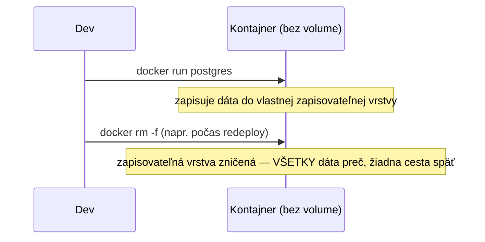
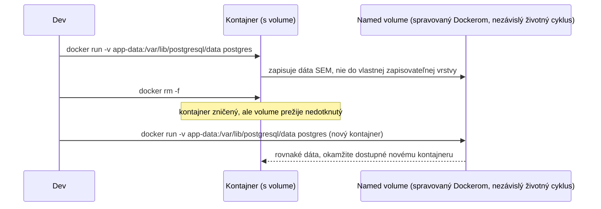

# Perzistencia Dát

Spája [Image vs. Kontajnery](../01-basics/images-vs-containers.md) a
[Volumes a Bind Mounts](./volumes-and-bind-mounts.md) do jedného pravidla, na ktorom v praxi
naozaj záleží: **nikdy sa nespoliehaj na vlastnú zapisovateľnú vrstvu kontajnera pre čokoľvek, čo
si potrebuješ ponechať.**

## Prečo sú kontajnery predvolene efemérne

Zapisovateľná vrstva kontajnera (pozri
[Image vs. Kontajnery](../01-basics/images-vs-containers.md)) existuje len tak dlho, ako existuje
tento konkrétny kontajner. Jej odstránenie — zámerne cez `docker rm`, alebo ako súčasť rutinného
redeploy, ktorý znovu vytvorí kontajner z nového image — úplne zahodí túto vrstvu, bez upozornenia
a bez undo.



Toto je zámer, nie bug — presne toto robí kontajnery lacné na znovuvytvorenie, zbúranie, a
redeploy bez hromadenia smetí. Cena je, že čokoľvek má *pretrvávať*, musí byť explicitne
nasmerované, aby žilo niekde inde.

## Oprava: pripoj volume pre čokoľvek, čo musí prežiť



Životný cyklus dát sa stane nezávislým od akéhokoľvek *konkrétneho* kontajnera — volume môže
prežiť mnoho znovuvytvorení kontajnera, presne ako sa od redeploy očakáva, že bude fungovať.

## Čo naozaj potrebuje volume

```text
Potrebuje volume:
  - Dátový priečinok databázy (postgres, mysql, redis so zapnutou perzistenciou)
  - Súbory nahrané používateľom, ak sú uložené na disku namiesto externého object store
  - Akýkoľvek stav appky, ktorý musí prežiť redeploy

Nepotrebuje ho:
  - Bezstavový web server alebo API — čokoľvek, čo "zapisuje" (logy, dočasné súbory), by malo ísť
    na stdout/stderr (pozri Exec, Logy a Inspect) alebo byť naozaj zahoditeľné
  - Build artefakty produkované čerstvo pri každom builde image
```

Naozaj bezstavová služba *má* stratiť všetko vo vlastnej zapisovateľnej vrstve pri
reštarte/redeploy — je to funkcia, nie niečo, čomu treba predchádzať. V momente, keď služba
potrebuje, aby dáta prežili znovuvytvorenie, je to signál, že potrebuje volume, nie že kontajnery
sú nejako "nespoľahlivé" na ukladanie.

## Bežná reálna chyba

```bash
❌ docker run postgres        # bez volume — každý redeploy potichu vymaže celú databázu
✅ docker run -v pg-data:/var/lib/postgresql/data postgres
```

Presne táto chyba — zabudnutie volume na databázovom kontajneri — je jedna z najbežnejších, a
najbolestivejších, Docker chýb: všetko funguje fajn v testovaní (kontajner sa jednoducho nikdy
neodstránil), kým prvý reálny redeploy potichu nezničí produkčné dáta bez akejkoľvek chyby vôbec,
lebo z pohľadu Dockeru sa nič nepokazilo — urobil presne to, o čo `docker rm` žiada.
