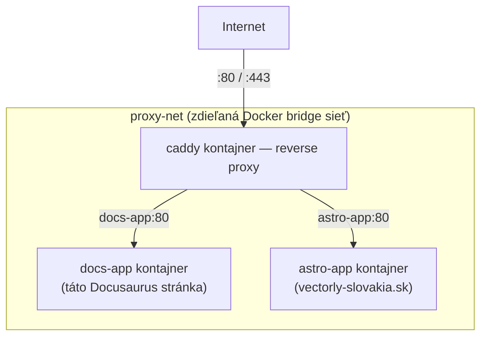

# Compose vo Vlastnom Deploy Tejto Organizácie

Všetko z tejto sekcie Docker Compose, aplikované na reálny deploy pipeline — pozri
[`/sk/internal-operations/server-architecture`](/sk/internal-operations/server-architecture) a
[`/sk/internal-operations/git-workflow`](/sk/internal-operations/git-workflow) pre plný zdroj
pravdy, ktorý táto stránka zhŕňa.

## Skutočný deploy príkaz

Táto docs stránka aj hlavná marketingová stránka sú nasadzované s rovnakým základným krokom:

```bash
docker compose up -d --build
```

— presne [rebuild príkaz](./compose-basics.md) pokrytý skôr v tejto sekcii, spustený GitHub
Actions workflow cez SSH po pripojení na VPS (pozri
[Základy SSH](/sk/study-materials/networking/ssh/ssh-basics) v téme Siete pre to, ako toto
pripojenie samotné funguje).

## Tvar skutočného nastavenia



Každá stránka je **vlastný** Compose projekt, vo vlastnom deploy priečinku
(`/opt/vectorly-docs`, `/opt/vectorly-main-site`) s vlastným `docker-compose.yml` a vlastným
GitHub Actions workflow — nie jeden obrovský Compose súbor pre všetko. Zdieľajú tú istú externú
sieť `proxy-net` (deklarovanú `external: true` — pozri
[Základy Docker Networkingu](/sk/study-materials/networking/practical-setups/docker-networking-basics)
v téme Siete pre presne to, čo to znamená a prečo), čo je to, čo umožňuje Caddy dosiahnuť aj
`docs-app` aj `astro-app` podľa mena napriek tomu, že sú to úplne samostatné Compose projekty,
nasadzované nezávisle.

## Prečo samostatné Compose projekty namiesto jedného zdieľaného súboru

- Každá stránka sa nasadzuje **nezávisle** — push do `vectorly-docs` spustí len workflow tejto
  stránky a rebuildne len `docs-app`, bez toho, aby sa dotkol alebo reštartoval nesúvisiaci
  kontajner `astro-app`.
- Každá má **vlastný build pipeline a verziu Node** vhodnú pre danú konkrétnu stránku, nie
  univerzálnu zdieľanú definíciu image.
- Chyba v Compose súbore jednej stránky nemôže náhodou pokaziť deploy tej druhej.

## Čo zhruba robí `docker-compose.yml` každej stránky

```yaml title="Koncepčný tvar docker-compose.yml tejto docs stránky"
services:
  docs-app:
    build: .
    networks:
      - proxy-net
    # žiadne `ports:` publikované priamo — dostupné len cez Caddy na proxy-net,
    # pozri Porty a Sieťové Režimy pre to, čo publikovanie vs. nepublikovanie naozaj znamená

networks:
  proxy-net:
    external: true
```

Žiadne mapovanie `ports:` vôbec je tu zámerný detail — `docs-app` nikdy nemá byť dosiahnuteľný
priamo z internetu, len cez Caddy. Toto je konkrétna, reálna inštancia princípu
[Porty a Sieťové Režimy](../04-networking-and-storage/ports-and-network-modes.md), že port
kontajnera je predvolene dostupný len iným kontajnerom na jeho sieti, pokiaľ nie je explicitne
publikovaný.

## Spojenie celej Docker témy dokopy

Tento jeden deploy — `git push` → CI → `docker compose up -d --build` → Caddy smeruje podľa
hostname — sa dotkne takmer všetkého pokrytého skôr v tejto téme: image vybudovaný z
[Dockerfile](../02-images-and-dockerfiles/dockerfile-basics.md), [životný cyklus kontajnera](../03-running-containers/container-lifecycle.md)
spravovaný Compose, a [networking](../04-networking-and-storage/ports-and-network-modes.md), ktorý
zámerne udrží kontajner appky nedosiahnuteľný okrem cez reverse proxy.
