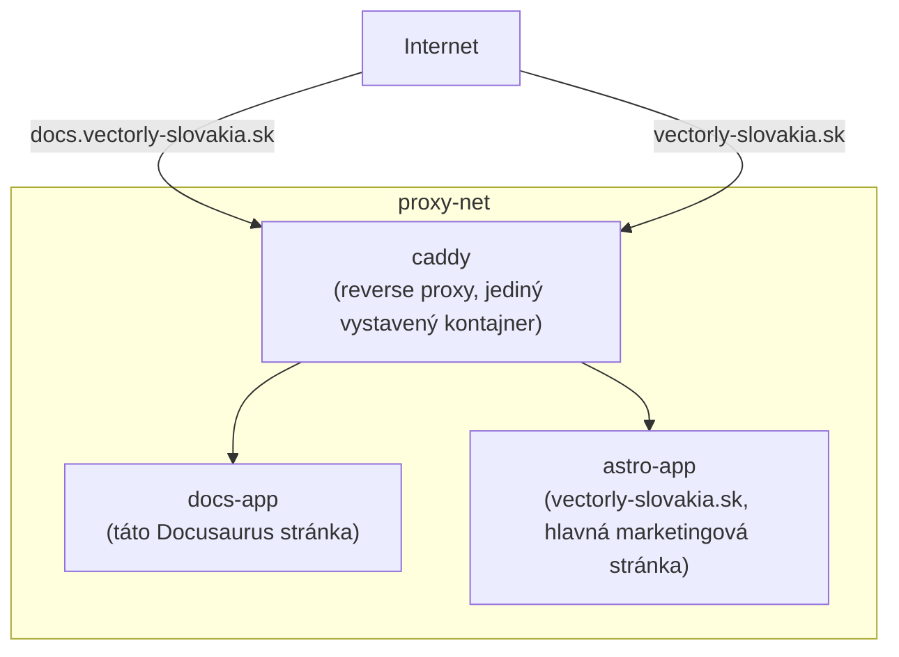
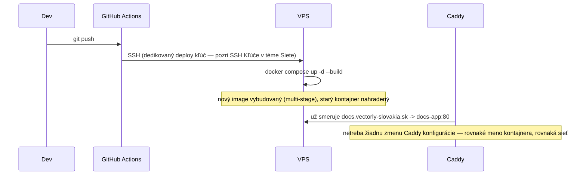

# Nastavenie Kontajnerov Tejto Organizácie

Konkrétna, end-to-end prehliadka toho, ako sa všetko z tejto Docker témy spája dokopy v reálnom
produkčnom nastavení tejto organizácie — pozri
[`/sk/internal-operations/server-architecture`](/sk/internal-operations/server-architecture) pre
autoritatívny zdroj; táto stránka je vedená prehliadka cez neho, v poradí, v akom táto téma
pokrývala koncepty.

## Infraštruktúra, na pohľad

- **Hosting**: jeden Netcup VPS (Linux, Docker) — pozri
  [Kontajnery vs. VM](../01-basics/containers-vs-vms.md) pre to, prečo viacero izolovaných stránok
  zdieľa jeden VPS cez kontajnery namiesto potreby jednej VM na každú.
- **Server user**: dedikovaný non-root používateľ (`bnovak`), nie root — pozri
  [Sudo a Root](/sk/study-materials/linux-shell/permissions-and-users/sudo-and-root) v téme Linux
  & Shell pre to, prečo je toto štandardná prax, ktorú toto nasleduje.
- **Sieť**: každá verejne dostupná služba je izolovaný kontajner pripojený k zdieľanej externej
  Docker bridge sieti, `proxy-net` — pozri
  [Porty a Sieťové Režimy](../04-networking-and-storage/ports-and-network-modes.md) pre to, čo
  "bridge sieť" naozaj znamená, a
  [Základy Docker Networkingu](/sk/study-materials/networking/practical-setups/docker-networking-basics)
  v téme Siete pre hlbšiu mechaniku tohto konkrétneho nastavenia.
- **Reverse proxy**: Caddy kontajner je jediný vstupný bod pre všetku prichádzajúcu webovú
  prevádzku, automaticky riešiaci TLS a smerujúci podľa hostname — pozri
  [Reverse Proxy](/sk/study-materials/networking/web-serving/reverse-proxies) v téme Siete.

## Dve stránky, dve nezávislé nasadenia

| | Docs portál (táto stránka) | Hlavná stránka |
|---|---|---|
| Deploy priečinok | `/opt/vectorly-docs` | `/opt/vectorly-main-site` |
| Stack | Docusaurus + Node.js 22 builder → Nginx (Alpine) runner | Astro (SSG) + Node.js 22 builder → Nginx (Alpine) runner |
| Meno kontajnera | `docs-app` | `astro-app` |
| Deploy trigger | Push na `main` | Push na `develop` |
| Extra bezpečnosť | Caddy HTTP Basic Auth (bcrypt) | — |

Oboje sleduje rovnaký vzor pokrytý v
[Dockerfile Best Practices](./dockerfile-best-practices.md): multi-stage build (Node.js builder
fáza, produkujúca statický výstup servírovaný minimálnou Nginx runner fázou) — vybudovaná stránka
je to, čo naozaj skončí vo finálnom image, nie samotný Node.js build toolchain.

## Deploy sekvencia, spájajúca každú predchádzajúcu stránku dokopy

Konfigurácia reverse proxy sa nemusí meniť pri každom deploy — smeruje na **meno kontajnera**
(`docs-app:80`) na zdieľanej sieti, nie na konkrétnu inštanciu kontajnera, takže
`docker compose up -d --build` nahradzujúce kontajner pod tým je pre smerovacie pravidlo Caddy
neviditeľné. Toto je presne prínos prístupu [Compose](../05-docker-compose/compose-in-this-orgs-deploy.md)
+ [pomenovaného networkingu](../04-networking-and-storage/ports-and-network-modes.md) pokrytého
skôr v tejto téme, aplikovaný konkrétne.

## Prečo nie sú publikované žiadne `ports:` na žiadnom kontajneri appky

Ani `docs-app` ani `astro-app` nepublikuje port priamo na hostiteľa (pozri
[Porty a Sieťové Režimy](../04-networking-and-storage/ports-and-network-modes.md)) — len Caddy to
robí. To znamená, že kontajnery appiek sú jednoducho **nedosiahnuteľné** z internetu okrem cez
Caddy, konštrukciou, nie firewall pravidlom, ktoré by sa mohlo zle nakonfigurovať — jeden z
konkrétnych, praktických prínosov pochopenia container networkingu namiesto len spúšťania
`docker run -p` na každej službe zo zvyku.
