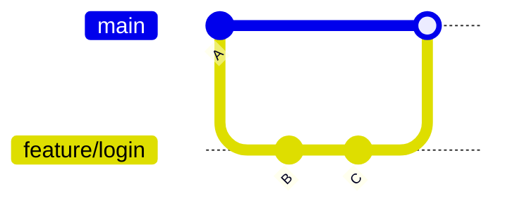
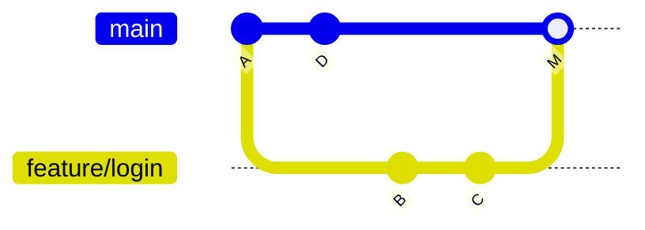

# Mergovanie

Mergovanie prenesie zmeny z jednej vetvy do druhej.

```bash
git switch main
git merge feature/login
```

Toto zlúči `feature/login` **do** vetvy, ktorú máš práve vyčekovanú (tu `main`).

## Fast-forward merge

Ak sa `main` nepohla odkedy sa `feature/login` odvetvila, Git nepotrebuje vytvárať merge commit
vôbec — jednoducho posunie ukazovateľ `main` dopredu na posledný commit `feature/login`:



Toto je **fast-forward** — `main` sa jednoducho posunie na `C`, žiadny samostatný merge commit.
História zostáva lineárna, nie je čo mergovať.

## Three-way merge

Ak sa `main` **pohla** (niekto iný pushol commity), zatiaľ čo sa pracovalo na `feature/login`, Git
vytvorí **merge commit** — commit s dvoma rodičmi, ktorý spojí obe histórie:



`M` je nový merge commit — má dvoch rodičov, `D` a `C`. Git porovná oba konce vetiev voči ich spoločnému predkovi (`A`) — "trojcestné" porovnanie — a
automaticky zlúči všetko, čo sa zmenilo len na jednej strane.

## Merge konflikty

Konflikt nastane, keď **obe** vetvy zmenili **rovnaké riadky** rovnakého súboru odlišne. Git
nevie uhádnuť, ktorú verziu chceš, tak sa zastaví a súbor označí:

```text title="file.txt po konfliktnom merge"
<<<<<<< HEAD
const timeout = 30;
=======
const timeout = 60;
>>>>>>> feature/login
```

- Všetko medzi `<<<<<<< HEAD` a `=======` je verzia **tvojej aktuálnej vetvy**.
- Všetko medzi `=======` a `>>>>>>> feature/login` je verzia **prichádzajúcej vetvy**.

Riešenie: uprav súbor ručne na to, čo *má* obsahovať, zmaž značky `<<<<<<<`/`=======`/`>>>>>>>`,
potom:

```bash
git add file.txt          # označ tento súbor ako vyriešený
git commit                 # dokončí merge (správa je predvyplnená)
```

Ak je to neporiadok a chceš začať odznova, celkom to zruš:

```bash
git merge --abort
```

## Merge vs. rebase

Merge zachová presne to, čo sa stalo (vrátane merge commitu); rebase prepíše históriu tak, aby
vyzerala lineárne. Pozri [Rebasing](./rebasing.md) pre kompromis, a
[Squash a Rebase](../05-conventions/squash-and-rebase.md) pre to, ktorý z nich tu skutočne
používame.

## Skontroluj sa

- Kedy Git spraví fast-forward merge namiesto vytvorenia merge commitu?

  <details>
  <summary>Odpoveď</summary>

  Keď sa cieľová vetva (napr. `main`) nepohla odkedy sa zlučovaná vetva od nej odvetvila — Git
  jednoducho posunie ukazovateľ dopredu, žiadny merge commit netreba.
  </details>

- Pri merge konflikte, ktorej vetvy verzia sa objaví medzi `<<<<<<< HEAD` a `=======`?

  <details>
  <summary>Odpoveď</summary>

  Verzia tvojej aktuálnej vetvy — verzia prichádzajúcej vetvy je medzi `=======` a
  `>>>>>>> <vetva>`.
  </details>

- Čo vytvorí "dvoch rodičov" merge commitu?

  <details>
  <summary>Odpoveď</summary>

  Three-way merge — Git porovná oba konce vetiev voči ich spoločnému predkovi a vytvorí commit
  spájajúci obe histórie, s každým pôvodným koncom vetvy ako rodičom.
  </details>
