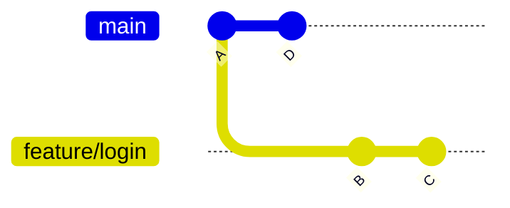
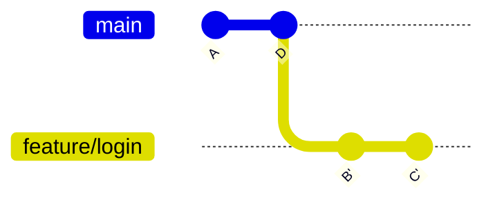

# Rebasing

Rebase vezme commity na tvojej vetve a znovu ich prehrá nad iným počiatočným bodom — zvyčajne
nad najnovším `main`.

```bash
git switch feature/login
git rebase main
```

## Ako to vyzerá vizuálne

Predtým:



Po `git rebase main`:



`B` a `C` sa stanú `B'` a `C'` — rovnaký *obsah*, nové commit hashe, pretože sa zmenil ich rodič.
Tvoja vetva teraz vyzerá, akoby bola napísaná od `D`, aj keď to tak nebolo. História pôsobí ako
jedna rovná línia namiesto tvaru rozdeľovania/spájania, ktorý produkuje merge.

## Rebase vs. merge

|  | Merge | Rebase |
|---|---|---|
| Tvar histórie | Zachová, čo sa naozaj stalo, vrátane merge commitu | Prepíše, aby vyzerala lineárne |
| Commit hashe | Nezmenené | Prepísané (nové hashe) pri každom prehratom commite |
| Bezpečné na zdieľanej vetve? | Áno, vždy | **Nie** — prepísanie commitov, ktoré si ostatní už pullli, spôsobí rozdielnu históriu pre nich |
| Vhodné pre | Zlúčenie hotovej feature do `main` | Vyčistenie / update vlastnej rozpracovanej vetvy pred jej zdieľaním |

**Pravidlo: nikdy nerebasuj vetvu, na ktorej pracujú aj iní ľudia.** Rebase prepisuje commit
hashe; ak si niekto stiahol tie staré, jeho história a tvoja si už nesedia. Rebasuj voľne len na
súkromnej feature vetve, ktorej sa dotýkaš iba ty.

## Interaktívny rebase

`rebase -i` ti umožní upraviť, preusporiadať, zlúčiť alebo zahodiť commity pred ich prehratím:

```bash
git rebase -i HEAD~3      # interaktívne prepíš posledné 3 commity
```

Otvorí sa editor so zoznamom ako:

```text
pick a1b2c3d Add login form
pick e4f5g6h Fix typo
pick h7i8j9k Add validation
```

Zmeň `pick` na:
- `reword` — ponechaj commit, uprav jeho správu
- `squash` (alebo `s`) — zlúč do **predchádzajúceho** commitu, ponechaj obe správy na úpravu
- `fixup` (alebo `f`) — zlúč do predchádzajúceho commitu, túto správu **zahoď**
- `drop` — commit úplne odstráň

Príklad — squashnutie "fix typo" commitu do predchádzajúceho:

```text
pick a1b2c3d Add login form
fixup e4f5g6h Fix typo
pick h7i8j9k Add validation
```

Výsledok: dva čisté commity namiesto troch neporiadnych. Toto je mechanizmus za
[Squash a Rebase](../05-conventions/squash-and-rebase.md) — čistenie lokálne pred zlúčením PR.

## Ak rebase konfliktuje

Rovnaké konfliktné značky ako pri merge (pozri [Mergovanie](./merging.md)). Uprav súbor, potom:

```bash
git add file.txt
git rebase --continue      # nie `git commit` — rebase si to obslúži sám
```

Alebo to celkom zruš:

```bash
git rebase --abort
```

## Skontroluj sa

- Prečo dostanú rebasnuté commity nové hashe, aj keď ich obsah je nezmenený?

  <details>
  <summary>Odpoveď</summary>

  Hash commitu závisí od jeho rodiča — rebase dá commitu iného rodiča, tak aj identický obsah
  produkuje nový hash.
  </details>

- Aké je pravidlo palca pre to, kedy je rebase bezpečný?

  <details>
  <summary>Odpoveď</summary>

  Nikdy nerebasuj vetvu, na ktorej pracujú aj iní ľudia — rebasuj voľne len na súkromnej vetve,
  ktorej sa dotýkaš iba ty, keďže prepísanie už pushnutých/pullnutých commitov rozíde tvoju
  históriu od ich histórie.
  </details>

- Pri interaktívnom rebase, aký je rozdiel medzi `squash` a `fixup`?

  <details>
  <summary>Odpoveď</summary>

  Oboje zlúčia commit do predchádzajúceho; `squash` ponechá obe commit správy na spoločnú úpravu,
  `fixup` zahodí správu zlučovaného commitu.
  </details>

- Ak rebase narazí na konflikt, spustíš po jeho oprave `git commit`?

  <details>
  <summary>Odpoveď</summary>

  Nie — spustíš `git rebase --continue`; rebase si dokončenie kroku obslúži sám.
  </details>
