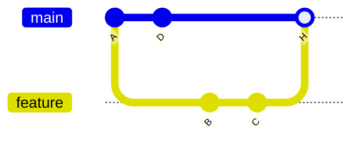
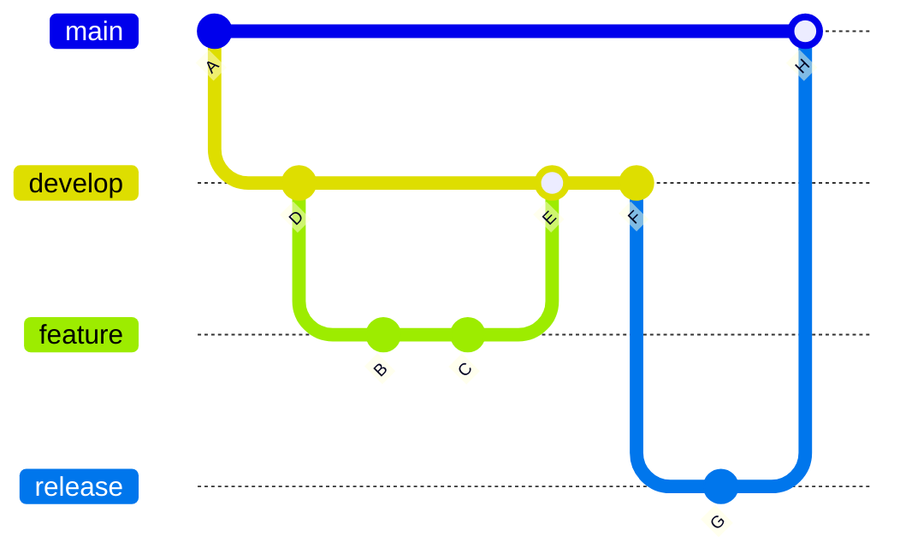

# Modely Git Workflow

"Workflow model" je len tímová dohodnutá konvencia, ako sa vytvárajú, pomenúvajú a zlučujú vetvy.
Git samotný nič z toho nevynucuje — je to proces, nie nástroj.

## Feature-branch workflow

Každý kúsok práce dostane vlastnú krátkotrvajúcu vetvu z `main`, zlúčenú späť cez PR po dokončení.

Jednoduché, funguje dobre pre malé až stredné tímy, a je to model, okolo ktorého sú postavené
väčšina nástrojov na báze PR (GitHub, GitLab).

## Trunk-based development

Podobný duch, ale tlačí na **veľmi** krátkotrvajúce vetvy (často zlúčené v ten istý deň) alebo aj
priame commitovanie do `main` za feature flagmi, aby sa predišlo dlho žijúcim vetvám, ktoré sa od
seba príliš vzdialia. Obľúbený tímami s kontinuálnym nasadzovaním.

## GitFlow

Ťažší model s dedikovanými dlhotrvajúcimi vetvami: `main` (produkcia), `develop` (integrácia),
plus `feature/*`, `release/*` a `hotfix/*` vetvy, každá s definovanými pravidlami, kam sa
zlučuje a odkiaľ vychádza.

Dáva silnú štruktúru produktom s plánovanými releasmi a viacerými verziami v prevádzke súčasne
(napr. odoslaný desktopový softvér). Zbytočne veľa pre kontinuálne nasadzovanú web appku — viac
ceremónie, než väčšina malých tímov potrebuje.

## Kompromisy na pohľad

| Model | Životnosť vetvy | Najlepší pre |
|---|---|---|
| Feature-branch | Dni | Väčšinu projektov postavených na PR |
| Trunk-based | Hodiny | Kontinuálne nasadzovanie, vysoká frekvencia commitov |
| GitFlow | Týždne+ | Plánované releasy, viacero udržiavaných verzií |

## Čo tu skutočne robíme

Pozri [`/sk/internal-operations/git-workflow`](/sk/internal-operations/git-workflow) pre reálnu
politiku tejto organizácie — odľahčený model `main` + `develop` + `feature/*` (najbližšie k
GitFlow vyššie, mínus `release/*`/`hotfix/*`), squash-mergovaný, s docs-only rýchlou cestou priamo
do `main`. Túto stránku ber ako všeobecnú teóriu, tamtú ako záväznú prax.

## Skontroluj sa

- Vynucuje Git samotný nejaký konkrétny workflow model (feature-branch, trunk-based, GitFlow)?

  

  
Odpoveď

  Nie — workflow model je čisto tímová konvencia o tom, ako sa vytvárajú a zlučujú vetvy; Git
  nemá vstavaný koncept ani jedného z nich.
  

- Ktorý workflow model uprednostňuje veľmi krátkotrvajúce vetvy alebo priame commitovanie do
  `main` za feature flagmi?

  

  
Odpoveď

  Trunk-based development.
  

- Čo tu organizácia skutočne používa, a ako sa to porovnáva s GitFlow?

  

  
Odpoveď

  Odľahčený model `main` + `develop` + `feature/*`, najbližšie k GitFlow, ale bez
  `release/*`/`hotfix/*` vetiev, squash-mergovaný s docs-only rýchlou cestou do `main`.
  

