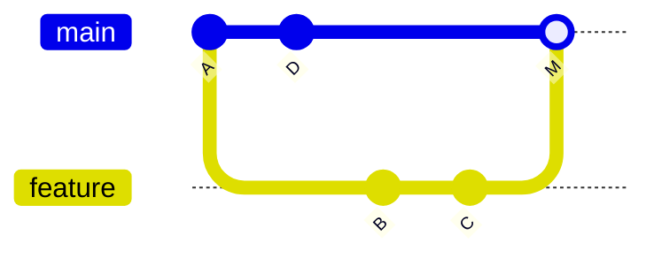

# Squash a Rebase

**Toto je merge stratégia používaná v repozitároch tejto organizácie** — pozri
[`/sk/internal-operations/git-workflow`](/sk/internal-operations/git-workflow) pre záväznú
politiku; táto stránka vysvetľuje mechaniku a dôvody za ňou.

## Tri spôsoby, ako dostať vetvu do `main`

**Merge commit** — zachová každý jednotlivý commit z vetvy, plus merge commit, ktorý ich spája:



**Rebase merge** — najprv prehrá commity vetvy nad `main`, potom fast-forwardne (žiadny merge
commit vôbec), ale stále zachová každý jednotlivý commit:

```
main:     A---D---B'---C'
```

**Squash merge** (čo používame my) — vezme *všetky* commity na vetve a zbalí ich do **jedného**
commitu na `main`, bez ohľadu na to, koľko neporiadnych commitov na vetve existovalo:

```
main:     A---D---S      (S = jeden commit obsahujúci všetko z B a C spolu)
```

## Prečo tu squashujeme

- História `main`/`develop` zostáva **jeden zmysluplný commit na feature/fix** — žiadny `wip`,
  `fix typo`, `test again` neporiadok natrvalo v histórii (pozri
  [Hygiena Commitov](./commit-hygiene.md)).
- Každý commit na `main` zodpovedá presne jednému PR, čo robí `git log`, `git bisect`
  (pozri [Bisect](../04-history-and-fixes/bisect.md)) a changelogy oveľa čitateľnejšími.
- Neporiadne rozpracované commity stále existujú v histórii PR na feature vetve/GitHub — nič sa
  nestratí, len sa neprenesie na `main`.

## Skutočné lokálne kroky

```bash
# 1. odvetvi sa z develop
git checkout develop
git pull origin develop
git checkout -b feature/neo4j-notes

# 2. commituj normálne počas práce (neporiadok lokálne je v poriadku)
git add .
git commit -m "feat(study): add advanced graph indexing notes"

# 3. pred pushnutím/otvorením PR: rebasni na najnovší develop, squashni vlastné commity
git fetch origin develop
git rebase -i origin/develop
#   v editore: prvý commit nechaj ako `pick`, zvyšok označ `squash` (alebo `fixup`)

# 4. push (potrebný force, keďže rebase prepísal commity tvojej vetvy)
git push origin feature/neo4j-notes --force-with-lease
```

Potom otvor PR a použi tlačidlo platformy **"Squash and merge"** — toto spraví finálny squash do
jedného commitu na `develop`/`main` v čase mergovania, aj keby si krok 3 vynechal.

## `--force-with-lease`, nie `--force`

Rebase prepisuje commit hashe (pozri [Rebasing](../02-branching-merging/rebasing.md)), takže
pushnutie výsledku vyžaduje force-push. `--force-with-lease` odmietne prepísať remote vetvu, ak
na ňu niekto iný pushol odkedy si naposledy fetchol — obyčajný `--force` takú kontrolu nemá a
môže potichu zahodiť cudziu prácu. Na zdieľanej vetve vždy uprednostni `--force-with-lease`; v
oboch prípadoch **nikdy force-pushuj do `main` alebo `develop`**.

## Interaktívny rebase na lokálne squashovanie

Pozri [Rebasing → Interaktívny rebase](../02-branching-merging/rebasing.md#interaktívny-rebase)
pre plnú mechaniku `rebase -i` a slovies `pick`/`squash`/`fixup`/`drop`.

## Skontroluj sa

- Aký je praktický rozdiel medzi rebase merge a squash merge, keď oboje vie produkovať lineárnu
  históriu?

  <details>
  <summary>Odpoveď</summary>

  Rebase merge stále zachová každý jednotlivý commit z vetvy (prehratý nad `main`); squash merge
  ich všetky zbalí do jedného commitu na `main`, bez ohľadu na to, koľko ich bolo.
  </details>

- Prečo použiť `--force-with-lease` namiesto obyčajného `--force` po rebase?

  <details>
  <summary>Odpoveď</summary>

  `--force-with-lease` odmietne prepísať remote vetvu, ak na ňu niekto iný pushol odkedy si
  naposledy fetchol; obyčajný `--force` takú kontrolu nemá a môže potichu zahodiť cudziu prácu.
  </details>

- Stratia sa neporiadne rozpracované commity na feature vetve po squash-merge?

  <details>
  <summary>Odpoveď</summary>

  Nie — stále existujú v histórii PR na feature vetve/GitHub, len sa neprenesú na `main`.
  </details>
