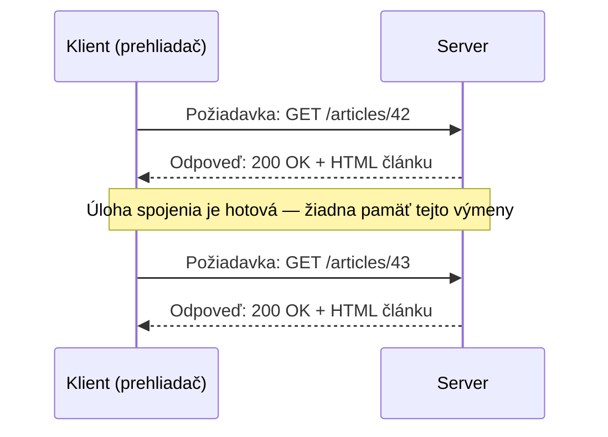

# Čo je HTTP

**HTTP** (HyperText Transfer Protocol) je protokol, na ktorom beží takmer celý web — dohodnutý
formát správ, ktorý umožní klientovi (prehliadaču, mobilnej appke, `curl`) požiadať server o
niečo, a serveru odpovedať.

## Request-response, nie konverzácia

HTTP je zásadne **bezstavový** a **riadený požiadavkou**: klient pošle jednu požiadavku, server
pošle presne jednu odpoveď, a úloha spojenia pre túto výmenu je hotová. Na úrovni protokolu
neexistuje žiadna prebiehajúca "session" — čokoľvek, čo *pôsobí* ako session (zostať prihlásený
naprieč načítaniami stránok), je postavené nad HTTP pomocou cookies, nie súčasť samotného HTTP
(pozri [Cookies a Session](../04-security/cookies-and-sessions.md)).



## Role klienta a servera

- **Klient** vždy iniciuje — server sa nikdy nekontaktuje prehliadač sám od seba cez obyčajné
  HTTP (real-time aktualizácie potrebujú niečo iné navrstvené na to, ako WebSockets alebo
  polling).
- **Server** vždy len odpovedá na to, o čo je požiadaný — nemôže poslať nevyžiadané dáta uprostred
  požiadavky.

Táto asymetria je dôvod, prečo "server mi poslal notifikáciu" v modernej webovej appke nikdy nie
je obyčajné HTTP, ktoré to robí — je to iný mechanizmus (WebSocket, Server-Sent Events, alebo
klient jednoducho pollujúci) postavený vedľa neho.

## Kde HTTP sedí v stacku

HTTP je protokol **aplikačnej vrstvy** — samotný netransportuje sieťovú prevádzku, jazdí na
vrchu TCP (alebo, pri HTTP/3, QUIC cez UDP — pozri
[HTTP/1.1 vs. 2 vs. 3](../06-performance-and-protocol-evolution/http-1-1-vs-2-vs-3.md)). Úlohou
TCP je len spoľahlivo a v poradí doručiť bajty; úlohou HTTP je definovať, čo tie bajty *znamenajú*
— riadok požiadavky, hlavičky, voliteľné telo.

## Surová výmena, zredukovaná na základy

```text title="Čo naozaj ide cez drôt (zjednodušene)"
GET /articles/42 HTTP/1.1
Host: example.com
Accept: text/html

---

HTTP/1.1 200 OK
Content-Type: text/html
Content-Length: 1524

<html>...</html>
```

[Requesty a Odpovede](./requests-and-responses.md) rozoberá tento presný tvar kúsok po kúsku;
[Status Kódy](./status-codes.md) popisuje, čo to `200` naozaj komunikuje.

## HTTPS je HTTP, plus šifrovanie

HTTPS nie je samostatný protokol s inou sémantikou — je to presne ten istý request/response model,
len bežiaci cez šifrované TLS spojenie. Všetko na tejto stránke a zvyšku tejto témy platí
identicky pre oboje; samotná šifrovacia vrstva je pokrytá v
[TLS a HTTPS](/sk/study-materials/networking/web-serving/tls-https) v téme Siete.
