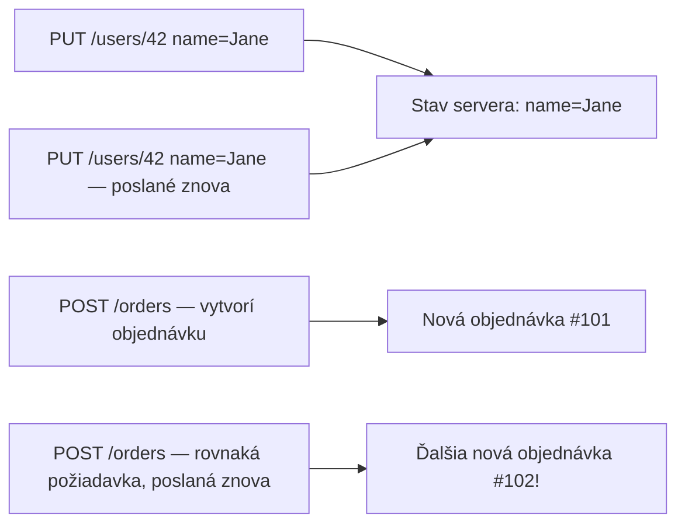

# Idempotencia a Bezpečnosť

Dve vlastnosti, ktoré sa od HTTP metód konvenčne očakávajú — nevynucuje ich samotný protokol, ale
spoliehajú sa na ne prehliadače, cache, load balancery a retry logika všade.

## Bezpečné (safe) metódy

Metóda je **bezpečná (safe)**, ak sa od nej neočakáva zmena stavu na serveri — konvenčne
len-na-čítanie.

```
Bezpečné:     GET, HEAD, OPTIONS
Nebezpečné:   POST, PUT, PATCH, DELETE
```

Toto je *dôvod*, prečo prehliadač môže bezpečne spekulatívne prefetchnúť odkaz (`GET`), alebo
prečo crawler vyhľadávača môže navštíviť každý `GET` odkaz na tvojej stránke bez obáv, že náhodou
niečo zmaže — pokiaľ tvoja appka tú konvenciu naozaj rešpektuje. Endpoint `GET /articles/42/delete`,
ktorý naozaj zmaže pri obyčajnom načítaní stránky, porušuje tento predpoklad, a je to skutočná,
klasická trieda bugov (crawlery mažúce dáta jednoduchým nasledovaním odkazov).

## Idempotentné metódy

Metóda je **idempotentná**, ak má jej zavolanie raz rovnaký efekt ako zavolanie mnohokrát.

```
Idempotentné:      GET, HEAD, PUT, DELETE, OPTIONS
Neidempotentné:    POST, PATCH (zvyčajne)
```



- `PUT /users/42` s rovnakým telom dvakrát necháva zdroj v rovnakom finálnom stave oba razy —
  idempotentné.
- `DELETE /users/42` dvakrát: prvýkrát ho zmaže, druhýkrát nenájde nič na zmazanie (často stále
  vráti úspech, alebo 404) — ale *konečný stav* (používateľ 42 neexistuje) je rovnaký v oboch
  prípadoch — stále idempotentné, aj keď sa *odpoveď* môže líšiť.
- `POST /orders` dvakrát vytvorí **dve samostatné objednávky** — neidempotentné, a presne toto je
  dôvod, prečo dvojklik na tlačidlo "Odoslať objednávku" je skutočný, historicky nákladný bug.

`PATCH` je technicky dovolené byť idempotentné alebo nie, v závislosti od toho, čo robí — `PATCH`,
ktorý nastaví pole na presnú hodnotu, je idempotentný; ten, ktorý znamená "zvýš tento počítadlo o
1," nie je.

## Prečo na tomto rozlíšení prakticky záleží

- **Automatické retries**: HTTP klient (prehliadač, alebo knižnica ako `axios`/`fetch` s retry
  logikou) môže bezpečne automaticky zopakovať `GET` alebo `PUT` pri zlyhaní siete, lebo urobiť to
  dvakrát je neškodné. Automatické opakovanie `POST` riskuje zdvojenie čohokoľvek, čo vytvoril.
- **Cachovanie**: predvolene sú cachovateľné len bezpečné metódy — pozri
  [Cachovanie a ETags](../03-headers-and-content/caching-and-etags.md).
- **Návrh API**: navrhnúť endpoint tak, aby naozaj zodpovedal očakávanej sémantike svojej metódy
  (pozri [Návrh Dobrého API](../05-rest-and-api-design/designing-a-good-api.md)) je to, čo
  umožňuje všetkému vyššie fungovať správne bez špeciálnych výnimiek.

:::warning
Postaviť `POST`/akciu-spúšťajúci endpoint, ktorý je dosiahnuteľný cez `GET` (napr. holý odkaz,
ktorý niečo zmaže), naraz poruší každý jeden z týchto predpokladov — crawlery, prefetching
prehliadača, a proxy všetky zaobchádzajú s `GET` ako s bezpečným na spekulatívne a opakované
volanie.
:::

## Skontroluj sa

- Čo znamená "bezpečná (safe)" pre metódu, a prečo sa na to môžu spoľahnúť crawlery a prefetching
  prehliadača?

  <details>
  <summary>Odpoveď</summary>

  Bezpečná metóda sa konvenčne nemá meniť stav servera — len-na-čítanie. Crawlery a prefetching ju
  môžu volať spekulatívne a opakovane bez rizika vedľajšieho účinku, pokiaľ appka konvenciu naozaj
  rešpektuje.
  </details>

- Je `DELETE` idempotentný? Vysvetli, prečo jeho dvojité zavolanie stále počíta ako idempotentné,
  aj keď sa odpoveď druhého volania líši od prvého.

  <details>
  <summary>Odpoveď</summary>

  Áno. Prvé volanie zdroj zmaže; druhé nenájde nič na zmazanie (možno vráti 404 namiesto úspechu).
  Ale konečný stav — zdroj neexistuje — je rovnaký oba razy, a práve tento konečný stav, nie
  odpoveď, je to, čo "idempotentné" naozaj meria.
  </details>

- Prečo je automatické opakovanie `POST` pri zlyhaní siete riskantnejšie než automatické
  opakovanie `PUT`?

  <details>
  <summary>Odpoveď</summary>

  Zahodený retry `POST` môže vytvoriť duplicitný zdroj (napr. druhú objednávku), keďže `POST` nie
  je idempotentný. Opakovanie `PUT` s rovnakým telom necháva zdroj v rovnakom finálnom stave oba
  razy, tak je automatické opakovanie neškodné.
  </details>

- Môže byť `PATCH` idempotentný, alebo nie? Daj príklad na oba prípady.

  <details>
  <summary>Odpoveď</summary>

  Idempotentný: `PATCH`, ktorý nastaví pole na presnú hodnotu. Neidempotentný: `PATCH`, ktorý
  znamená "zvýš tento počítadlo o 1" — jeho opakovanie mení výsledok pri každom volaní.
  </details>
