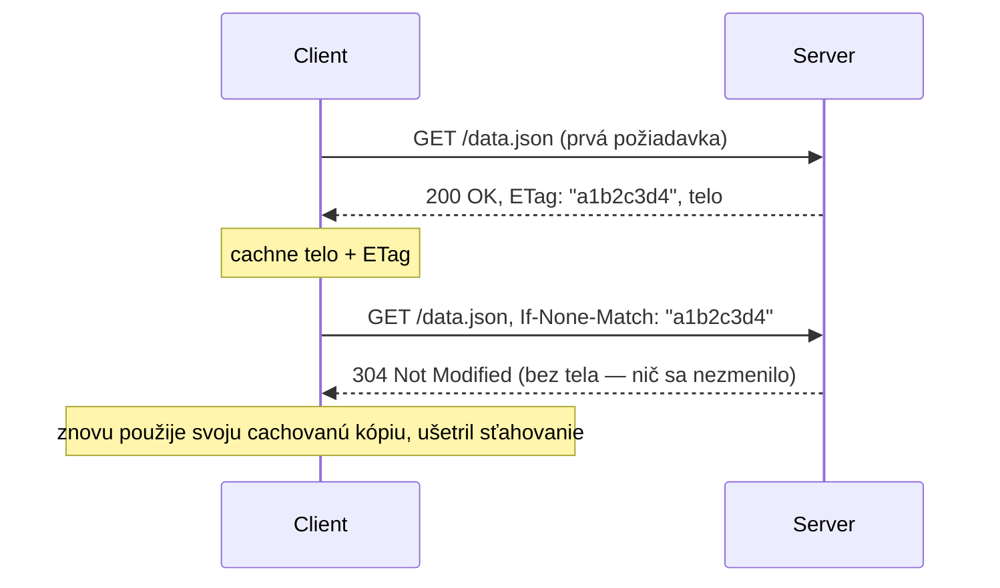

# Cachovanie a ETags

HTTP má vstavané cachovanie, riadené úplne cez hlavičky — prehliadač, CDN, alebo akékoľvek proxy
medzitým sa môže vyhnúť opätovnému stiahnutiu obsahu, ktorý už má, bez toho, aby appka potrebovala
vlastnú custom cachovaciu logiku.

## `Cache-Control` — hlavná cachovacia hlavička

```http
Cache-Control: max-age=3600              — cachovateľné na 3600 sekúnd, potom považované za zastarané
Cache-Control: no-cache                    — musí sa revalidovať so serverom pred použitím cachovanej kópie
Cache-Control: no-store                      — nikdy toto necachovať vôbec (citlivé dáta)
Cache-Control: public, max-age=86400           — cachovateľné zdieľanými cache (CDN), nielen prehliadačom
Cache-Control: private, max-age=3600             — cachovateľné len vlastným prehliadačom koncového používateľa
```

`no-cache` je bežný bod zmätku — **ne**znamená "necachuj," znamená "cachuj to, ale over si to so
serverom pred použitím" (pozri ETags nižšie). `no-store` je ten, čo naozaj znamená "toto nikdy
necachuj."

## ETags — validovanie cachovanej kópie bez opätovného stiahnutia

**ETag** je nepriehľadný identifikátor (často hash), ktorý server pripojí ku konkrétnej verzii
zdroja:

```http
HTTP/1.1 200 OK
ETag: "a1b2c3d4"
Cache-Control: no-cache
```

Nabudúce, keď klient chce tento zdroj, môže sa spýtať "je toto stále aktuálne" namiesto slepého
opätovného sťahovania:



Odpoveď `304 Not Modified` **nemá telo** — celý zmysel je vyhnúť sa opätovnému posielaniu dát,
ktoré klient už má. Ak sa zdroj *naozaj* zmenil, server jednoducho odpovie normálne s `200` a
novým `ETag`.

## Prečo na tomto prakticky záleží

- **Šírka pásma**: `304` odpoveď je titerná v porovnaní s opätovným poslaním celého tela —
  má význam vo veľkom pre čokoľvek často požadované (obrázky, JS/CSS bundly, API odpovede, ktoré
  sa nemenia často).
- **CDN sa na toto úplne spoliehajú** — CDN edge node servírujúci cachovaný obsah v tvojom mene je
  jednoducho automatizácia presne tohto Cache-Control/ETag vyjednávania, na vrstve pred tvojím
  serverom (pozri
  [CDN a Edge Cachovanie](../06-performance-and-protocol-evolution/cdns-and-edge-caching.md)).
- **Bugy s cache invalidáciou** sú takmer vždy `Cache-Control` hlavička nastavená príliš
  agresívne (alebo úplne chýbajúca) — "nasadil som fix, ale používatelia stále vidia starú
  verziu" je, viac ako nie, problém s cachovacou hlavičkou, nie problém s nasadením.

## `Last-Modified` — jednoduchšia, hrubšia alternatíva k ETag

```http
Last-Modified: Wed, 21 Oct 2026 07:28:00 GMT
```

```http
If-Modified-Since: Wed, 21 Oct 2026 07:28:00 GMT
```

Rovnaká myšlienka ako ETag, ale založená na timestampe namiesto content hashu — hrubšie (nevie
detekovať zmenu, ktorá sa udeje v rámci tej istej sekundy, a nedetekuje vrátenie k identickému
obsahu spôsobom, akým by to prirodzene urobil hash-based ETag), ale jednoduchšie pre server na
vygenerovanie, keď presný content hash nie je ľahko dostupný.

## Skontroluj sa

- Aký je skutočný rozdiel medzi `Cache-Control: no-cache` a `no-store`?

  <details>
  <summary>Odpoveď</summary>

  `no-cache` znamená "cachuj to, ale over si to so serverom pred použitím." `no-store` znamená
  "toto nikdy necachuj vôbec."
  </details>

- Na čo sa klient vďaka `ETag` môže spýtať servera, a čo odpovie server, keď sa nič nezmenilo?

  <details>
  <summary>Odpoveď</summary>

  Umožňuje klientovi spýtať sa "je toto stále aktuálne" (cez `If-None-Match`). Ak sa nič
  nezmenilo, server odpovie `304 Not Modified` bez tela.
  </details>

- Prečo `304 Not Modified` odpoveď nemá telo?

  <details>
  <summary>Odpoveď</summary>

  Lebo celý zmysel je vyhnúť sa opätovnému posielaniu dát, ktoré klient už má — zahrnutie tela by
  poprelo tento zmysel.
  </details>

- Prečo je "cache invalidácia," nie zlý deploy, často skutočná príčina "nasadil som fix, ale
  používatelia stále vidia starú verziu"?

  <details>
  <summary>Odpoveď</summary>

  Lebo prehliadač alebo CDN stále legitímne servíruje to, čo mu bolo povedané cachovať — takmer
  vždy ide o `Cache-Control` hlavičku nastavenú príliš agresívne (alebo úplne chýbajúcu), nie o
  pokazený deploy.
  </details>
