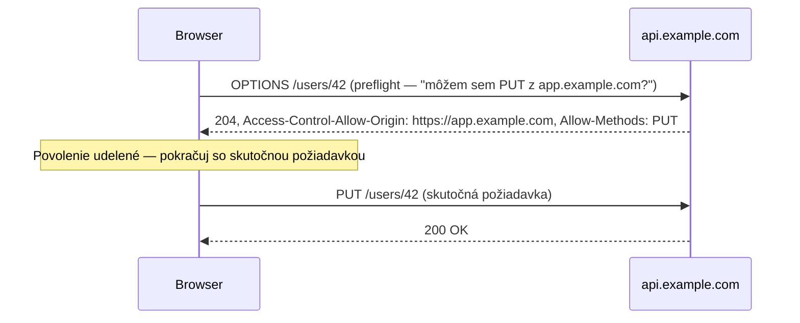

# Same-Origin Policy a CORS

## Čo je "origin"

Origin je kombinácia **scheme + host + port**:

```
https://app.example.com:443
   ^         ^            ^
scheme      host         port
```

Dve URL zdieľajú origin len ak sa všetky tri presne zhodujú — `https://app.example.com` a
`http://app.example.com` sú **rôzne origins** (iná scheme), rovnako ako
`https://app.example.com` a `https://api.example.com` (iný host), aj keď vyzerajú blízko
súvisiace.

## Same-origin policy

Prehliadače predvolene vynucujú **same-origin policy**: JavaScript bežiaci na jednom origin
nemôže čítať odpoveď požiadavky urobenej na iný origin, pokiaľ ten iný origin to explicitne
nepovolí. Toto je bezpečnostná hranica, nie sieťové obmedzenie — požiadavka sa často stále dá
technicky *poslať*, prehliadač len zablokuje *skriptu stránky* prečítať výsledok.

Bez tohto by mohla škodlivá stránka potichu spustiť JavaScript, ktorý číta dáta tvojej
prihlásenej bankovej session, len preto, že tvoj prehliadač mal náhodou otvorené oba taby.

## CORS — explicitné povolenie

**CORS** (Cross-Origin Resource Sharing) je spôsob, ako server udelí výnimku z tohto predvoleného
blokovania — hlavičky odpovede hovoriace prehliadaču "tento konkrétny iný origin má povolené
čítať toto."

```http
Access-Control-Allow-Origin: https://app.example.com
Access-Control-Allow-Methods: GET, POST, PUT
Access-Control-Allow-Headers: Content-Type, Authorization
```

## Jednoduché požiadavky vs. preflight

"Jednoduchá" požiadavka (obyčajný `GET`/`POST` len s pár povolenými hlavičkami) prejde priamo, a
prehliadač skontroluje hlavičku `Access-Control-Allow-Origin` na skutočnej odpovedi. Čokoľvek
zložitejšie (custom hlavička, `PUT`/`DELETE`, JSON telo za určitých konfigurácií) spustí
**preflight** — prehliadač pošle `OPTIONS` požiadavku *najprv*, pýtajúc si povolenie, pred
poslaním tej skutočnej:



Preflight je v aplikačnom kóde neviditeľný — prehliadač ho spracuje automaticky — ale je to presne
dôvod, prečo `PUT`/`DELETE` API volanie môže v network dev tools ukázať *dve* požiadavky namiesto
jednej.

## `Access-Control-Allow-Origin: *` — čo skutočne povoľuje, a čo nie

```http
Access-Control-Allow-Origin: *
```

Povolí **ktorémukoľvek** origin čítať odpoveď — fajn pre verejné, necitlivé API (verejné dáta,
žiadne cookies). Konkrétne **nemôže** byť skombinované s credentialed požiadavkami (cookies,
`Authorization` hlavičky spoliehajúce sa na credentials uložené v prehliadači) — prehliadač
odmietne odhaliť odpoveď credentialed požiadavke, ak je origin wildcard, presne kvôli prevencii
zneužitia verejnej `*` politiky na únik autentifikovaných dát.

:::warning
CORS je ochrana **vynucovaná prehliadačom** — nič nerobí na zastavenie non-browser klienta
(`curl`, server-to-server požiadavka, Postman) čítať odpoveď. Chráni prehliadače používateľov
pred škodlivými *stránkami*, nie tvoje API pred všetkými možnými volajúcimi. Nikdy sa nespoliehaj
na CORS ako na skutočnú kontrolu prístupu — tá sa stále musí diať na strane servera (auth
kontroly, API kľúče), CORS len riadi, čo *stránka v prehliadači* smie čítať.
:::

## Prečo toto vôbec existuje v kontexte tejto organizácie

Statické stránky bez vlastného backend API (ako táto docs stránka, alebo čisto front-end appka)
zriedka spustia CORS samy — stáva sa relevantným v momente, keď akýkoľvek JavaScript na jednom
origin potrebuje zavolať API hostované na inom origin, čo je bežné v zložitejších webových
appkách, aj keď tu priamo nie je v hre.
