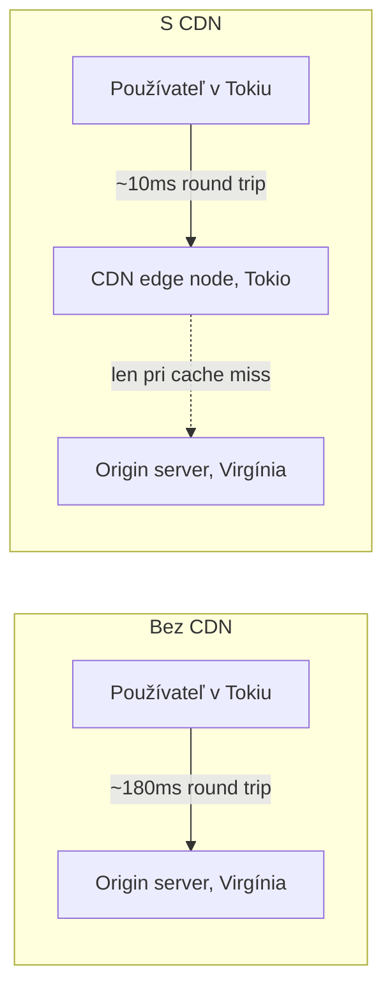

# CDN a Edge Cachovanie

**CDN** (Content Delivery Network) je sieť serverov geograficky distribuovaných, cachujúcich
kópie obsahu blízko toho, kde sa používatelia naozaj nachádzajú — rozšírenie tej istej mechaniky
[Cachovanie a ETags](../03-headers-and-content/caching-and-etags.md), ktorú HTTP už poskytuje, len
bežiace na mnohých miestach namiesto jedného origin servera.

## Prečo na fyzickej lokácii záleží

Latencia je obmedzená fyzickou vzdialenosťou — žiadna optimalizácia servera neodstráni čas, ktorý
trvá svetlu (alebo elektrickému signálu) prejsť dlhú fyzickú vzdialenosť. Používateľ v Tokiu
sťahujúci zdroj zo servera vo Virgínii platí túto cenu round-trip pri každej jednej požiadavke,
bez ohľadu na to, ako rýchlo ten origin server odpovedá interne.



CDN edge node blízko používateľa servíruje cachovanú kópiu priamo — vzdialený origin server je
zapojený len vtedy, keď edge node ešte nemá platnú cachovanú kópiu.

## Čo sa naozaj cachuje na edge

Statické, cachovateľné assety sú prirodzený fit: obrázky, CSS, JS bundly, fonty, a — pre plne
statickú stránku (pozri [Nasadenie Statickej Stránky](/sk/study-materials/networking/practical-setups/deploying-a-static-site)
v téme Siete) — samotné HTML. Dynamický, personalizovaný, alebo často sa meniaci obsah (dashboard
prihláseného používateľa, live výsledok vyhľadávania) sa predvolene typicky na edge **necachuje**,
keďže zlé cachovanie riskuje servírovanie súkromných dát jedného používateľa druhému.

## Cache invalidácia — naozaj náročná časť

Klasický výrok ("v informatike sú len dva ťažké problémy: cache invalidácia a pomenúvanie vecí")
tu platí priamo. Akonáhle edge node niečo cachne, servíruje tú cachovanú kópiu, kým buď nevyprší
jej `Cache-Control` `max-age`, alebo niečo explicitne nepovie, aby ju predčasne zahodil:

```bash
# typické CDN purge/invalidačné API volanie, koncepčne
curl -X POST https://cdn-provider.example.com/purge -d '{"url": "https://example.com/app.js"}'
```

Deploy, ktorý zmení *obsah* súboru, ale nie jeho *URL*, riskuje, že používatelia budú naďalej
vidieť starú verziu, kým cache prirodzene nevyprší alebo sa explicitne nepurgne — preto mnoho
build nástrojov pridáva content hash do mien súborov (`app.a1b2c3.js`) namiesto opätovného
používania rovnakého mena súboru navždy: zmenený súbor dostane naozaj novú URL, čím sa invalidácii
úplne vyhne namiesto potreby čokoľvek purgnúť.

## Prečo toto nenahrádza cachovacie hlavičky origin servera

CDN edge node stále rešpektuje rovnaké `Cache-Control`/`ETag` hlavičky, ktoré nastaví origin
server (pozri [Cachovanie a ETags](../03-headers-and-content/caching-and-etags.md)) — nie je to
samostatný cachovací systém s vlastnými pravidlami, je to ten istý HTTP cachovací kontrakt, len
vynucovaný na oveľa viac fyzických miestach než jednom. Zle nakonfigurované cachovacie hlavičky
spôsobia presne tie isté problémy na CDN edge, ako by spôsobili len s browser cachovaním, len vo
väčšom, viditeľnejšom rozsahu, keďže to postihne každého používateľa zasahujúceho ten edge node,
nie len jeden prehliadač.

## Skontroluj sa

- Prečo CDN pomáha aj vtedy, keď samotný origin server odpovedá okamžite?

  <details>
  <summary>Odpoveď</summary>

  Lebo latencia je obmedzená fyzickou vzdialenosťou — žiadna rýchlosť origin servera neodstráni
  čas round-tripu na server, ktorý je fyzicky ďaleko. CDN edge node je fyzicky bližšie k
  používateľovi.
  </details>

- Prečo sa dynamický alebo personalizovaný obsah predvolene necachuje na edge?

  <details>
  <summary>Odpoveď</summary>

  Zlé cachovanie riskuje servírovanie súkromných alebo personalizovaných dát jedného používateľa
  druhému.
  </details>

- Prečo mnoho build nástrojov vloží content hash do mena súboru (`app.a1b2c3.js`) namiesto
  opätovného použitia rovnakého mena súboru pri každom deployi?

  <details>
  <summary>Odpoveď</summary>

  Zmenený súbor dostane naozaj novú URL, čím sa cache invalidácii úplne vyhne namiesto potreby
  explicitne purgnúť CDN alebo čakať na vypršanie cache.
  </details>
