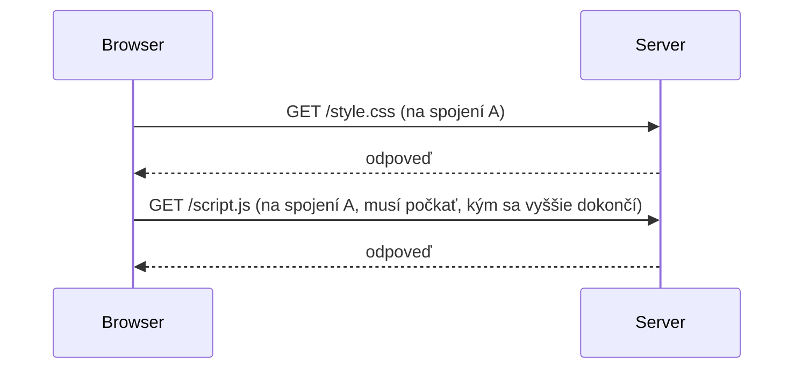
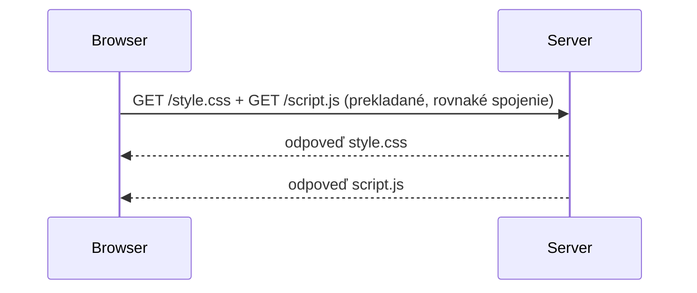

# HTTP/1.1 vs. 2 vs. 3

Rovnaký request/response model naprieč všetkými troma verziami (pozri
[Čo je HTTP](../01-basics/what-is-http.md)) — čo sa menilo pri každej z nich, je podkladová
transportná mechanika, mierená na opravu skutočných výkonnostných problémov predchádzajúcej
verzie.

## HTTP/1.1 — jedna požiadavka naraz, na spojenie



Jedno TCP spojenie spracováva požiadavky **jednu naraz** — druhá požiadavka musí počkať, kým sa
prvá úplne dokončí (toto je "head-of-line blocking" na HTTP vrstve). Prehliadače to historicky
obchádzali otváraním viacerých paralelných TCP spojení na ten istý server (bežne 6), čo pomáha,
ale každé spojenie stále nesie vlastnú réžiu TCP handshake.

## HTTP/2 — multiplexing cez jedno spojenie



Viacero požiadaviek a odpovedí zdieľa **jedno** TCP spojenie súčasne, prekladané — už žiadne
čakanie, kým sa jedna dokončí, pred poslaním ďalšej. Tiež zaviedlo kompresiu hlavičiek (HPACK) a
server push (v praxi väčšinou opustené — ukázalo sa ťažké použiť správne, väčšina implementácií
ho deprecatuje).

Toto rieši head-of-line blocking **na HTTP vrstve**, ale problém zostáva o jednu vrstvu nižšie.

## HTTP/3 — oprava head-of-line blocking na samotnej TCP vrstve

Multiplexing HTTP/2 stále jazdí na jednom **TCP** spojení — a samotné TCP garantuje striktné
poradie bajtov. Ak sa stratí jeden paket, TCP zablokuje *všetko* na tomto spojení, kým sa stratený
paket nepretransmituje a nedorazí — aj dáta pre úplne nesúvisiacu požiadavku, ktorá už v poriadku
dorazila. Toto je head-of-line blocking znova, len presunuté nižšie na transportnú vrstvu.

**HTTP/3** beží cez **QUIC** (postavené na UDP, nie TCP) namiesto toho — QUIC implementuje
vlastnú spoľahlivosť, ale per-stream namiesto pre celé spojenie: stratený paket blokuje len jeden
stream, ku ktorému patrí, nie každú inú prebiehajúcu požiadavku zdieľajúcu spojenie.

```text
HTTP/1.1  →  TCP    (jedna požiadavka naraz na spojenie)
HTTP/2    →  TCP    (multiplexované, ale jeden stratený paket zablokuje všetko na spojení)
HTTP/3    →  QUIC/UDP  (multiplexované, stratený paket blokuje len svoj vlastný stream)
```

## Prečo na tomto prakticky záleží, aj bez priameho dotyku protokolu

Takmer nič z tohto nevyžaduje zmeny aplikačného kódu — webový server (alebo reverse proxy pred
ním, pozri [Reverse Proxy](/sk/study-materials/networking/web-serving/reverse-proxies) v téme
Siete) vyjedná HTTP verziu s klientom automaticky, transparentne pre appku. Čo to vysvetľuje:

- Prečo pri HTTP/1.1 kedysi oveľa viac záležalo na bundlovaní veľa malých súborov (menej round
  trips), než pri HTTP/2 (multiplexing už zabráni väčšine tejto ceny) — skutočný posun v
  konvenčnej múdrosti frontend build tooling-u v priebehu rokov.
- Prečo mierne stratová sieť (mobil, slabé Wi-Fi) môže spôsobiť, že HTTP/2 stránka pôsobí
  prekvapivo pomaly aj napriek multiplexingu — jeden zahodený paket zastaví celé spojenie na TCP
  vrstve, čo je presne problém, na ktorý cieli HTTP/3.

## Skontroluj sa

- Aký konkrétny problém rieši HTTP/2, ktorý má HTTP/1.1, a aký mechanizmus na to použije?

  <details>
  <summary>Odpoveď</summary>

  Head-of-line blocking na HTTP vrstve (len jedna požiadavka naraz na spojenie). HTTP/2 to rieši
  multiplexingom viacerých požiadaviek a odpovedí cez jedno TCP spojenie súčasne.
  </details>

- Aký problém zostáva aj po HTTP/2, a prečo existuje "o jednu vrstvu nižšie"?

  <details>
  <summary>Odpoveď</summary>

  Head-of-line blocking sa deje stále, len presunuté na TCP vrstvu — TCP garantuje striktné
  poradie bajtov, tak jeden stratený paket zablokuje všetko na spojení, aj nesúvisiace
  požiadavky, ktoré už v poriadku dorazili.
  </details>

- Čo HTTP/3 zmení, aby opravil tento zostávajúci problém, a prečo to naozaj funguje?

  <details>
  <summary>Odpoveď</summary>

  HTTP/3 beží cez QUIC (UDP) namiesto TCP, implementuje spoľahlivosť per-stream namiesto pre celé
  spojenie — stratený paket blokuje len jeden stream, ku ktorému patrí, nie každú inú prebiehajúcu
  požiadavku.
  </details>
