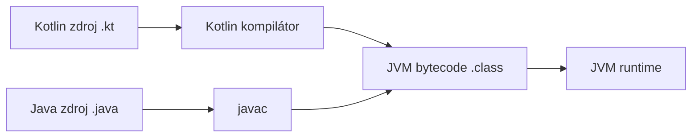

# Čo je Kotlin

Kotlin je staticky typovaný jazyk bežiaci primárne na JVM — plne interoperabilný s Javou,
kompilujúci sa do rovnakého bytecode, schopný priamo volať Java knižnice a byť volaný z Javy
naspäť. Cieli aj na iné platformy (Kotlin/Native pre natívne binárky, Kotlin/JS pre prehliadač),
ale JVM je zďaleka jeho najbežnejší domov, vrátane backend frameworkov ako Spring Boot.

## Prečo si ho tímy vyberajú namiesto Javy

```kotlin
// Kotlin
data class User(val name: String, val email: String)

fun greet(user: User?) = user?.let { "Hello, ${it.name}!" } ?: "Hello, stranger!"
```

```java
// Ekvivalent v obyčajnej Jave je zmysluplne viac kódu —
// plná trieda s konštruktorom, gettermi, equals/hashCode/toString,
// plus explicitná kontrola null.
```

- **Stručnosť** — data classes, type inference, a expression-oriented syntax orežú veľa
  štrukturálneho boilerplatu Javy bez straty statického typovania.
- **Null safety** — nullabilita je súčasťou samotného typového systému, nie konvencia
  vynucovaná disciplínou a nádejou — pozri [Null Safety](./null-safety.md), najčastejšie
  citovaný dôvod, prečo tímy migrujú.
- **Coroutines** — ľahká konkurencia zabudovaná priamo do jazyka, nie prilepená ako knižničný
  koncept, ako to majú Java `Thread`/`ExecutorService`.

## Plný Java interop, obojsmerne

```kotlin
// Kotlin volajúci existujúcu Java triedu priamo, žiaden wrapper netreba
val list = java.util.ArrayList<String>()
list.add("hello")
```

```java
// Java volajúca Kotlin triedu funguje rovnako, volá ju ako hocijakú inú Java triedu
User user = new User("Jane", "jane@example.com");
```

Tento interop je dôvod, prečo tímy vedia prijať Kotlin **inkrementálne** — konvertujúc jeden
súbor alebo jeden modul naraz v existujúcom Java kódovej báze, namiesto potreby all-or-nothing
prepisu. Pozri [Kotlin/Java Interop](../06-interop-and-tooling/kotlin-java-interop.md) pre
mechaniku.

## Kompiluje sa do JVM bytecode — rovnaký runtime ako Java



Oba kompilátory produkujú rovnaký druh bytecode, spustený rovnakým JVM — presne *preto* interop
funguje tak plynulo: za behu neexistuje zmysluplný rozdiel medzi triedou, ktorá začala ako Kotlin
zdroj, a takou, ktorá začala ako Java zdroj.

## Ostatné ciele Kotlinu, v skratke

```text
Kotlin/JVM      — predvolený cieľ, beží kdekoľvek beží JVM (toto táto téma predpokladá)
Kotlin/Native    — kompiluje sa do natívnej binárky, JVM netreba (iOS, embedded, CLI nástroje)
Kotlin/JS          — kompiluje sa do JavaScriptu, beží v prehliadači alebo Node.js
Kotlin Multiplatform — zdieľanie kódu naprieč niektorými alebo všetkými vyššie uvedenými cieľmi z jednej kódovej bázy
```

Táto téma, a súvisiace Kotlin témy v tejto sekcii study-materials (Idioms & Advanced Features,
Coroutines & Concurrency, Kotlin + Spring Boot, Testing in Kotlin), predpokladajú všetky
Kotlin/JVM — multiplatformové ciele sú dosť veľká téma na to, aby boli naozaj mimo rozsahu tu.

## Kde začať

[Premenné a Typy](./variables-and-types.md) pokrýva základnú syntax; [Null Safety](./null-safety.md)
pokrýva funkciu, ktorá najviac formuje, ako idiomatický Kotlin kód naozaj vyzerá.
