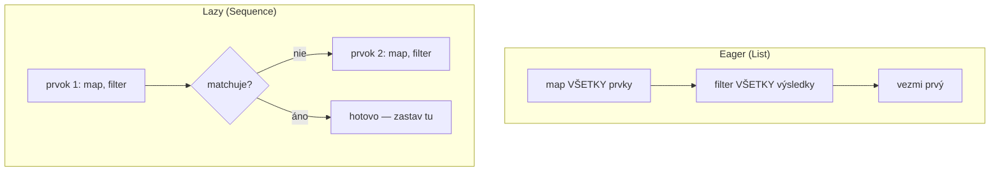

# Sequences

`Sequence<T>` je lazy alternatíva Kotlinu k eager-vyhodnocovaným kolekčným operáciám — rovnaký
slovník `map`/`filter`/atď. z [Funkcionálne Operácie](./functional-operations.md), ale
vyhodnocovaný prvok po prvku, len keď to terminálna operácia naozaj potrebuje výsledok.

## Eager vs. lazy, konkrétne

```kotlin
val result = listOf(1, 2, 3, 4, 5)
    .map { println("map: $it"); it * 2 }
    .filter { println("filter: $it"); it > 4 }
    .first()
```

S obyčajným `List` `map` beží **úplne** naprieč všetkými 5 prvkami najprv, produkujúc celý nový
list, **potom** `filter` beží úplne naprieč tým celým novým listom, produkujúc ďalší celý list, a
až potom `first()` chytí prvý výsledok — aj keď bol naozaj potrebný len úplne prvý matchujúci
prvok.

```kotlin
val result = listOf(1, 2, 3, 4, 5).asSequence()
    .map { println("map: $it"); it * 2 }
    .filter { println("filter: $it"); it > 4 }
    .first()
```

S `.asSequence()` každý prvok prejde **celým reťazcom** (map, potom filter) jeden po druhom, a
spracovanie sa zastaví, akonáhle `first()` nájde match — žiadna zbytočná práca na prvkoch 4 a 5,
ktoré neboli nikdy potrebné.



## Kedy to naozaj záleží na výkone

```text
Záleží:
  - Veľké kolekcie, kde je medzikrok drahý
  - Reťazce, ktoré sa skrátia skoro (first, find, take(n), any) — sequences vedia zastaviť
    skoro, eager kolekcie spracujú všetko bez ohľadu na to
  - Dlhé reťazce viacerých operácií, kde eager vyhodnotenie vytvorí celý intermediate list
    po KAŽDOM kroku

Naozaj nezáleží:
  - Malé kolekcie (pár desiatok prvkov) — réžia samotnej sequence mašinérie môže prevážiť
    akékoľvek úspory
  - Jedna operácia bez skorého konca (napr. len jeden .map() cez celý list) — malý rozdiel tak či tak
```

:::note
`Sequence` nie je "vždy rýchlejší" — vymení niektoré eager-list optimalizácie (niektoré operácie
sú naozaj rýchlejšie na `List`, keď potrebuješ *celý* výsledok aj tak) za vyhnutie sa
intermediate kolekciám a umožnenie skorého ukončenia. Siahni po `.asSequence()` zámerne, pre
veľké kolekcie alebo skracujúce sa reťazce, nie ako reflexívny zvyk "sequences sú lepšie."
:::

## Nekonečné sequences — niečo, čo `List` fundamentálne nedokáže

```kotlin
val naturalNumbers = generateSequence(1) { it + 1 }    // 1, 2, 3, 4, ... navždy

val firstFiveSquares = naturalNumbers
    .map { it * it }
    .take(5)
    .toList()

println(firstFiveSquares)    // [1, 4, 9, 16, 25]
```

Eager-vyhodnocovaný `List` naozaj nedokáže reprezentovať nekonečnú kolekciu vôbec — musel by
plne materializovať každý prvok. Lazy `Sequence` počíta len to, čo je naozaj skonzumované, takže
`generateSequence` skombinovaný s `take(n)` funguje perfektne, aj keď je podkladová sequence
koncepčne nekonečná.

## Konverzia medzi oboma

```kotlin
val list = listOf(1, 2, 3)
val sequence = list.asSequence()      // List -> Sequence, žiadne dáta skopírované, len lazy zabalí
val backToList = sequence.toList()      // Sequence -> List, teraz vynúti plné vyhodnotenie
```
