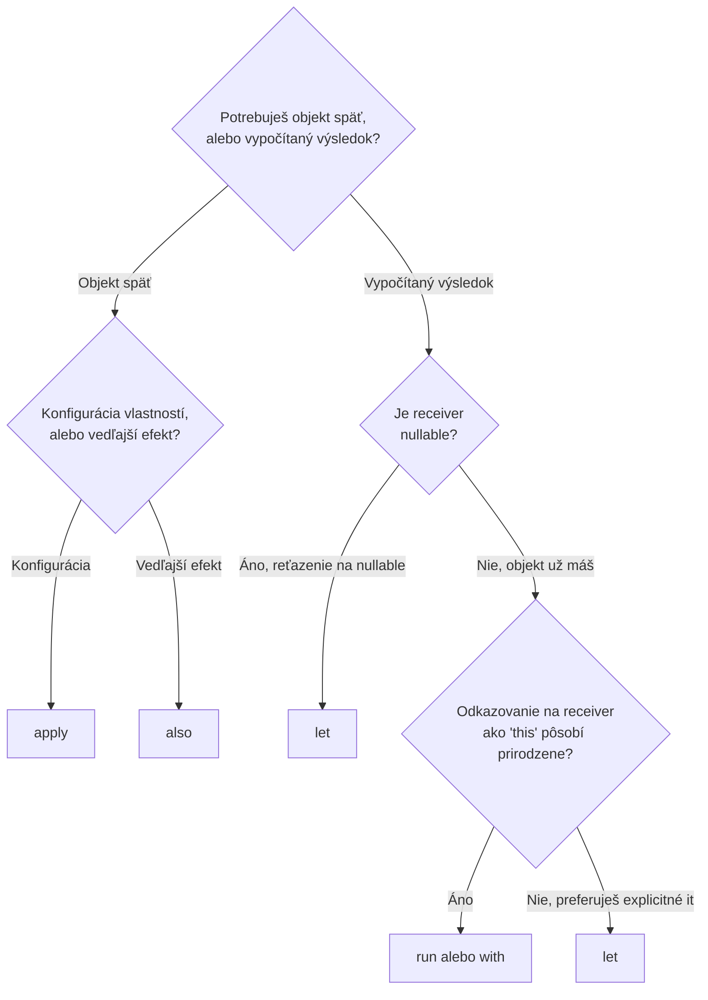

# Výber Správnej Scope Funkcie

[let, run, with](./let-run-with.md) a [apply, also](./apply-also.md) pokrývajú všetkých päť
jednotlivo — táto stránka je praktický návod na rozhodovanie, akonáhle vieš, čo každá robí a
potrebuješ si rýchlo vybrať jednu.

## Plné porovnanie

| Funkcia | Receiver | Vráti | Najlepšia pre |
|---|---|---|---|
| `let` | `it` | Výsledok lambdy | Null-safety reťazenie, transformácia hodnoty na niečo iné |
| `run` (s receiverom) | `this` | Výsledok lambdy | Reťazenie výpočtu priamo na objekte |
| `run` (bez receivera) | — | Výsledok lambdy | Vyčlenenie bloku dočasných premenných |
| `with` | `this` | Výsledok lambdy | Zoskupenie viacerých volaní na už existujúcom, non-null objekte |
| `apply` | `this` | Objekt | Konfigurácia vlastných vlastností čerstvo vytvoreného objektu |
| `also` | `it` | Objekt | Vedľajší efekt (logovanie, validácia) bez úpravy objektu |

## Dve otázky, ktoré vyberú tú správnu



1. **Potrebuješ pôvodný objekt späť, alebo novo vypočítanú hodnotu?**
   Objekt späť → `apply`/`also`. Vypočítaná hodnota → `let`/`run`/`with`.
2. **Ak vypočítaná hodnota: je receiver nullable, alebo chceš explicitné `it`?**
   `let` zvládne oboje — je to prirodzená predvoľba pre nullable reťazenie (`?.let { }`) alebo
   kedykoľvek sa `it` číta jasnejšie než implicitné `this`.

## Príklad výberu medzi nimi

```kotlin
data class User(var name: String = "", var age: Int = 0, val id: String = "")

// Konfigurácia nového objektu → apply
val user = User().apply {
    name = "Jane"
    age = 30
}

// Vedľajší efekt uprostred reťazenia, objekt nezmenený → also
val validUser = user
    .also { require(it.age >= 0) { "Age cannot be negative" } }

// Nullable reťazenie, transformácia na niečo iné → let
val greeting: String? = findUserById(id)?.let { "Hello, ${it.name}!" }

// Viacero volaní na existujúcom, isto non-null objekte → with
val summary = with(user) {
    "$name is $age years old"
}
```

## Kedy nesiahnuť po scope funkcii vôbec

```kotlin
❌ val x = someValue.let { it + 1 }
✅ val x = someValue + 1
```

Scope funkcia, ktorá naozaj nič nezjednoduší — obalenie jedného triviálneho výrazu len preto, že
je dostupná — pridáva vrstvu nepriamosti bez reálneho prínosu. Sú naozaj užitočné na null-safety
reťazenie, konfiguráciu objektu, a zoskupovanie súvisiacich volaní; reflexívne siahanie po nich na
každom riadku robí kód ťažšie čitateľným, nie ľahšie, čo poráža celý zmysel idiomu, ktorý má
zlepšiť čitateľnosť.

## Bežná chyba: vnáranie scope funkcií a strata prehľadu o `this`/`it`

```kotlin
❌ // na ktoré `it` sa toto v každom bode odkazuje? naozaj ťažké odhadnúť na prvý pohľad
outer.let { o ->
    inner.let {
        process(o, it)
    }
}
```

Vnáranie scope funkcií rovnakého druhu je reálna past na čitateľnosť — explicitné pomenovanie
parametra (`let { o -> ... }` namiesto spoliehania sa na implicitné `it`) na každej úrovni, alebo
jednoduché vyhnutie sa vnáraniu pomenovanou medziľahlou premennou, tomu zabráni stať sa hádankou
"čie je toto `it`" pre ďalšieho čitateľa.
