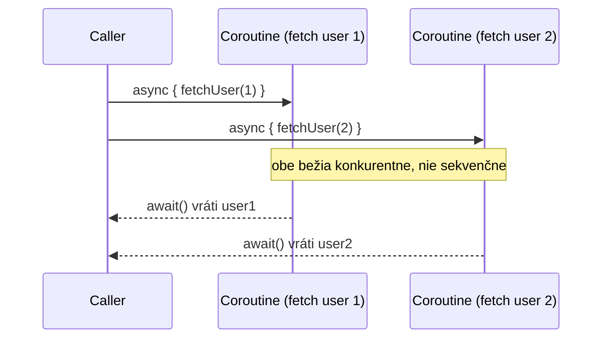

# Launch vs. Async

Dva základné **coroutine buildery** — funkcie, ktoré naozaj spustia novú coroutine. Všetko
ostatné v tejto téme predpokladá, že jeden z týchto dvoch niečo naštartoval na začiatku.

## `launch` — fire-and-forget, vráti `Job`

```kotlin
fun main() = runBlocking {
    val job: Job = launch {
        delay(500L)
        println("Task done")
    }
    println("Coroutine launched")
    job.join()    // pozastav sa, kým sa spustená coroutine nedokončí
}
// Výstup:
// Coroutine launched
// Task done
```

Použi `launch`, keď ti záleží na tom, že sa niečo *stane*, ale nepotrebuješ z toho späť hodnotu
výsledku — logovanie, poslanie notifikácie, aktualizácia nejakého stavu ako vedľajší efekt. Vrátený
`Job` ti umožní počkať na dokončenie (`.join()`) alebo to zrušiť (`.cancel()`), ale nenesie žiadnu
hodnotu výsledku.

## `async` — vráti hodnotu, cez `Deferred`

```kotlin
fun main() = runBlocking {
    val deferred: Deferred<Int> = async {
        delay(500L)
        42
    }
    println("Waiting for result...")
    val result = deferred.await()    // pozastav sa, kým hodnota nie je pripravená
    println("Got: $result")
}
// Výstup:
// Waiting for result...
// Got: 42
```

Použi `async`, keď potrebuješ skutočnú **návratovú hodnotu** konkurentnej práce — `.await()` sa
pozastaví, kým nie je pripravená, a (na rozdiel od `launch`) propaguje akúkoľvek výnimku, ktorú
coroutine hodila, presne pri volaní `.await()` (pozri
[Spracovanie Výnimiek v Coroutines](../05-error-handling-and-testing/exception-handling-in-coroutines.md)
pre presne to, ako sa toto líši od správania výnimiek pri `launch`).

## Spustenie dvoch vecí konkurentne — skutočný zmysel `async`

```kotlin
suspend fun fetchTwoUsersConcurrently(): Pair<User, User> = coroutineScope {
    val deferred1 = async { fetchUser(1) }
    val deferred2 = async { fetchUser(2) }
    deferred1.await() to deferred2.await()    // obe požiadavky už teraz bežia konkurentne
}
```



Porovnaj to so sekvenčným volaním oboch suspend funkcií (pozri
[Suspend Funkcie](./suspend-functions.md)) — spustenie oboch cez `async` *pred* zavolaním
`.await()` na ktoromkoľvek z nich je to, čo ich naozaj spraví bežiace konkurentne namiesto jednej
po druhej. Zavolanie `.await()` hneď po každom `async` volaní, namiesto po spustení oboch, by ich
znovu náhodou serializovalo.

## Vedľa seba

| | `launch` | `async` |
|---|---|---|
| Vráti | `Job` | `Deferred<T>` |
| Má hodnotu výsledku | Nie | Áno, cez `.await()` |
| Typické použitie | Vedľajšie efekty, fire-and-forget práca | Konkurentný výpočet, ktorého výsledok potrebuješ |
| Správanie pri nezachytenej výnimke | Propaguje sa okamžite rodičovi | Držaná, kým sa nezavolá `.await()` |

## Bežná chyba: zabudnutie skutočne použiť výsledok

```kotlin
// ❌ spustil konkurentnú prácu, nikdy nevyzdvihol výsledok — a ak hodí výnimku, výnimka je
//    potichu držaná, kým niečo nakoniec nezavolá .await() (alebo sa nikdy neprejaví vôbec)
async { riskyOperation() }

// ✅ ak výsledok nepotrebuješ, použi radšej launch — jeho správanie pri výnimkách je predvídateľnejšie
launch { riskyOperation() }
```

Ak návratová hodnota coroutine nie je nikdy naozaj potrebná, `launch` je poctivejšia voľba —
použitie `async` a nikdy nezavolanie `.await()` je bežný zdroj zmätku, aj ohľadom zmeškaných
výsledkov, aj ohľadom výnimiek, ktoré sa neprejavia, keď sa očakávajú.
