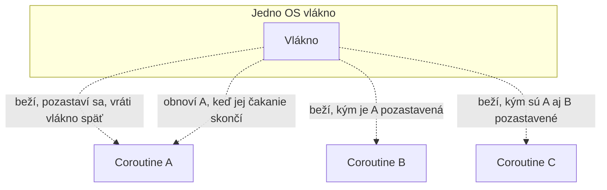

# Čo sú Coroutines

**Coroutine** je jednotka konkurentnej práce, ktorá sa dá **pozastaviť (suspend)** a **obnoviť
(resume)** bez blokovania podkladového OS vlákna, na ktorom náhodou beží. Kotlin coroutines sa
často popisujú ako "ľahké vlákna" — užitočná prvá intuícia, ale mechanizmus pod tým je naozaj iný,
nie len menšia verzia vlákna.

## Suspenzia, nie blokovanie

OS vlákno, ktoré čaká (na I/O, na zámok, na `Thread.sleep`), je **zablokované** — sedí tam a nič
nerobí, ale OS ho stále musí plánovať, a stále drží vlastný stack a pamäť celý ten čas.
Pozastavená coroutine vráti vlákno úplne späť — vlákno je voľné spustiť iné coroutines, kým táto
čaká, a vlastný stav coroutine sa uloží samostatne, obnoví sa neskôr, možno dokonca na inom
vlákne.



Preto jedno vlákno vie prekladať tisíce coroutines — nič v skutočnosti neblokuje toto vlákno ako
rukojemníka, kým čaká.

## Prečo na tom záleží pri väčšej škále

```text
Vlákna:      pár stoviek až pár tisíc, realisticky, kým réžia OS plánovania a pamäť na vlákno
             (každé OS vlákno si rezervuje vlastný stack, často 512KB-1MB) sa nestane skutočným
             hrdlom fľaše
Coroutines:  desiatky tisíc až milióny sú praktické — stav pozastavenej coroutine je malý objekt
             na heape, nie rezervovaný stack na úrovni OS
```

Server obsluhujúci veľa súbežných spojení, každé väčšinou čakajúce na I/O (databázový dopyt, HTTP
volanie na inú službu) namiesto kontinuálnej CPU práce, je klasický prípad, kde je tento rozdiel
podstatou veci — väčšina týchto "vlákien" by strávila takmer celý čas jednoducho zablokovaná v
čakaní, za reálnu cenu pamäte, bez skutočného úžitku.

## Prvý príklad

```kotlin
import kotlinx.coroutines.*

fun main() = runBlocking {
    launch {
        delay(1000L)          // pozastaví túto coroutine — NEblokuje vlákno
        println("World!")
    }
    println("Hello,")
}
// Výstup:
// Hello,
// World!
```

`delay` je **suspending funkcia** (pozri [Suspend Funkcie](./suspend-functions.md)) — pozastaví
coroutine na 1 sekundu bez blokovania vlákna, na ktorom `main` beží, preto sa `"Hello,"` vypíše
okamžite, skôr než sa oneskorená coroutine obnoví a vypíše `"World!"`. Porovnaj to s
`Thread.sleep(1000L)`, ktoré *by* vlákno zablokovalo — nič iné by na ňom počas tej sekundy nemohlo
bežať.

## Coroutines nie sú náhrada za vlákna — bežia na nich navrch

Coroutines stále potrebujú skutočné OS vlákna, na ktorých nakoniec vykonajú prácu — **dispatcher**
(pozri [Dispatchery](../03-dispatchers-and-threading/dispatchers.md)) rozhoduje, na ktorom thread
poole daná coroutine naozaj beží. Coroutines sú spôsob, ako využiť vlákna oveľa efektívnejšie, nie
spôsob, ako sa im úplne vyhnúť.

## Kam táto téma smeruje ďalej

- [Suspend Funkcie](./suspend-functions.md) — jazyková funkcia, ktorá suspenziu vôbec umožňuje.
- [Launch vs. Async](./launch-vs-async.md) — dva základné spôsoby, ako naozaj spustiť coroutine.
- [Vysvetlenie Štruktúrovanej Konkurencie](../02-structured-concurrency/structured-concurrency-explained.md)
  — dizajnový princíp, ktorý riadi, ako spolu coroutines súvisia, argumentovateľne najdôležitejšia
  myšlienka v celej tejto téme.

Táto téma predpokladá, že si už pohodlný so samotným Kotlinom — pozri tému
[Kotlin Fundamentals](/study-materials/kotlin/kotlin-fundamentals/basics/what-is-kotlin), ak funkcie, triedy a lambdy v
Kotline ešte nie sú známa pôda.
