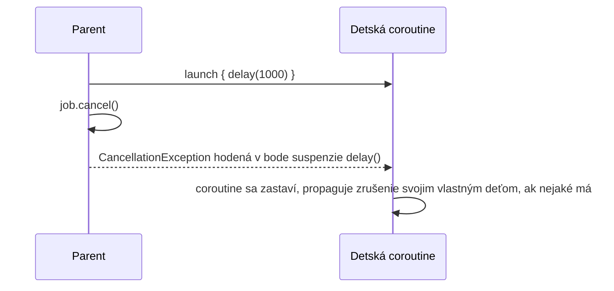

# Zrušenie

Zrušenie v Kotlin coroutines je **kooperatívne** — coroutine musí sama skontrolovať, či bola
zrušená, a zastaviť sa. Nič nasilu neprerušuje bežiacu coroutine tak, ako by napríklad mohlo
zabitie OS vlákna.

## Vyžiadanie zrušenia

```kotlin
val job = launch {
    repeat(1000) { i ->
        delay(100L)
        println("Working... $i")
    }
}
delay(350L)
job.cancel()      // vyžiada zrušenie
job.join()          // pozastav sa, kým sa naozaj nedokončí zrušenie
// alebo, kombinovane:
job.cancelAndJoin()
```

## Prečo "kooperatívne" — a čo spôsobí, že coroutine naozaj zareaguje

Suspending funkcie z `kotlinx.coroutines` (`delay`, `yield`, a väčšina ostatných) automaticky
kontrolujú zrušenie vo svojich bodoch suspenzie, a hodia `CancellationException`, ak bola
coroutine zrušená — presne *takto* zrušenie naozaj nadobudne účinok, nie vedľajší detail.

```kotlin
val job = launch {
    var i = 0
    while (i < 1000) {
        // ❌ tu vôbec nie je žiadny bod suspenzie — tento cyklus NEzareaguje na cancel()
        i++
    }
}
```

:::warning
Tesný cyklus bez žiadneho suspending volania vnútri nezareaguje na `cancel()` — coroutine sa nikdy
nedostane do bodu, kde sa zrušenie naozaj kontroluje. Toto je naozaj bežný zdroj bugov "zavolal
som `.cancel()`, ale stále to beží" — oprava je buď zavolať suspending funkciu periodicky (aj
lacnú ako `yield()`), alebo explicitne kontrolovať `isActive`:

```kotlin
val job = launch {
    var i = 0
    while (isActive) {    // explicitne kontroluje stav zrušenia
        i++
    }
}
```
:::

## `CancellationException` — špeciálna výnimka, nie bežná chyba

```kotlin
val job = launch {
    try {
        delay(1000L)
    } catch (e: CancellationException) {
        println("Cleaning up before cancellation completes")
        throw e    // dôležité: znovu ju hoď, nepohlcuj ju
    }
}
```

`CancellationException` je to, ako je zrušenie naozaj implementované pod kapotou — hodí sa v bode
suspenzie, propaguje sa ako akákoľvek výnimka, ale coroutine mechanika s ňou zaobchádza ako s "toto
bolo zrušené," nie "toto zlyhalo" (pozri
[Spracovanie Výnimiek v Coroutines](../05-error-handling-and-testing/exception-handling-in-coroutines.md)
pre rozlíšenie v praxi). Zachytenie kvôli cleanup je v poriadku a bežné; **pohltenie bez opätovného
hodenia rozbije zrušenie** pre čokoľvek downstream, čo očakáva jeho propagáciu.

## Zrušenie a štruktúrovaná konkurencia spolu



Toto je presne mechanizmus za automatickým šírením zrušenia
[Štruktúrovanej Konkurencie](./structured-concurrency-explained.md) — zrušenie rodičovského scope
funguje zrušením jeho `Job`, čo zruší každý detský `Job`, čo (cez body suspenzie) naozaj zastaví
vykonávanie každej coroutine.

## `withTimeout` — zrušenie s deadline

```kotlin
try {
    withTimeout(1000L) {
        delay(2000L)    // toto bude zrušené po 1000ms — withTimeout hodí výnimku
    }
} catch (e: TimeoutCancellationException) {
    println("Took too long")
}
```

Bežné, praktické použitie toho istého mechanizmu zrušenia — automaticky zruš prácu, ktorá trvá
dlhšie než akceptovateľné, namiesto ručného sledovania uplynulého času.
