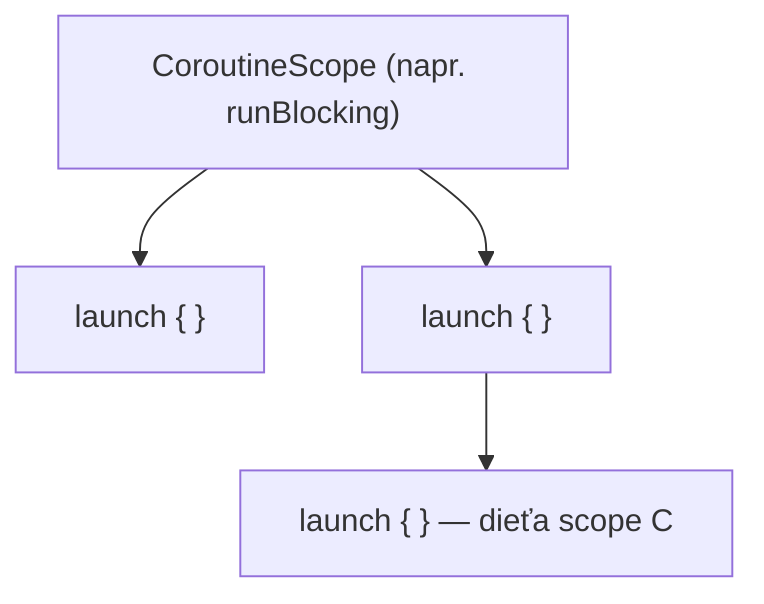

# CoroutineScope a CoroutineContext

Dva súvisiace, ale odlišné kúsky mechaniky pod každou coroutine — `CoroutineScope` definuje *kde
coroutine žije*, `CoroutineContext` definuje *čo riadi, ako beží*.

## `CoroutineContext` — sada elementov

`CoroutineContext` je indexovaná sada obsahujúca veci ako ktorému `Job` táto coroutine patrí,
na akom dispatcheri beží, a voliteľné meno na debugovanie.

```kotlin
val context = Dispatchers.IO + CoroutineName("data-fetch")
```

Kontexty sa kombinujú s `+` — pravostranný element rovnakého druhu prepíše ten ľavý. Preto vie
`withContext(Dispatchers.IO)` (pozri
[Prepínanie Kontextu](../03-dispatchers-and-threading/context-switching.md)) vymeniť len
dispatcher, kým všetko ostatné v kontexte zostane rovnaké.

```kotlin
launch(Dispatchers.Default + CoroutineName("worker")) {
    println(coroutineContext[CoroutineName])    // CoroutineName(worker)
}
```

## `CoroutineScope` — kde žije životnosť coroutine

`CoroutineScope` obaľuje `CoroutineContext` a poskytuje skutočnú hranicu, na ktorú je viazaná
životnosť coroutine. Každý coroutine builder (`launch`, `async`) je **extension funkcia** na
`CoroutineScope` — nemôžeš zavolať `launch` bez neho, zámerne.

```kotlin
class UserRepository {
    private val scope = CoroutineScope(Dispatchers.IO + SupervisorJob())

    fun refreshUser(id: Int) {
        scope.launch {
            val user = fetchUser(id)
            // ... použi výsledok
        }
    }

    fun close() {
        scope.cancel()    // zruší každú coroutine spustenú cez tento scope, naraz
    }
}
```

Tento vzor — trieda vlastniaca scope viazaný na vlastný lifecycle, zrušený, keď je trieda hotová —
je štandardný spôsob, ako sa uistiť, že coroutines neprežijú vec, ktorá ich spustila (pozri
[Vysvetlenie Štruktúrovanej Konkurencie](./structured-concurrency-explained.md), prečo na tom
záleží).

## `runBlocking` a `coroutineScope` — dva spôsoby, ako získať scope vnútri suspend kódu

```kotlin
fun main() = runBlocking {           // vytvorí scope, ZABLOKUJE aktuálne vlákno, kým sa nedokončí
    launch { /* ... */ }
}

suspend fun doWork() = coroutineScope {   // vytvorí scope, NEblokuje — namiesto toho sa pozastaví
    launch { /* ... */ }
}
```

`runBlocking` naozaj blokuje svoje vlákno — vhodné pre `main()` alebo test, kde niečo musí
premostiť blokujúci a suspending kód. `coroutineScope` je sama o sebe suspend funkcia — nič
neblokuje, len vytvorí scope a pozastaví sa, kým sa nedokončia všetky coroutines spustené vnútri
nej. Siahnutie po `runBlocking` vnútri inak suspending produkčného kódu (namiesto na skutočnej
blokujúcej/suspending hranici) je bežná chyba — pozri
[Blokujúce Volania v Coroutines](../06-common-pitfalls/blocking-calls-in-coroutines.md).

## Kde sa scopes vnárajú



Každé volanie `launch`/`async` vytvorí **dieťa** coroutine scope, v ktorom bolo zavolané — a
coroutine builder zavolaný *vnútri* inej coroutine vytvorí scope, ktorý je sám dieťaťom tejto
coroutine. Toto vnáranie je doslovný mechanizmus za
[štruktúrovanou konkurenciou](./structured-concurrency-explained.md): rodičovský scope vie o
každej coroutine spustenej (priamo alebo transitívne) v ňom.
