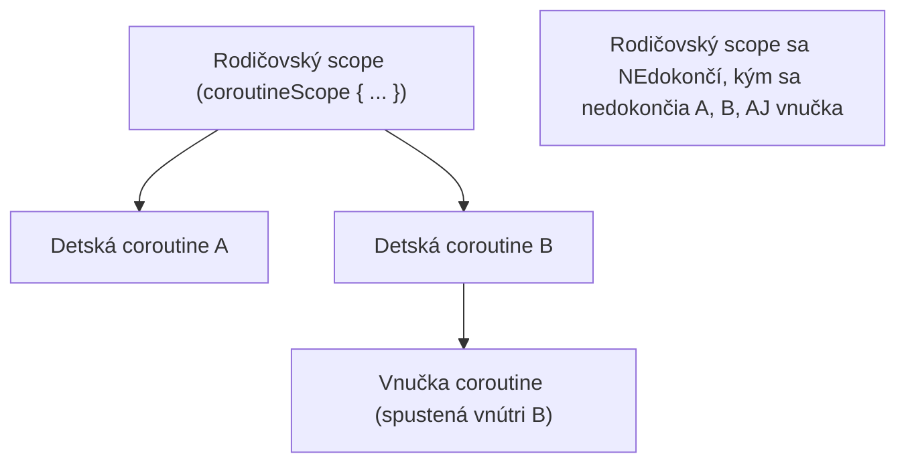
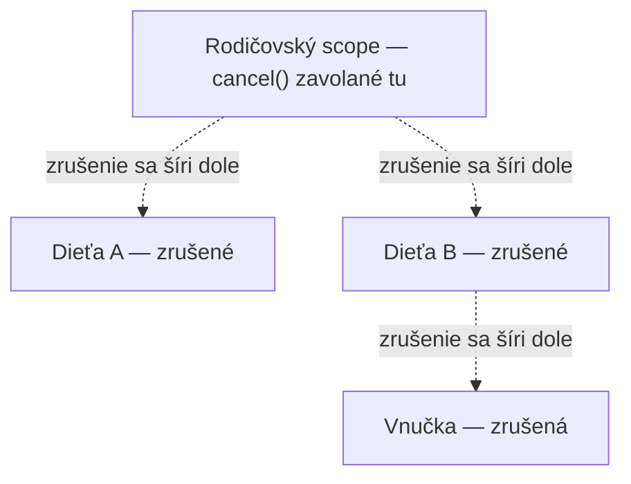
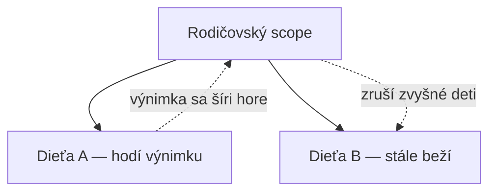

# Vysvetlenie Štruktúrovanej Konkurencie

Argumentovateľne najdôležitejšia myšlienka v celom dizajne Kotlin coroutines — a vec, ktorá
najjasnejšie oddeľuje ich od "len async/await s extra syntaxou."

## Základné pravidlo

**Životnosť coroutine je viazaná na scope, v ktorom bola spustená — scope sa nedokončí, kým sa
nedokončí každá coroutine spustená v ňom (vrátane transitívne, detí detí).**



Toto nie je konvencia ani best practice — vynucuje to samotná coroutine mechanika. Neexistuje
spôsob, ako spustiť coroutine, ktorá potichu "unikne" svojmu rodičovskému scope a beží ďalej po
tom, čo si rodič myslí, že je hotový (okrem zámerného použitia unscoped builderu ako
`GlobalScope`, pokrytého ako anti-pattern v
[Bežných Chybách s Coroutines](../06-common-pitfalls/common-coroutine-mistakes.md)).

## Prečo na tom záleží — problém, ktorý to naozaj rieši

Bez štruktúrovanej konkurencie "spusti nejakú async prácu" ľahko vedie k:

```text
- Unikajúcim coroutines, ktoré bežia ďalej po tom, čo kód, ktorý ich spustil, sa už posunul
  ďalej, potichu spotrebúvajúc zdroje bez úžitku pre nikoho
- Žiadnemu spoľahlivému spôsobu, ako vedieť, kedy je "všetka práca" naozaj hotová
- Zrušenej operácii, ktorej spustená práca na pozadí beží ďalej aj tak
```

```kotlin
// ❌ neštruktúrované — nič neviaže životnosť tejto coroutine na čokoľvek
fun startBackgroundTask() {
    GlobalScope.launch {
        doWork()   // beží ďalej, aj keď volajúci sa už dávno posunul ďalej / bol zničený
    }
}

// ✅ štruktúrované — viazané na scope so skutočnou, ohraničenou životnosťou
class Worker(private val scope: CoroutineScope) {
    fun startBackgroundTask() {
        scope.launch {
            doWork()   // automaticky zrušené, ak je `scope` zrušený
        }
    }
}
```

## Zrušenie sa automaticky šíri cez štruktúru



Zrušenie rodičovského scope automaticky zruší každú coroutine v ňom vnorenú, celkom dole — nikdy
nemusíš ručne sledovať a rušiť každé dieťa jednotlivo. Pozri [Zrušenie](./cancellation.md) pre
mechaniku toho, ako coroutine naozaj reaguje na zrušenie.

## Výnimka v dieťati sa predvolene šíri hore



Predvolene nespracovaná výnimka v jednom dieťati zruší rodičovský scope, ktorý zase zruší každé
*iné* dieťa — "zlyhaj spolu" je predvolené, nie "zlyhaj potichu a nezávisle." Toto je zámerné: ak
časť štruktúrovanej jednotky práce zlyhá, pokračovanie v behu zvyšku bez vedomia o zlyhaní zriedka
je to, čo naozaj chceš. Pozri [Supervisor Joby](../05-error-handling-and-testing/supervisor-jobs.md)
pre explicitný opt-out, keď súrodenci naozaj majú byť nezávislí.

## Mentálny model, s ktorým odísť

Predstav si coroutine scope ako **zátvorku okolo konkurentnej práce** — všetko spustené vnútri
zátvorky je garantovane hotové (alebo zrušené) predtým, než sa zátvorka samotná zavrie. Nič
"neunikne," pokiaľ zámerne neprelomíš túto štruktúru.
