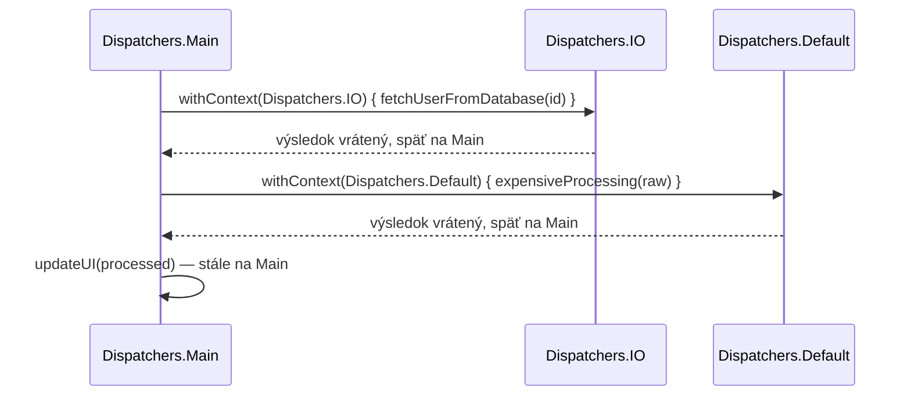

# Prepínanie Kontextu

Jedna coroutine sa vie presunúť medzi dispatchermi uprostred vykonávania pomocou `withContext` —
štandardný spôsob, ako urobiť "kúsok CPU práce, potom blokujúce volanie, potom späť na CPU prácu"
všetko v rámci jednej logickej coroutine, bez spúšťania samostatných coroutines pre každú časť.

## `withContext` — prepni, spusti, prepni späť

```kotlin
suspend fun loadAndProcessUser(id: Int): ProcessedUser = withContext(Dispatchers.Main) {
    val raw = withContext(Dispatchers.IO) {
        fetchUserFromDatabase(id)    // blokujúce volanie, správne na Dispatchers.IO
    }
    val processed = withContext(Dispatchers.Default) {
        expensiveProcessing(raw)       // CPU-náročná práca, správne na Dispatchers.Default
    }
    updateUI(processed)                  // späť na Dispatchers.Main automaticky
    processed
}
```



Každé volanie `withContext` sa pozastaví, kým sa jeho blok nedokončí, potom automaticky obnoví
vykonávanie späť na **pôvodnom** dispatcheri — nemusíš si ručne sledovať "na ktorom dispatcheri
som bol predtým."

## `withContext` vs. spustenie novej coroutine — reálne rozlíšenie

```kotlin
// withContext: sekvenčné, čaká na blok, vráti jeho výsledok, rovnaká logická coroutine
val result = withContext(Dispatchers.IO) { fetchData() }

// launch: spustí nezávislú konkurentnú prácu, nečaká, žiadna návratová hodnota
launch(Dispatchers.IO) { fetchData() }
```

`withContext` je na "spusti túto časť mojej sekvenčnej logiky na inom dispatcheri, potom
pokračuj" — je to stále jedna coroutine, jeden lineárny tok, len vykonávajúci rôzne segmenty na
rôznych thread pooloch. **Nie** je to nástroj na konkurenciu — na skutočný súbežný beh vecí pozri
[Launch vs. Async](../01-basics/launch-vs-async.md).

## Prečo na explicitnom prepínaní dispatchera záleží pre správnosť, nielen výkon

Zavolanie blokujúcej funkcie bez najprv prepnutia na vhodný dispatcher neškodí len výkonu — na
dispatcheri s obmedzeným thread poolom (ako `Dispatchers.Default`, veľkosti podľa CPU jadier),
blokujúce volanie môže úplne vyhladovať tento pool, čo zabráni *iným*, nesúvisiacim coroutines
vôbec získať vlákno na beh. Pozri
[Blokujúce Volania v Coroutines](../06-common-pitfalls/blocking-calls-in-coroutines.md) pre
presne tento typ zlyhania podrobnejšie.

## `withContext` a štruktúrovaná konkurencia

`withContext` nevytvorí novú nezávislú coroutine mimo stromu štruktúrovanej konkurencie (pozri
[Vysvetlenie Štruktúrovanej Konkurencie](../02-structured-concurrency/structured-concurrency-explained.md))
— je to stále tá istá coroutine, dočasne bežiaca svoj ďalší segment pod iným kontextom. Zrušenie
pôvodnej coroutine ju zruší bez ohľadu na to, na ktorom dispatcheri `withContext` blok práve beží.
