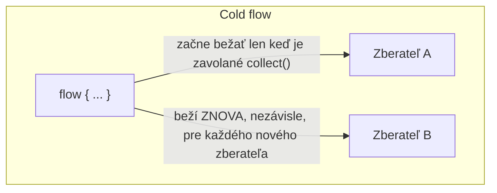
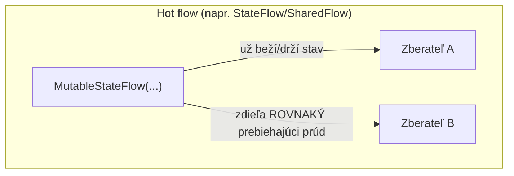

# Úvod do Flow

`suspend fun` vráti **jednu** hodnotu. `Flow<T>` je odpoveď coroutines na to, keď potrebuješ
**viacero** hodnôt v čase — asynchrónny prúd, postavený na tej istej suspenznej mechanike pokrytej
naprieč touto témou.

## Vytvorenie flow

```kotlin
fun countDown(): Flow<Int> = flow {
    for (i in 3 downTo 1) {
        delay(1000L)
        emit(i)            // suspending — emituje jednu hodnotu tomu, kto zbiera
    }
}
```

## Zber flow

```kotlin
suspend fun main() {
    countDown().collect { value ->
        println(value)
    }
}
// (čaká 1s) 3
// (čaká 1s) 2
// (čaká 1s) 1
```

`collect` je sama suspend funkcia — zber flow neblokuje, pozastaví sa, kým nie je emitovaná
ďalšia hodnota (alebo kým sa flow nedokončí).

## Cold vs. hot — najdôležitejšie rozlíšenie





**Cold** flow (čo buduje `flow { }`) nerobí vôbec nič, kým nie je zavolané `collect` — a beží celé
svoje telo nezávisle, od začiatku, pre *každého* samostatného zberateľa. **Hot** flow (ako
`StateFlow`/`SharedFlow` — pozri [StateFlow a SharedFlow](./stateflow-and-sharedflow.md)) existuje
a potenciálne emituje bez ohľadu na to, či ho niekto zbiera, a viacero zberateľov zdieľa ten istý
prebiehajúci prúd namiesto toho, aby každý spúšťal nezávislý beh.

```kotlin
val coldFlow = flow {
    println("Flow started")     // tento riadok sa spustí KAŽDÝKRÁT, keď je zavolané collect()
    emit(1)
}

coldFlow.collect { }    // vypíše "Flow started"
coldFlow.collect { }    // vypíše "Flow started" ZNOVA — nezávislý beh
```

## Flow vs. suspend funkcia vracajúca `List`

```kotlin
suspend fun fetchAllUsers(): List<User> { /* ... */ }    // čaká na VŠETKY výsledky, potom vráti
fun streamUsers(): Flow<User> { /* ... */ }                // emituje používateľov jedného po druhom, ako sú pripravení
```

Suspend funkcia vracajúca `List` ťa prinúti čakať na **všetko** predtým, než niečo dostaneš.
`Flow` umožní konzumentovi začať reagovať na **prvú** položku hneď, ako je dostupná, bez čakania na
zvyšok — naozaj užitočné pre veľké alebo pomaly produkované sekvencie (čítanie veľkého súboru
riadok po riadku, prijímanie stránkovaných API výsledkov, počúvanie prúdu udalostí v čase) namiesto
pevnej, plne dostupnej vopred kolekcie.

## Flow buildery, nad rámec `flow { }`

```kotlin
flowOf(1, 2, 3)                      // flow pevných známych hodnôt
listOf(1, 2, 3).asFlow()               // konvertuj existujúcu kolekciu na flow
```

## Kam táto téma smeruje

- [Operátory Flow](./flow-operators.md) — transformácia a kombinovanie flow, rovnako ako by si
  použil `map`/`filter` na bežnej kolekcii, ale suspending-aware.
- [StateFlow a SharedFlow](./stateflow-and-sharedflow.md) — hot-flow varianty, a kedy je ktorý
  správny nástroj.
