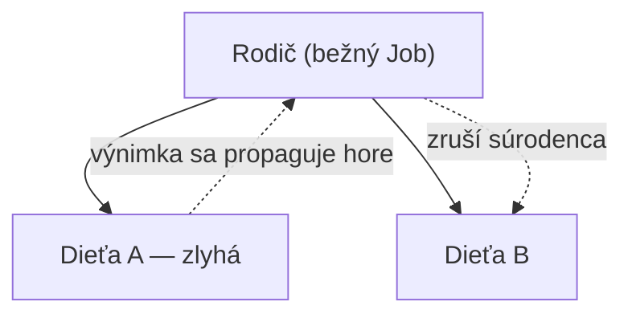
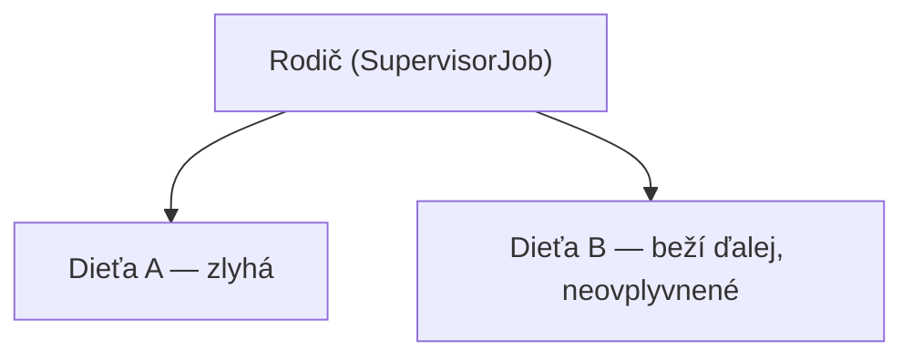

# Supervisor Joby

Explicitný opt-out z predvoleného správania "zlyhaj spolu" štruktúrovanej konkurencie (pozri
[Vysvetlenie Štruktúrovanej Konkurencie](../02-structured-concurrency/structured-concurrency-explained.md)
a [Spracovanie Výnimiek v Coroutines](./exception-handling-in-coroutines.md)) — pre prípady, kde
zlyhanie jedného dieťaťa naozaj nemá ovplyvniť jeho súrodencov.

## Predvolené správanie, ako pripomienka



S bežným `Job` zlyhanie jedného dieťaťa zruší rodiča, ktorý zruší aj každé iné dieťa.

## `SupervisorJob` — súrodenci zlyhajú nezávisle



```kotlin
val scope = CoroutineScope(SupervisorJob() + Dispatchers.Default)

scope.launch {
    throw RuntimeException("Task A failed")   // NEzruší scope ani Task B
}
scope.launch {
    delay(1000L)
    println("Task B still completes normally")
}
```

`SupervisorJob` mení pravidlo propagácie konkrétne pre **svoje vlastné priame deti** — zlyhanie
jedného nezruší ostatné, ani nezruší samotný supervisor scope.

## `supervisorScope` — štruktúrovaná, scoped verzia

```kotlin
suspend fun runIndependentTasks() = supervisorScope {
    launch {
        throw RuntimeException("Task A failed")   // neovplyvní Task B
    }
    launch {
        delay(1000L)
        println("Task B still completes")
    }
}
```

`supervisorScope` je suspend-funkčný ekvivalent ručného zostavenia `CoroutineScope` so
`SupervisorJob` — preferovaný vo väčšine kódu, keďže zostáva správne štruktúrovaný (viazaný na
vlastnú životnosť volajúcej coroutine) namiesto vyžadovania samostatne, ručne spravovaného scope.

## Kedy je toto naozaj správna voľba

```text
Dobrý fit pre SupervisorJob:
  - UI obrazovka s viacerými nezávislými widgetmi, každý načítavajúci vlastné dáta —
    zlyhanie dát jedného widgetu by nemalo vyprázdniť celú obrazovku
  - Spracovanie dávky nezávislých položiek, kde zlyhanie jednej položky by nemalo
    prerušiť spracovanie zvyšku
  - Sada nesúvisiacich background tasks spustených spolu kvôli pohodliu, bez skutočnej
    závislosti medzi ich výsledkami

Slabý fit (drž sa bežnej štruktúrovanej konkurencie):
  - Kroky, ktoré naozaj závisia na úspechu toho druhého (natiahni dáta, POTOM ich spracuj —
    spracovanie bez platných dát nemá zmysel)
  - Čokoľvek, kde "čiastočný úspech" nie je naozaj platný, bezpečný stav
```

## Bežná chyba: príliš široké použitie `SupervisorJob`

```kotlin
// ❌ supervisorScope obaľujúci kroky, ktoré na sebe naozaj závisia
supervisorScope {
    val user = async { fetchUser(id) }         // ak toto zlyhá...
    val orders = async { fetchOrders(user.await().id) }   // ...toto zlyhá aj tak, len menej
                                                              //    predvídateľne, a ostatní
                                                              //    "nezávislí" súrodenci bežia
                                                              //    ďalej zbytočne
}
```

`SupervisorJob`/`supervisorScope` je zámerná výnimka z predvoleného stavu štruktúrovanej
konkurencie, nie všeobecný spôsob, ako sa vyhnúť premýšľaniu o propagácii zlyhania — siahni po
ňom konkrétne, keď sú výsledky súrodeneckých coroutines naozaj nezávislé jeden od druhého, nie
ako predvolený zvyk.
