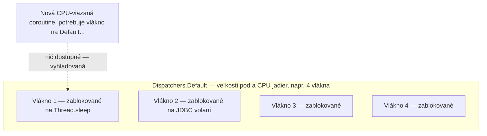

# Blokujúce Volania v Coroutines

Dosť bežné, a dosť rušivé, aby si zaslúžilo vlastnú stránku: volanie naozaj **blokujúcej** funkcie
zvnútra coroutine bez toho, aby si ju najprv presmeroval cez vhodný dispatcher.

## Chyba

```kotlin
❌ launch(Dispatchers.Default) {
    Thread.sleep(5000L)         // BLOKUJE skutočné vlákno — poráža celý zmysel
    val data = jdbcConnection.executeQuery(sql)    // blokujúce JDBC volanie, tiež na Default
}
```

`Thread.sleep` a blokujúce volanie JDBC driveru sa nepozastavia — naozaj obsadia a zablokujú
podkladové OS vlákno na celú svoju dobu, presne ako by to robili mimo akejkoľvek coroutine vôbec.
Coroutines magicky nespravia blokujúce volanie neblokujúcim.

## Prečo je toto horšie, než vyzerá — vyhladovanie thread poolu



`Dispatchers.Default` má obmedzený thread pool, zámerne veľkosti podľa počtu CPU jadier — je
mienený pre CPU-viazanú prácu, ktorá naozaj potrebuje bežať konkurentne s inou CPU-viazanou
prácou, nie na čakanie. Dosť blokujúcich volaní bežiacich na ňom môže vyčerpať celý pool, čím
vyhladuje **každú inú** coroutine — vrátane úplne nesúvisiacich — ktorá potrebuje vlákno z
`Default` na postup.

## Oprava: `Dispatchers.IO`, alebo `withContext` okolo len blokujúcej časti

```kotlin
✅ launch(Dispatchers.Default) {
    val processed = expensiveComputation(input)     // naozaj CPU-viazané — fajn na Default

    val data = withContext(Dispatchers.IO) {
        jdbcConnection.executeQuery(sql)               // blokujúce volanie, správne izolované na IO
    }
}
```

`Dispatchers.IO` je zámerne oveľa väčší než `Default` (pozri
[Dispatchery](../03-dispatchers-and-threading/dispatchers.md)), špecificky na absorbovanie mnohých
konkurentných blokujúcich volaní bez vyhladovania CPU-viazanej práce inde. `withContext(Dispatchers.IO)`
okolo len blokujúcej časti — nie celej coroutine — necháva zvyšok coroutine voľne bežať tam, kde
začala.

## `delay()` nie je to isté ako `Thread.sleep()` — súvisiaci, ale iný bod

```kotlin
❌ launch { Thread.sleep(1000L) }    // zablokuje vlákno na 1 sekundu
✅ launch { delay(1000L) }             // pozastaví sa na 1 sekundu, vlákno je voľné robiť inú prácu
```

`delay` je naozajstná suspending funkcia — nič neblokuje. `Thread.sleep` vnútri coroutine je
blokujúce volanie ako každé iné, podlieha presne rovnakej obave o vyhladovanie vlákien popísanej
vyššie, aj keď *zámer* (počkaj nejaký čas) vyzerá identicky.

## Rozpoznanie blokujúceho volania v knižnici, ktorú si nenapísal

Nie vždy zjavné len zo signatúry funkcie — funkcia knižnice bez modifikátora `suspend`, ktorá robí
I/O (databázový driver bez podpory coroutines, synchrónny HTTP klient, čítanie súboru cez obyčajné
`java.io`), veľmi pravdepodobne blokuje pod kapotou, aj keď na jej volaní nič nevyzerá inak než
volanie akejkoľvek inej bežnej funkcie.

```text
Pravidlo palca: ak funkcia nie je označená `suspend` A robí I/O (sieť, disk, databáza),
predpokladaj, že blokuje volajúce vlákno, a zabaľ ju do withContext(Dispatchers.IO).
```

## Prečo je toto uvedené ako "pasca" a nie len detail Dispatcherov

Táto konkrétna chyba je vyčlenená, lebo jej symptómy sú často mätúce a nepriame — appka nespadne,
len sa stane záhadne pomalou alebo nereagujúcou pod záťažou, so skutočnou príčinou (vyhladovaný
thread pool dispatchera) o niekoľko krokov ďalej od miesta, kde je spomalenie naozaj *pozorované*.
