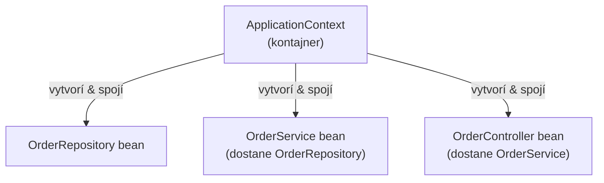

# Základy DI v Spring

## Čo dependency injection naozaj rieši

Trieda, ktorá potrebuje spolupracovníka (service potrebujúci repository, controller potrebujúci
service), má dva spôsoby, ako ho získať: **vytvorí si ho sama**, alebo **je jej odovzdaný**
zvonku. Dependency injection je druhý prístup, systematizovaný.

```kotlin title="❌ Trieda si vytvorí vlastnú závislosť"
class OrderService {
    private val repository = OrderRepository()    // natvrdo zakódované, nedá sa vymeniť ani mockovať
}
```

```kotlin title="✅ Závislosť je odovzdaná dnu"
class OrderService(private val repository: OrderRepository)
```

Druhá verzia nevie ani sa nestará o to, *ako* bol `OrderRepository` skonštruovaný — reálny,
fejkový na testovanie, úplne inú implementáciu. Toto je celý zmysel: **oddeliť, čo trieda
potrebuje, od toho, ako sa táto potreba naplní.**

## `ApplicationContext` — kontajner Spring

DI kontajner Spring (`ApplicationContext`) je zodpovedný za:

1. **Objavovanie** tried označených ako Spring-spravované (`@Component`, `@Service`,
   `@Repository`, `@RestController`, a ďalšie — pozri [Beany a Scopes](./beans-and-scopes.md)).
2. **Konštruovanie** ich inštancií (tieto inštancie sa volajú **beany**).
3. **Spájanie** ich dokopy — ak `OrderService` potrebuje `OrderRepository`, kontajner nájde (alebo
   vytvorí) `OrderRepository` bean a automaticky ho odovzdá.



Nikde v aplikačnom kóde sám nepíšeš `OrderService(OrderRepository())` — kontajner toto spojenie
robí automaticky, na základe toho, čo konštruktor každého beanu deklaruje, že potrebuje.

## Prečo na tomto záleží nad rámec "menej boilerplate"

- **Testovateľnosť** — vymeň reálnu závislosť za test double bez akejkoľvek zmeny testovanej
  triedy (pozri [Unit Testovanie s MockK](../05-testing-spring-apps/unit-testing-with-mockk.md)).
- **Single Responsibility** — trieda zameraná na vlastnú logiku nepotrebuje tiež vedieť, ako
  skonštruovať svojich spolupracovníkov.
- **Centralizovaná konfigurácia** — ktorá konkrétna implementácia sa použije (pozri príklad
  beanov špecifických pre profil v [Konfigurácia a Profily](../01-basics/configuration-and-profiles.md))
  je rozhodnutá na jednom mieste, nie roztrúsená naprieč každým miestom, kde sa závislosť
  konštruuje.

## Tri spôsoby injektovania v Spring, v skratke

```kotlin
// Constructor injection — odporúčaná predvoľba, pozri ďalšiu stránku
class OrderService(private val repository: OrderRepository)

// Field injection — funguje, ale všeobecne neodporúčané
class OrderService {
    @Autowired
    private lateinit var repository: OrderRepository
}

// Setter injection — v praxi zriedkavé
class OrderService {
    private lateinit var repository: OrderRepository
    @Autowired
    fun setRepository(repository: OrderRepository) { this.repository = repository }
}
```

[Constructor Injection, Kotlinovým Spôsobom](./constructor-injection-kotlin-style.md) pokrýva
presne prečo je constructor injection silnou predvolenou odporúčanou voľbou, a prečo je obzvlášť
prirodzeným fitom konkrétne pre Kotlin.
