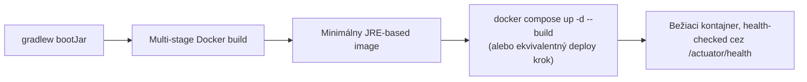

# Balenie a Nasadzovanie Spring Boot Appky

Spája celú túto tému s témou [Docker](/sk/study-materials/docker/basics/what-is-a-container) — vybudovanie Spring Boot
appky do container image nasleduje presne rovnaké princípy tam pokryté, aplikované na tento
konkrétny stack.

## Build artefakt — fat JAR

```bash
./gradlew bootJar
```

Vyprodukuje jeden spustiteľný JAR obsahujúci skompilovaný kód appky **a každú závislosť**
zabalenú vnútri — spustiteľný priamo cez `java -jar app.jar`, netreba samostatný classpath setup.
Toto je to, čo sa naozaj skopíruje do finálnej fázy container image nižšie.

## Multi-stage Dockerfile

```dockerfile title="Dockerfile"
# Fáza 1: build s plným JDK
FROM eclipse-temurin:21-jdk AS builder
WORKDIR /app
COPY . .
RUN ./gradlew bootJar --no-daemon

# Fáza 2: beh len s JRE, oveľa menší
FROM eclipse-temurin:21-jre-alpine
WORKDIR /app
COPY --from=builder /app/build/libs/*.jar app.jar
EXPOSE 8080
CMD ["java", "-jar", "app.jar"]
```

Toto je priama aplikácia multi-stage build vzoru z
[Dockerfile Best Practices](/sk/study-materials/docker/production-practices/dockerfile-best-practices)
v téme Docker: plné **JDK** (kompilátor, build nástroje) je potrebné len na *vyprodukovanie* JAR;
jeho beh potrebuje len **JRE** (žiadny kompilátor vôbec) — zmysluplne menší finálny image, s
celým Gradle build toolchainom a cache závislostí ponechaným v zahodenej `builder` fáze.

## Layered JAR-y — ešte cache-priateľnejší prístup

```dockerfile
FROM eclipse-temurin:21-jdk AS builder
WORKDIR /app
COPY . .
RUN ./gradlew bootJar --no-daemon
RUN java -Djarmode=layertools -jar build/libs/*.jar extract

FROM eclipse-temurin:21-jre-alpine
WORKDIR /app
COPY --from=builder /app/dependencies/ ./
COPY --from=builder /app/spring-boot-loader/ ./
COPY --from=builder /app/snapshot-dependencies/ ./
COPY --from=builder /app/application/ ./
ENTRYPOINT ["java", "org.springframework.boot.loader.launch.JarLauncher"]
```

Funkcia layered JAR Spring Boot rozdelí fat JAR na samostatné vrstvy podľa toho, ako často sa
každá mení — závislosti (zriedka), potom kód appky (často). Toto je ten istý princíp
[cachovania vrstiev image](/sk/study-materials/docker/images-and-dockerfiles/image-layers-and-caching)
z témy Docker aplikovaný konkrétne na Spring Boot JAR: zmena len kódu invaliduje len finálnu,
malú vrstvu `application`, nie celú niekoľko-stomegabajtovú vrstvu závislostí, zmysluplne
zrýchľujúc rebuildy a pushy do registry.

## Konfigurácia za behu, cez premenné prostredia

```dockerfile
ENV SPRING_PROFILES_ACTIVE=prod
```

```bash
docker run -e SPRING_PROFILES_ACTIVE=prod -e SPRING_DATASOURCE_PASSWORD=secret my-app
```

Spring Boot automaticky mapuje premenné prostredia na konfiguračné vlastnosti
(`SPRING_DATASOURCE_PASSWORD` → `spring.datasource.password`) — rovnaký
[vzor konfigurácie cez premenné prostredia](/sk/study-materials/docker/running-containers/environment-and-secrets)
pokrytý v téme Docker, umožňujúci tomu istému image bežať voči dev/staging/prod
[profilom](../01-basics/configuration-and-profiles.md) bez rebuildovania na prostredie. Ako tam
pokryté, skutočné heslo databázy patrí do poriadneho secrets mechanizmu pri deploy, nie zapečené
do image alebo commitnuté kdekoľvek.

## Integrácia health checku

```dockerfile
HEALTHCHECK --interval=30s --timeout=3s --retries=3 \
  CMD curl -f http://localhost:8080/actuator/health || exit 1
```

Priamo sa viaže na [Actuator a Observability](./actuator-and-observability.md) pokryté skôr v
tejto sekcii — presne health endpoint, ktorý poskytuje Actuator, je to, čo by mal volať vlastný
health check kontajnera, uzatvárajúc slučku medzi "appka hlási samú seba zdravú" a "container
runtime vie na ňu smerovať prevádzku alebo ju reštartovať."

## Celkový obraz



Každý krok tu znovupoužíva koncept už pokrytý inde do hĺbky — táto stránka je konkrétne
spojivo ukazujúce, ako vlastný build výstup Kotlin+Spring Boot (`bootJar`) zapadá do
všeobecných praktík kontajnerizácie a nasadzovania plne pokrytých v téme
[Docker](/sk/study-materials/docker/basics/what-is-a-container), namiesto duplikovania toho materiálu.
