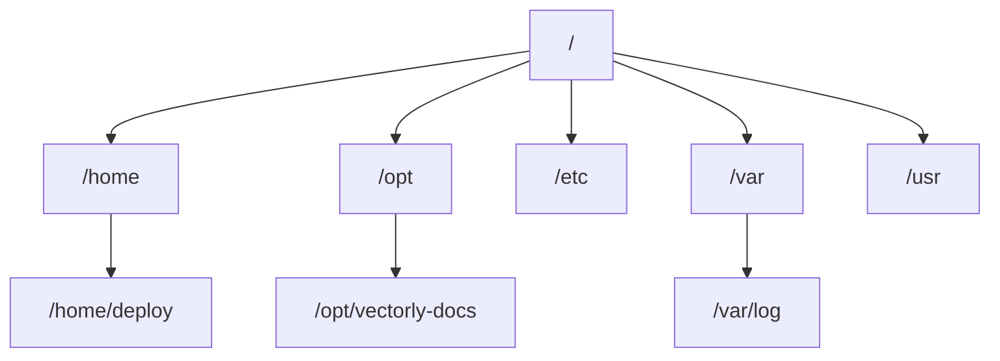

# Súborový Systém

Linux má **jeden** strom súborového systému, zakorenený v `/` — na rozdiel od Windows `C:\`,
`D:\` písmen diskov, všetko (vrátane ostatných diskov, sieťových zdieľaní, USB kľúčov) sa
*pripája (mountuje)* niekam do tohto istého jedného stromu.



## Kľúčové priečinky

| Cesta | Čo tam býva |
|---|---|
| `/home/<user>` | Osobné súbory a konfigurácia každého používateľa, `~` skratky sem |
| `/opt` | Aplikácie tretích strán / samostatne nainštalované — tu bývajú `/opt/vectorly-docs` a `/opt/vectorly-main-site` na VPS tejto organizácie |
| `/etc` | Konfiguračné súbory na úrovni celého systému |
| `/var` | Premenlivé dáta — logy (`/var/log`), cache, veci, ktoré sa menia počas behu systému |
| `/usr` | Nainštalované programy a ich podporné súbory (väčšina toho, čo nainštaluje package manager) |
| `/tmp` | Dočasné súbory, často vyčistené pri reštarte |

## Absolútne vs. relatívne cesty

```bash
/opt/vectorly-docs/docs/README.md      # absolútna — vždy začína od /, jednoznačná odkiaľkoľvek
docs/README.md                          # relatívna — závisí od aktuálneho priečinka
../vectorly-site/package.json            # relatívna, ".." znamená "o úroveň vyššie"
```

`~` je skratka pre tvoj domovský priečinok (`/home/deploy` pre používateľa menom `deploy`) —
`cd ~` aj `cd` (bez argumentu) ťa oba dostanú domov.

## `pwd` — kde práve som

```bash
pwd
# /opt/vectorly-docs
```

Shell má vždy "aktuálny pracovný priečinok" — každá relatívna cesta sa interpretuje s počiatkom
tam. Toto je najužitočnejší príkaz, keď sa relatívna cesta nesprestáva podľa očakávania.

## Skryté súbory

Akýkoľvek súbor/priečinok začínajúci `.` je skrytý pred obyčajným `ls`:

```bash
ls              # nezobrazí .bashrc, .ssh, .env, .gitignore, atď.
ls -a           # zobrazí všetko, vrátane skrytých súborov
```

Toto nie je bezpečnostný ani permission mechanizmus — len konvencia na udržanie
config/dotfile súborov mimo bežných výpisov priečinka. `.ssh/`, `.bashrc`, `.gitconfig` sú takto
skryté všetky.

## Všetko je súbor

Filozofia Linuxu, oplatí sa poznať aj na úrovni základov: zariadenia, sockety a informácie o
procesoch sú vystavené *akoby* boli tiež súbormi (`/dev/sda` pre disk, `/proc/1234` pre proces
1234) — rovnaké nástroje (`cat`, `ls`, presmerovanie) fungujú na nich ako na bežných súboroch,
preto je toľko z Linux administrácie jednoducho "čítanie a písanie súborov," aj keď to podkladové
nie je naozaj dokument.
