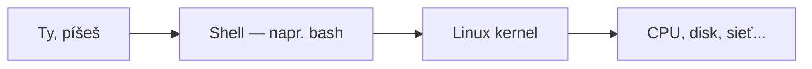

# Čo je Shell

**Shell** je program, ktorý číta príkazy, ktoré píšeš, a žiada operačný systém, aby ich spustil.
Je to vrstva medzi tebou a jadrom (kernelom) OS — kernelu sa priamo nedotýkaš, rozprávaš sa so
shellom, ktorý sa v tvojom mene rozpráva s kernelom.



## Shell vs. terminál vs. OS

Ľahko sa to popletie, sú to naozaj rôzne veci:

- **Terminál** — okno/appka, do ktorej píšeš (napr. GNOME Terminal, Windows Terminal, iTerm). Len
  zobrazuje text dnu a von; sám osebe nič nerobí.
- **Shell** — program bežiaci *vnútri* toho terminálu, ktorý skutočne interpretuje, čo napíšeš
  (`bash`, `zsh`, `sh`). Toto skutočne parsuje `ls -la` a rozhoduje, čo s tým urobiť.
- **OS / kernel** — o čo shell žiada, aby skutočne vykonal prácu (otvoril súbor, vypísal
  priečinok, spustil proces).

Shell vieš spustiť aj bez terminálu (skript spustený cez `cron`, alebo shell, ktorý GitHub Actions
používa na spustenie každého kroku workflow) — "shell" a "terminál" nie sú to isté, aj keď sa
takmer vždy vidia spolu.

## bash konkrétne

**bash** (Bourne Again SHell) je predvolený shell na väčšine Linux distribúcií, vrátane
Fedora/Ubuntu-based VPS, na ktorom beží server tejto organizácie (pozri
[`/sk/internal-operations/server-architecture`](/sk/internal-operations/server-architecture)).
Takmer všetko v tejto sekcii predpokladá bash, pokiaľ nie je uvedené inak — `zsh` (predvolený na
macOS od Catalina) je v bežnom používaní dosť podobný na to, aby sa takmer všetko dalo priamo
preniesť.

## Interaktívny vs. skriptový režim

Ten istý shell beží dvoma spôsobmi:

```bash
# interaktívny — napíšeš príkaz, vidíš výsledok, napíšeš ďalší
$ ls
$ cd /opt/vectorly-docs

# skript — súbor príkazov spustený naraz, bez človeka v slučke
#!/bin/bash
cd /opt/vectorly-docs
docker compose up -d --build
```

[Základy Shell Scriptingu](../06-practical-shell/shell-scripting-basics.md) popisuje písanie
druhého typu.

## Prompt

```
deploy@docs-server:/opt/vectorly-docs$
```

Čítanie: `deploy` (prihlásený používateľ) `@` `docs-server` (hostname) `:` `/opt/vectorly-docs`
(aktuálny priečinok) `$` (bežný používateľ — `#` namiesto toho znamená, že si root, pozri
[Sudo a Root](../02-permissions-and-users/sudo-and-root.md)).

## Kam ísť ďalej

[Súborový Systém](./the-filesystem.md) popisuje, čo cesta `/opt/vectorly-docs` naozaj znamená;
[Navigácia a Súbory](./navigating-and-files.md) popisuje pohyb a manipuláciu s tým, čo je tam.
