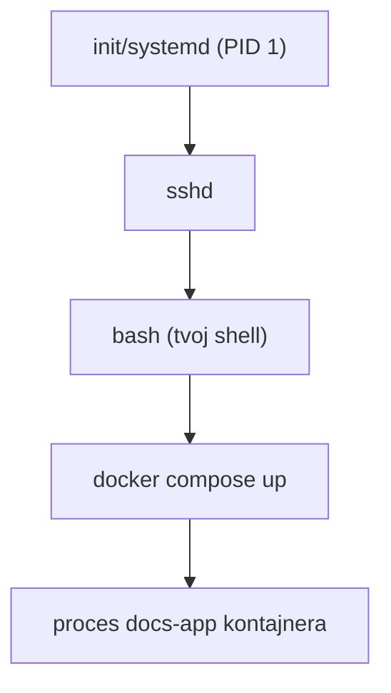

# Čo je Proces

**Proces** je bežiaca inštancia programu — ten istý program (napr. `bash`, `node`) môže bežať ako
viacero samostatných procesov naraz, každý s vlastnou pamäťou, vlastným stavom, a vlastným
**PID** (process ID).

## Rodičovské a detské procesy

Každý proces (okrem úplne prvého pri štarte) je spustený *iným* procesom — svojím rodičom.
Spustenie príkazu zo shellu spraví tvoj shell rodičom nového detského procesu:



Preto zatvorenie terminálu môže zabiť všetko, čo si z neho spustil (jeho deti), pokiaľ ich
zámerne neodpojíš — pozri [Pozadie a Joby](./background-and-jobs.md).

## PID-y a exit kódy

```bash
echo $$          # PID tvojho aktuálneho shellu
```

Každý proces, keď skončí, vráti **exit kód** — `0` znamená úspech, čokoľvek iné znamená nejaký
druh zlyhania (konkrétny nenulový význam definuje ten daný program).

```bash
ls /nonexistent
echo $?            # vypíše exit kód POSLEDNÉHO príkazu — tu nenulový, keďže ls zlyhal
```

`$?` je to, ako skripty kontrolujú "podaril sa naozaj predchádzajúci príkaz" — chrbtica error
handlingu v [Základoch Shell Scriptingu](../06-practical-shell/shell-scripting-basics.md).

## Stavy procesu, v skratke

Proces je zvyčajne v jednom z: **running** (aktívne používa CPU), **sleeping** (čaká na niečo —
disk I/O, sieť, používateľský vstup — nepoužíva CPU), alebo **zombie** (dokončený, ale jeho exit
status ešte nevyzdvihol jeho rodič — normálne sa rýchlo vyčistí, hromada zombie procesov zvyčajne
signalizuje bug v rodičovskom procese).

## Prečo na tom dennodenne záleží

Pochopenie "proces má rodiča, PID a exit kód" je to, čo robí ďalšie dve stránky —
[Správa Procesov](./managing-processes.md) a
[Pozadie a Joby](./background-and-jobs.md) — zmysluplnými ako viac než len zoznam príkazov na
naučenie naspamäť.
