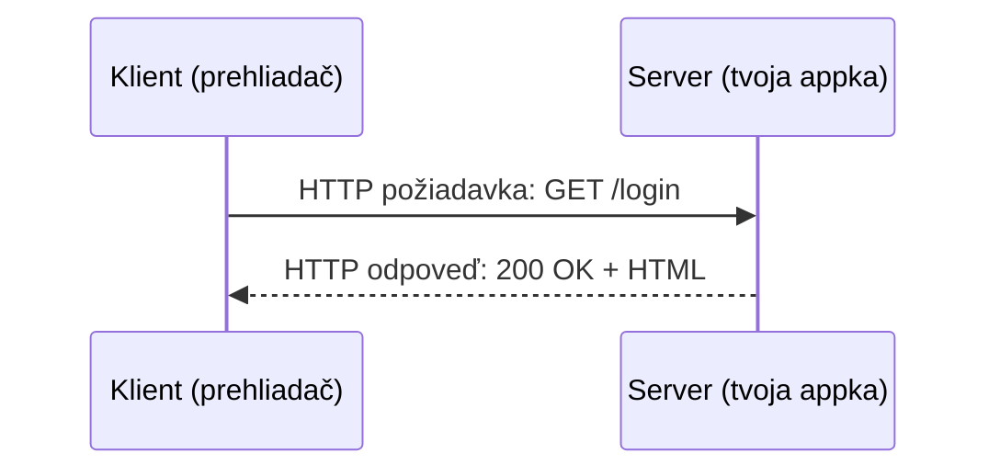

# Čo je Server

**Server** je jednoducho program počúvajúci na sieťové pripojenia — čaká, kým sa ho niečo spýta na
dáta, a odpovedá. **Klient** je čokoľvek, čo takéto pripojenie iniciuje: prehliadač, mobilná
appka, `curl`, iný server.



"Server" popisuje *rolu*, nie typ počítača. Ten istý fyzický počítač môže bežať viacero serverov
súčasne (web server, databázový server, SSH server), každý počúvajúci na vlastnom **porte** —
pozri [Porty a Protokoly](./ports-and-protocols.md).

## Localhost vs. remote

- `localhost` (alebo `127.0.0.1`) vždy znamená "tento počítač" — server bežiaci na tvojom
  vlastnom notebooku, dostupný len z tvojho vlastného notebooku (pokiaľ ho zámerne nesprístupníš).
- **Remote** (vzdialený) server beží na inom počítači — dostupný cez sieť pomocou svojej IP
  adresy, alebo bežnejšie, doménového mena, ktoré sa na túto IP prekladá (pozri
  [Ako DNS Funguje](../03-domains-and-dns/how-dns-works.md)).

```bash
curl http://localhost:3000        # rozprávaš sa so serverom na vlastnom počítači
curl https://docs.vectorly-slovakia.sk    # rozprávaš sa so vzdialeným serverom
```

## Kde bývajú servery tejto organizácie

Konkrétne: `docs.vectorly-slovakia.sk` je Docusaurus stránka bežiaca v Docker kontajneri na
vzdialenom VPS (pozri
[`/sk/internal-operations/server-architecture`](/sk/internal-operations/server-architecture)) —
reverse proxy (Caddy) pred ním rozhoduje, ktorý kontajner obslúži požiadavku na základe
doménového mena. [Web Serving](../04-web-serving/reverse-proxies.md) popisuje, ako toto smerovanie
funguje, [SSH](../02-ssh/ssh-basics.md) popisuje, ako sa dostaneš k terminálu na tomto vzdialenom
počítači, aby si ho mohol spravovať.

## Client-server vs. peer-to-peer

Takmer všetko v tejto sekcii je **client-server**: jedna strana ponúka službu, druhá ju
konzumuje, a roly sú pevné. (Peer-to-peer, kde každý uzol môže vystupovať v oboch rolách, tiež
existuje — BitTorrent, niektoré blockchainové siete — ale je mimo rozsahu tejto sekcie; nič v
stacku tejto organizácie takto nefunguje.)
