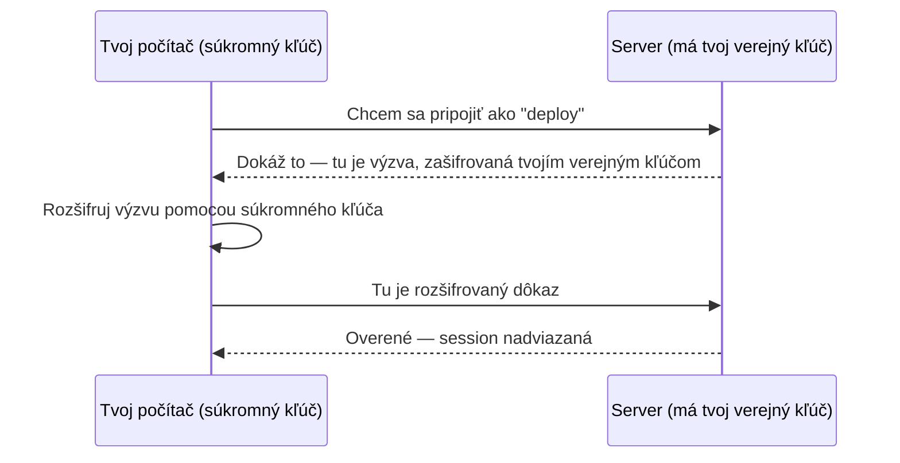

# SSH Kľúče

SSH pár kľúčov sú dva matematicky prepojené súbory: **súkromný kľúč** (nikdy nezdieľaj, dokazuje
tvoju identitu) a **verejný kľúč** (voľne zdieľateľný, umiestni ho na servery, ku ktorým chceš
prístup).

## Generovanie páru kľúčov

```bash
ssh-keygen -t ed25519 -C "ty@example.com"
```

Predvolene vytvorí dva súbory:

```
~/.ssh/id_ed25519        <- súkromný kľúč, NIKDY nezdieľaj, nikdy necommituj
~/.ssh/id_ed25519.pub     <- verejný kľúč, bezpečné zdieľať/vložiť kdekoľvek
```

`ed25519` je moderný odporúčaný typ kľúča — menší a rýchlejší ako starší `rsa`, bez reálnej
nevýhody pri bežnom použití.

## Ako autentifikácia naozaj funguje



Tvoj súkromný kľúč neopustí tvoj počítač ani počas autentifikácie — server vidí len verejný kľúč a
dôkaz, že máš zodpovedajúci súkromný kľúč.

## Dostanie verejného kľúča na server

```bash
ssh-copy-id user@server                       # najjednoduchšie, ak je password auth ešte zapnutá
# alebo ručne:
cat ~/.ssh/id_ed25519.pub | ssh user@server "cat >> ~/.ssh/authorized_keys"
```

Server kontroluje prichádzajúce pripojenia voči všetkému uvedenému v
`~/.ssh/authorized_keys` pre daného usera — každý kľúč tam uvedený má povolený prístup.

## Passphrase

```bash
ssh-keygen -t ed25519 -C "ty@example.com"
# Enter passphrase (empty for no passphrase): ****
```

Passphrase zašifruje samotný súbor súkromného kľúča v pokoji — aj keby súbor unikol (ukradnutý
notebook, chyba pri zálohe), bez passphrase je nepoužiteľný. Použi `ssh-agent`, aby si ho odomkol
raz za session namiesto opätovného zadávania pri každom pripojení:

```bash
eval "$(ssh-agent -s)"
ssh-add ~/.ssh/id_ed25519
```

:::warning
Súkromný kľúč bez passphrase, na počítači, ktorý sa kompromituje, odovzdá útočníkovi plný prístup
ku všetkému, čo tento kľúč dosiahne — žiaden druhý faktor, ktorý by ho spomalil. Deploy kľúče
(ako CI kľúč tohto repozitára — pozri
[`/sk/internal-operations/git-workflow`](/sk/internal-operations/git-workflow)) sú zámerná
výnimka: sú bez passphrase, lebo CI ju nemá ako zadať, presne preto sú úzko zaškatuľkované (jeden
kľúč, jeden účel) namiesto opätovného použitia osobného kľúča.
:::

## Jeden kľúč na jeden účel

Generuj samostatné páry kľúčov pre samostatné účely (osobný prístup na GitHub vs. deploy kľúč vs.
konkrétny server) namiesto opätovného použitia jedného kľúča všade — pozri
[SSH Konfigurácia](./ssh-config.md) pre čisté spravovanie viacerých kľúčov.
