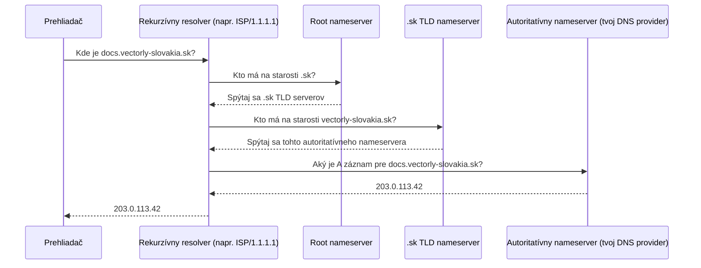

# Ako DNS Funguje

**DNS** (Domain Name System) prekladá ľudsky čitateľnú doménu (`docs.vectorly-slovakia.sk`) na IP
adresu, na ktorú počítač vie skutočne smerovať pakety. Bez neho by si musel pamätať a písať
surové IP adresy pre všetko.

## Registrátor vs. nameservery — dve rôzne úlohy

- **Registrátor** — kde si doménu *kúpil* (napr. Namecheap, GoDaddy). Stará sa o vlastníctvo,
  obnovu, a nasmeruje doménu na sadu nameserverov.
- **Nameservery** — servery, ktoré skutočne odpovedajú na dopyty "aká je IP pre túto doménu".
  Často ich prevádzkuje DNS provider (Cloudflare, samotný registrátor, alebo hostingový
  poskytovateľ) — tu skutočne žijú a upravujú sa DNS záznamy (pozri
  [DNS Záznamy](./dns-records.md)).

Registrátor domény a jej DNS provider sú bežne rôzne firmy — registrátor len potrebuje vedieť,
*ktoré* nameservery ukázať; všetko ostatné sa deje tam.

## Priebeh resolvovania



V praxi je väčšina tohto cachovaná na každej úrovni, takže sa to naplno neodohráva pre doménu,
ktorá bola nedávno resolvovaná kdekoľvek na tvojej sieti — toto je cesta pri "studenom štarte".

## Cachovanie a TTL

Každý DNS záznam má **TTL** (time to live) — ako dlho smie resolver odpoveď cachovať, kým sa
spýta znova. Pred plánovanou DNS zmenou ho nastav nízko (napr. 300 sekúnd), aby sa zmena rýchlo
prejavila; dlhodobo stabilný záznam s vysokým TTL (napr. 86400 = 24h) znižuje záťaž nameservera,
ale zmeny sa všade prejavia pomalšie.

## Kontrola DNS sám

```bash
dig docs.vectorly-slovakia.sk           # podrobný dopyt + odpoveď
dig docs.vectorly-slovakia.sk +short     # len IP
nslookup docs.vectorly-slovakia.sk        # alternatíva, predvolene dostupnejšia na Windows
```

Viac o čítaní týchto výsledkov v
[Riešení Problémov s Pripojením](../05-practical-setups/troubleshooting-connectivity.md).
