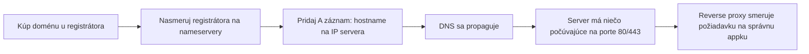

# Nasmerovanie Domény na Server

Spojenie predchádzajúcich dvoch stránok dokopy: praktické kroky, ako dostať doménové meno, aby
skutočne servírovalo bežiacu appku.

## Reťaz



Každý box je samostatná stránka v tejto sekcii — táto stránka je len checklist, ktorý ich spája.

## Krok za krokom

1. **Zaregistruj doménu** u registrátora (pozri [Ako DNS Funguje](./how-dns-works.md) pre
   rozdelenie registrátor/nameservery).
2. **Pridaj `A` záznam** nasmerovaný na verejnú IP tvojho servera (pozri
   [DNS Záznamy](./dns-records.md)):
   ```
   A   docs.vectorly-slovakia.sk   → 203.0.113.42
   ```
3. **Počkaj na propagáciu** — over cez `dig docs.vectorly-slovakia.sk +short`, kým nevráti správnu
   IP odvšadiaľ, odkiaľ testuješ.
4. **Uisti sa, že niečo počúva** na serveri na portoch 80/443 — pozri
   [Porty a Protokoly](../01-basics/ports-and-protocols.md) a
   [Základy SSH](../02-ssh/ssh-basics.md) na dostanie sa na server na kontrolu.
5. **Nastav reverse proxy** (napr. Caddy, nginx) na serveri, aby smeroval prichádzajúcu požiadavku
   podľa hostname na správnu appku/kontajner, a obsluhoval TLS — pozri
   [Reverse Proxy](../04-web-serving/reverse-proxies.md) a
   [TLS a HTTPS](../04-web-serving/tls-https.md).

## Overenie každého článku reťaze samostatne

Keď "doména nefunguje," skontroluj reťaz v poradí namiesto hádania:

```bash
dig docs.vectorly-slovakia.sk +short         # resolvuje DNS vôbec na správnu IP?
curl -v http://203.0.113.42                    # server dostupný priamo cez IP?
curl -v https://docs.vectorly-slovakia.sk       # celá reťaz, vrátane reverse proxy a TLS?
```

Ak funguje kontrola cez IP, ale nie hostname: DNS problém. Ak nefunguje ani jedno: server alebo
firewall. Ak IP funguje cez `http://`, ale doména zlyháva cez `https://`: konkrétne reverse
proxy/TLS konfigurácia. Pozri
[Riešenie Problémov s Pripojením](../05-practical-setups/troubleshooting-connectivity.md) pre
viac tohto diagnostického prístupu.

## Ako to robí táto organizácia

`docs.vectorly-slovakia.sk` presne sleduje túto reťaz na Netcup VPS popísaný v
[`/sk/internal-operations/server-architecture`](/sk/internal-operations/server-architecture) — DNS
nasmerované na VPS, Caddy ako reverse proxy obsluhujúci TLS a smerujúci podľa hostname na správny
Docker kontajner.

## Skontroluj sa

- Doména sa resolvuje na správnu IP cez `dig`, ale `curl -v https://tvoja-domena` zlyhá, zatiaľ čo
  `curl -v http://tvoja-ip` uspeje. Kde je problém, podľa diagnostického poradia z tejto stránky?

  <details>
  <summary>Odpoveď</summary>

  Konkrétne v konfigurácii reverse proxy/TLS — DNS aj samotný server sú v poriadku, keďže
  kontrola IP cez obyčajné HTTP fungovala.
  </details>

- Prečo skontrolovať `dig ... +short` skôr, než vôbec skúsiš `curl` proti doméne?

  <details>
  <summary>Odpoveď</summary>

  Izoluje to, či DNS vôbec resolvuje na správnu IP, ako prvé — nemá zmysel debugovať server alebo
  reverse proxy, ak doména ešte neukazuje na správne miesto.
  </details>

- Čo musí platiť na samotnom serveri predtým, než môže byť reverse proxy vôbec užitočný, podľa
  reťaze na tejto stránke?

  <details>
  <summary>Odpoveď</summary>

  Niečo musí naozaj počúvať na portoch 80/443 na serveri — reverse proxy smeruje prichádzajúce
  požiadavky, nevytvára poslucháča tam, kde žiadny neexistuje.
  </details>

